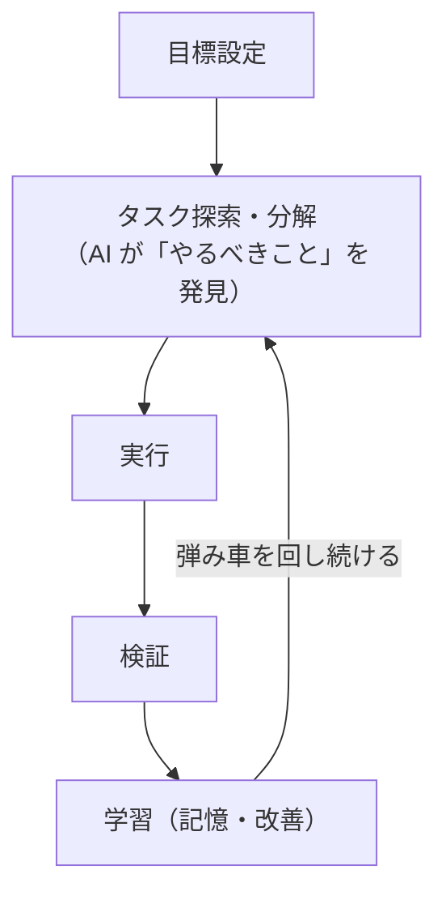

# claude-flywheel

AI を「自律的に働く社員」として動かすための **ハーネス・ツール・運用ナレッジ** を管理するリポジトリです。

指定された目標に対して、AI 自身がやるべきことを探索し、タスクに分解し、実行・検証・改善まで自走させる仕組みを継続的に磨き込んでいきます。開発業務・運営業務の両方を対象とします。

**最重要の目標は、AI 自身が課題を整理し、自分のポジション（役割）に関係するものを選び取って自律的に動くエージェントを作ること** です。人間が一つずつ指示するのではなく、エージェントが「自分が取り組むべき課題」を判断して動き出す状態を目指します。

そのため本プロジェクトは、特定の業務やツールに縛られない **自走するエージェントを作るための土台（コンサル／ツールキット）** を提供します。利用者はこの土台の上に、**プロジェクトごとに独立した自律エージェント**を作ります（例: 医療機器開発 / BIツール開発 / インフラ・セキュリティ横断管理）。提供物は ①ポジションに沿ったスキル群、②自律実行ランタイム。開発の自律化では [claude-harness](https://github.com/masanami/claude-harness) を**利用できます**が、特定ツールに**依存しません**（差し替え可能）。

## コンセプト：Flywheel（弾み車）

目標設定 → タスク探索 → 実行 → 検証 → 学習（記憶・改善）のループを回し続け、回せば回すほど自律性と成果が加速していく状態を目指します。

*図: Flywheel（弾み車）— 目標設定→タスク探索→実行→検証→学習 を回し続け、学習が次の探索を加速する。*



## 配布形態：Claude Code プラグイン

claude-flywheel は **Claude Code プラグイン**として install して使います。1 つのプラグインから、**プロジェクトごとに独立した複数のエージェント（fleet）** を作ります。構成は 3 層:

- **機械（プラグイン）** — スキル・テンプレ・docs（全エージェント共通の土台）
- **各エージェント（独立リポジトリ）** — 課題台帳・positions・memory・runtime ＋ 独自ハーネス（守備範囲は原則重複しない）
- **共有課題ソース** — 人間が課題を集約する単一の入口。各エージェントが自分に関係する分だけ取り込む

> プラグインは配布・更新されるため、運用状態は中に持たず、各エージェントのリポジトリに置きます。

```bash
# 1. マーケットプレイスを登録し、プラグインを install
/plugin marketplace add masanami/claude-flywheel
/plugin install claude-flywheel@claude-flywheel

# 2. エージェント用リポジトリで状態を初期化（スキルは plugin 名で名前空間化される）
/claude-flywheel:flywheel-init          # 状態を生成（templates から）
/claude-flywheel:bootstrap-domain-map   # positions/・memory/ を生成（ドメイン地図）

# 3. 共有ソースから自分に関係する課題を取り込み → 自走
#   /claude-flywheel:ingest-challenges で challenge-ledger.md へ取り込み（run-cycle 内でも自動実行）
#   → /claude-flywheel:run-cycle（routine で定期実行も可）
```

提供物（プラグイン本体）:
- **`skills/`** — `flywheel-init` / `bootstrap-domain-map` / `ingest-challenges` / `run-cycle` / `agent-memory` / `reflect` などのスキル群【成果物(a)】
- **`templates/`** — 利用先に scaffold する雛形（課題台帳・ポジション・関連リポジトリ・ランタイム設定）
- **`scripts/`** — 機械的処理の純シェル（`sync-repos.sh`：関連リポジトリ（作業用クローン）の clone/fetch／`trust-clone.sh`：クローンの trust 承認（人間が一度だけ手動実行））
- **`docs/`** — 設計ドキュメント（要件・アーキテクチャ・課題・memory運用・自己改善）

> 同じプラグインを複数のワークスペースに導入でき、それぞれが独立した状態を持ちます（汎用性）。設計の詳細は [docs/architecture.md](docs/architecture.md) を参照。

## 対象とする業務

| 領域 | 例 |
| --- | --- |
| 開発業務 | 要件定義、設計、実装、レビュー、テスト、PR運用、技術負債の解消 |
| 運営業務 | 目標に対するタスクの探索・起票・進行管理・報告 |

## ステータス

🌱 立ち上げ期。ハーネスとツールの構造を整備中です。
