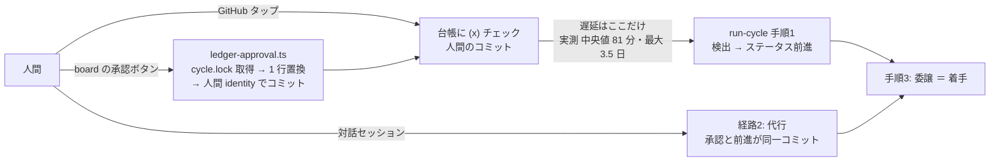

# 承認→着手のレイテンシ（Issue [#160](https://github.com/masanami/claude-flywheel/issues/160)）

> **ステータス**: 確定。**論点①〜⑤のすべてに結論が付いている**（AO-01〜AO-04 の決定は §9）。実装は別 Issue（§8）。
> 本メモは「承認から着手までの遅延をどこで縮めるか」を、実測・実コードの事実と、そこから導いた決定として記録する。
> **決定者の所在**: AO-01〜AO-04 は**親（flywheel エージェント）が決定した**（横断課題＝複数 repo にまたがるため意思決定権を親が保持する）。ただし **AO-03（事前承認）の再検討だけは人間の判断を要する**——承認ゲートの委任範囲は人間の権限設計に属するため（§6.1）。

FR-13（計画承認）は「タスク案を書く → 人間が `[x]` を入れる → **次の** run-cycle が検出して前進させる」という往復で、検出がサイクル境界に律速される。本メモは (1) その遅延を実測し、(2) 承認をイベントとして拾う経路の可否を実コードで判定し、(3) そこから設計を決定する。

## 1. 要約（先に結論）

| # | 論点 | 本メモの結論 | 確度 |
| --- | --- | --- | --- |
| ① | 承認をイベントとして拾えるか（board から） | **board をトリガにしない**（観測プレーンの条件②に抵触し、board 側も Enter を送らない設計で構造的に塞いである）。**ただし遅延の人間側は既に解決済み**——board は承認チェックを書いてコミットするところまで実装済みで、残る遅延は**検出側**だけ | **確定**（実コード） |
| ② | サイクル境界より細かい軽量パス | **軽量パスを置く**。承認検出は索引＋`git log` だけで完結するため安く作れる。「1 周 1 journal」とは両立しないので、**案 A＝軽量パスは journal を書かない**（恒久記録を「journal ＋ Git 履歴」へ広げる）を採る（§5.4・AO-02） | **決定** |
| ③ | 事前承認の粒度 | **レイテンシを理由には導入しない**（§6.1）。目標は軽量パス単独で達成でき、③は真正性の不変条件を変える唯一の案であるため、便益が無いのにリスクだけを取ることになる。**機構そのものの恒久的な否定ではない**（AO-03） | **決定** |
| ④ | FR-32 も同時に扱うか | **検出は FR-13 / FR-32 の両方、前進は FR-13 のみ**（§6.2）。FR-32 の前進はアーカイブへの原子的移動を軽量パスへ持ち込むため、第 2 段の実装 Issue（I-6）へ送る（AO-04） | **決定** |
| ⑤ | 承認の真正性 | 軽量パス・board 経路は真正性を**弱めない**（読むだけ／人間 identity のコミット）。事前承認だけが真に真正性の要件を変える。**あわせて、現行の「`git log` の author 確認」は実運用ワークスペースで判別力を持っていないことが判明した**（§7.2） | **確定**（実測） |

**Issue #160 の前提のうち 1 点を実測が否定する**: 「着手が cadence 1 周分（既定 90 分）遅れる」は**上界として正しくない**。当日最終サイクル以降に入った承認は翌営業日まで待つため、実測の最大は **5,035 分（約 3.5 日）**（§2.3）。

### 1.1 本課題のスコープ外だが、別途対応が要る 2 件

本課題の調査中に判明した既存規定のずれであり、**いずれも本課題の案の欠陥ではない**。採否と独立に単独で対応でき、**それぞれ別 Issue として起票する**（粒度案は §8 の I-1 / I-5）。

| # | 内容 | なぜ本課題のスコープ外か |
| --- | --- | --- |
| 1 | **観測プレーンの条件① が現況を記述していない**（§4.4）。上流は「①状態ファイルに書き込まない」と定義するが、board は [#165](https://github.com/masanami/claude-flywheel-board/issues/165) でこの線を「何を書くか」へ引き直し済みで、区分②（人間の入力＝承認チェック）は実際に書いてコミットしている | **上流規定（`templates/runtime/README.md`）の陳腐化**であり、本課題が何を決めても直す必要がある |
| 2 | **承認の真正性の author 検査が判別力を持っていない**（§7.2）。参照ワークスペースではエージェントのサイクルコミットと人間の承認コミットが author・committer とも同一で、区別する trailer も無い | **既存の状態**であり、本課題が導入する案が持ち込む欠陥ではない。ただし §7.1 の不変条件を論じる前提を変える |

## 2. 実測 — 現状のレイテンシ

### 2.1 計測方法

対象は参照ワークスペース（`/Users/masami/Tom`）の 2026-08-14〜2026-09-11、`cycle_start` 63 件・台帳コミット全件。

- **承認の瞬間**: `challenge-ledger.md` の同一コミット内に `- [ ] （計画|完了）を承認` の**削除行**と `- [x] …` の**追加行**が両方あるコミット（＝チェックが実際に立った瞬間）。アーカイブ移動は追加行のみのため自動的に除外される。
- **前進の瞬間**: 各コミット時点の台帳スナップショットを再構成して `計画承認待ち → 着手中` / `完了確認待ち → 完了` の遷移を検出する。**FR-32 の前進は「完了へ遷移＋アーカイブへ原子的移動」のため台帳上は `完了` として現れず、エントリの消滅として現れる**（この扱いを入れないと FR-32 が n=0 になる）。

### 2.2 2 つの経路を分離する（これを混ぜると数字が意味を失う）

承認コミット 56 件は、**同じコミットがステータス行も動かしているか**で機械的に 2 分される。

| 経路 | 判別 | 件数 | レイテンシ |
| --- | --- | --- | --- |
| **経路2**（対話代行） | チェックとステータス前進が**同一コミット** | 26 | **構造上ゼロ**（承認と前進が同時） |
| **経路1**（人間の純粋な承認） | チェック行**のみ**変更。board のボタン／GitHub のタップ | 30 | 下表 |

**cron 自走で使えるのは経路1 だけ**（経路2 は対話セッションが前提＝`SKILL.md` 手順1 の真正性・経路2）。したがって以降は経路1 のみを扱う。

### 2.3 結果（経路1）

2 つの測り方を併記する。両者の差そのものが本課題の核心である（§2.4）。

| 指標 | n | 最小 | 中央値 | p75 | p90 | 最大 | 90 分超 |
| --- | --- | --- | --- | --- | --- | --- | --- |
| **A: 承認 → 次の `cycle_start`**（純粋な cron モデルでの検出時刻） | 30 | 0.5 | **81.0** | 548.5 | 678.2 | **5,035.7** | 13 件（43%） |
| **B: 承認 → 実際にステータスが前進したコミット** | 19 | 2.7 | **13.5** | 23.4 | 108.9 | 109.9 | 2 件（11%） |

*（単位: 分。B が n=19 なのは、対応する前進を機械的に同定できた分に限ったため。11 件は差し戻し・エントリ改名等で同定できず除外した）*

B の内訳:

| 区分 | n | 中央値 | 最大 |
| --- | --- | --- | --- |
| 業務時間内（10:00–18:00）に承認 | 5 | 19.3 | 109.9 |
| 業務時間外に承認 | 14 | 11.1 | 23.7 |
| FR-13（計画） | 6 | 23.7 | 109.9 |
| FR-32（完了） | 13 | 10.4 | 19.3 |

### 2.4 解釈 — 何が本当の問題か

**A（81 分・最大 3.5 日）と B（13.5 分）の乖離が、そのまま脆さの正体である。**

実データ上、人間はサイクルレポートを読んだ直後に承認する。その時点ではセッションが生きている（あるいは直後に人間が次の周を回す）ため、**多くの承認は「次の定期便」ではなく、走行中／直後のセッションに拾われている**。例: `09-05 21:30` の 4 件は、次の `cycle_start`（22:01）ではなく **21:40 のサイクルコミット**で前進している＝承認が入った時点で既に走っていた周が拾った。

つまり:

- **今の実効レイテンシ（中央値 13.5 分）は、人間がその場に居ることに依存して達成されている**。これは Issue #160 が「既存の緩和と、その限界」に挙げた対話経路そのものであり、**定期便には適用されないと明記されている**逃げ道である。
- 人間が居ない純粋な cron 運用に置き換えると、実効値は A（中央値 81 分・p75 548 分）へ退行する。**43% が 90 分を超える。**
- 悪化の主因は cadence 90 分ではなく**営業時間の境界**である。業務時間外（実測では承認の 21/30 件＝70% がここ）に入った承認は、当日の定期便が尽きているため翌営業日の初回サイクルまで待つ。最大 5,035 分（3.5 日）はこの形。

**したがって設計目標は「90 分を縮める」ではなく、「人間の同席に依存せずに B の水準を出す」**である。

副次的な便益として、承認待ちの滞留は毎周の固定文脈コストでもある（索引方式で滞留 1 件あたり約 2.5k tok/周・2026-08-27 実測）ため、滞留時間の短縮はそのまま文脈コストの削減になる。

## 3. 目標レイテンシ（**決定 = AO-01**）

| 区分 | 目標 | 根拠 |
| --- | --- | --- |
| **業務時間内に入った承認** | **15 分以内に着手へ前進（p90）** | ① §2.3 B の中央値 13.5 分＝「人間が同席していたときの実績」に、同席なしで並ぶ水準。② §5.3 のとおり、one-shot cron の本数上限から**実行可能な最小間隔がおおむね 15 分**であり、機構側の下限と一致する |
| **業務時間外に入った承認** | **翌営業日の初回サイクル（現状維持）** | エージェントは業務時間外に稼働しない設計（`start-day` は当日日付固定の one-shot のみ登録）。ここを縮めるのは「営業時間外も拍動させるか」という別の意思決定であり、本課題のスコープ外 |

> **前提条件（AO-01 に付帯）**: 上表の 15 分は **§5.3 の「セッション内 cron は目安 50 件前後」という記述に依拠**しており、この上限値そのものは**未実測**である（§5.3 の注記）。したがって **15 分の実現可能性は実装 Issue I-3 で実測して確かめることを前提条件とする**。実測の結果 15 分間隔が登録できないと判明した場合は、**目標値の再確定が必要**になる（登録可能な最小間隔まで目標を緩めるか、`recurring` 方式への切り替え〔§5.3 の注記〕を改めて評価するかの分岐になる）。この場合の再確定も横断判断のため親が行う。

> **なぜ「サイクル間隔の短縮」で目標を表現しないか**: cadence を 90 分→15 分にすると承認以外の全手順（ingest・整理・計画・journal・コミット）も 6 倍走る。run-cycle の毎周固定文脈は SKILL.md 約 27.7k tok ＋ 台帳約 27.9k tok（2026-08-27 実測）であり、6 倍は費用面で成立しない。目標は**承認検出だけを速くする**形でしか満たせない。

## 4. 論点① — 承認をイベントとして拾えるか（**確定**）

### 4.1 実コードで確認した board の現状

| 確認対象 | 事実 |
| --- | --- |
| `src/server/watcher.ts` | chokidar で台帳・journal・`runs.jsonl`・`priority-policy.md`・`challenge-archive*.md` を watch する。**副作用は `cache.replaceAgent` / `replaceJournal` / `replaceRuns`＝メモリ上の読み取りキャッシュ更新のみ**。プロセス起動・コマンド実行の経路は無い |
| `src/server/ledger-approval.ts` | **board は既に台帳へ書き、コミットまで行う**。`.flywheel/cycle.lock` を取得 → 承認チェック 1 行の `[ ]`→`[x]` 置換 → 再パースして契約検証 → **人間の git identity でコミット**（`GIT_AUTHOR_*` / `GIT_COMMITTER_*` を子プロセスから除去して config へフォールバック）。コミットできなければ書き込みを取り消す |
| `src/server/pty/messages.ts` / `tmux.ts` | 埋め込みターミナルへの prefill は**改行を含む文字列を検証段階で拒否**し、`sendKeysLiteral`（`-l`）で送る。**Enter を送るコードパスが構造的に存在しない**（クリティカル設計決定・board 親 Issue #2 / #14） |

### 4.2 結論

**「board が承認を検出して run-cycle を起こす」案は採らない。** 理由は 2 つで、いずれも既存の決定に根ざす:

1. **観測プレーンの条件②（制御プレーンの依存にならない＝止まっても自走に影響しない）に抵触する。** board が起動役になると、board が落ちている間は承認が着手へ繋がらない。board 側も同じ性質を「承認の正規動線は GitHub・ターミナル・board の 3 本があり、board が落ちていても残り 2 本で承認できる」「**claude-flywheel 側に board を前提とする変更を入れない**（依存は board → flywheel の一方向のみ）」として明文化している（board `docs/requirements.md` NFR-01 区分②）。
2. **board 側に実行経路が無く、それは意図的である**（§4.1 の prefill）。ここを開けることは board の書き込み境界の再設計であり、本課題のスコープを超える。

### 4.3 重要な副産物 — 遅延の人間側は既に解決している

board が承認チェックを**書いてコミットするところまで**実装済みである以上、「人間が承認操作をしてから `[x]` がコミットとして確定するまで」の遅延は既にゼロである。**残っているのは検出側だけ**であり、これは claude-flywheel 側（＝制御プレーン）で閉じて解ける。論点① を board 側の課題として扱う必要はない。

### 4.4 整合の要修正点（本課題が発見した既存規定のずれ）

**claude-flywheel 側の正本テキストは、board の現況と食い違っている。**

- `templates/runtime/README.md:5` および `docs/architecture.md:453` は観測プレーンの条件を「**①状態ファイルに書き込まない** ②制御プレーンの依存にならない」と定義する。
- 一方 board は #165 でこの線を「board が書くか否か」から「**何を書くか**」へ引き直し済みで、**区分②（人間の入力＝承認チェック等）は board が直接書く**（board `docs/architecture.md:15` / `docs/requirements.md:108-118`）。台帳への書き込みは実際に行われている。

つまり上流の条件① は現況を記述していない。**本課題の採否と独立に追随が必要**（§8 の I-1）。追随の方向は board の 3 区分をそのまま輸入するのではなく、上流の語彙で「**エージェントの状態機械（ステータス・journal・memory・runs.jsonl）には書かない。人間の入力欄（承認チェック）を人間の identity でコミットする経路は条件① の対象外**」と書き換えるのが最小変更である。

*図: 承認から着手までの経路と、遅延が残っている区間*



## 5. 論点② — サイクル境界より細かい軽量パス（**決定**）

### 5.1 なぜ成立の見込みがあるか

承認検出は**台帳の全文を必要としない**。`docs/ledger-load-strategy.md` の手順1 対応表が既にこれを機械的に示している:

| # | 規定 | 必要な入力 | 索引で足りるか |
| --- | --- | --- | --- |
| 1-f | 承認プロトコル（`[x]` の検出と前進） | ステータス＋承認チェックボックス 2 行 | **✓** |
| 1-g | 承認の真正性（`[x]` が人間のコミットで入ったか） | `git log`（台帳本文ではない） | **✓（台帳不要）** |

**承認の検出・前進は、索引（`ledger-index.rb` の TSV 投影）＋ `git log` だけで完結する**——これが軽量パスを安く作れる根拠であり、本課題で新たに作る必要のある機構ではない。

### 5.2 両立を確認すべき既存機構

| 機構 | 軽量パスとの関係 | 判定 |
| --- | --- | --- |
| `.flywheel/cycle.lock`（run-cycle 同士の排他） | 軽量パスも台帳を書くため取得が必要。**取得は原子的（mkdir 1 回）**で、フルサイクルと軽量パスが互いを弾く | **両立する**（ただし §5.5 の副作用あり） |
| journal 1 周 1 ファイル ＋ `index.jsonl` 1 周 1 行 | **両立しない**（§5.4） | **決定済み**＝案 A（軽量パスは journal を書かない。AO-02） |
| no-op 周の束ね（[#82](https://github.com/masanami/claude-flywheel/issues/82)・close 済み） | 判定条件 5 が「当周の `cycle_start` 以降に `cycle_start`/`cycle_end` **以外**のイベントが無いこと」を見る。軽量パス用の新イベント種別を足す場合、`noop-check.rb` がそれを「変化」と見るかを決める必要がある | **両立する**（fail-closed 側＝「変化あり」に倒せば安全。判定の正本 1 箇所の更新で済む） |
| サイクル予算 `cycle_budget_usd` | 軽量パスは委譲しないため消費はセッション実行分のみ。ただし**周あたりの固定文脈が発生する**（§5.3） | 両立する（計上方法の明記は必要） |

### 5.3 機構側の下限 — one-shot cron の本数が最小間隔を決める

`start-day` は定期便を「**1 発火時刻 = 1 個の日付固定 one-shot cron ジョブ**」として登録し、**セッション内 cron にはセッション全体で目安 50 件前後の上限がある**（`start-day` SKILL.md 手順3 が明記し、登録前にジョブ数を見積もる規定を持つ）。業務時間 10:00–18:00（480 分）で計算すると:

| 軽量パス間隔 | 軽量パスのジョブ数 | ＋定期便 6 ＋締め 1 | 上限（目安 50）に対して |
| --- | --- | --- | --- |
| 30 分 | 16 | 23 | 余裕 |
| **15 分** | **32** | **39** | **収まる** |
| 10 分 | 48 | 55 | **超過** |
| 5 分 | 96 | 103 | 大幅超過 |

**one-shot 方式を維持する限り、実行可能な最小間隔はおおむね 15 分**である。§3 の目標 15 分はこの下限と一致するよう選んである。

> より短い間隔が要るなら `recurring: true` の cron 1 本に切り替える選択肢はあるが、`start-day` が one-shot を選んだ理由（**起動日以外に発火しない構造的保証**＝`--resume` で日付境界を跨いでも翌日に発火しない）を失う。recurring は 7 日で自動失効する別の寿命も持ち込む。**決定（AO-01 に付随）: 15 分・one-shot 維持**。recurring への切り替えは、I-3 の実測で 15 分が登録できないと判明した場合にのみ再評価する。

### 5.4 両立しない点 —「1 周 1 journal」（**決定 = 案 A / AO-02**）

軽量パスがステータスを前進させると、それは「触った課題があった」＝記録すべき変化である。しかし journal は **1 周 1 ファイル ＋ `index.jsonl` 1 周 1 行**で、`index.jsonl` の**行数**が `start-day` の reflect しきい値判定（`floor(T / N) > floor((T − t) / N)`）の入力になっている。軽量パスが行を書けば **reflect の起動周期が最大 7 倍速まる**（15 分パスと 90 分サイクルの比）。

| 案 | 何を緩めるか | 契約物への波及 | 評価 |
| --- | --- | --- | --- |
| **A: 軽量パスは journal を書かない** | 「1 周 1 journal」の**「周」の定義をフルサイクルのみに狭める**。軽量パスの恒久記録は**台帳のコミット（Git 履歴）**が担い、次のフルサイクルの journal ①触った課題に事後記載する | **ゼロ**（スキーマ・バリデータ・board パーサ・reflect 判定すべて無変更） | **採用** |
| B: 軽量パスも journal 行を書き、reflect 側を直す | `index.jsonl` に周種別フィールドを足し、しきい値判定を「フルサイクル行のみ計数」へ変更 | **大きい**。`journal-index.schema.json` は `additionalProperties: false` のためスキーマ改訂が必須、board パーサの追随も必要 | **却下** |
| C: 軽量パスを作らず cadence 自体を 15 分へ | 何も緩めない | ゼロ | **却下**（§3 の注記＝費用が約 6 倍） |

**採用根拠（案 A / AO-02）**:

1. **契約物の変更がゼロ**である。`journal-index.schema.json`・`validate-artifact.rb`・board の `parseJournal`・`start-day` の reflect しきい値判定のいずれにも追随が要らない。
2. **案 B は「同期させる規定」を新設してしまう**。`index.jsonl` のスキーマ・board パーサ・reflect のしきい値判定という**3 面を同時に整合させ続ける**必要が生じ、「2 つのリストを同期させる規定は必ずずれる。**正本 1 つ ＋ 既定 fail-closed** で同期を不要にする」という既存の設計原則に正面から反する。案 A はこの原則の側に立っている（正本は台帳 1 つのまま）。
3. **[#82](https://github.com/masanami/claude-flywheel/issues/82)（no-op 周の束ね）と判断の一貫性が保てる**。#82 は同じ状況で「記録は毎周そのまま行い、減らすのは**コミットの回数だけ**」に倒し、契約物の変更ゼロを採用根拠にした。案 A はその裏返し（記録の単位は変えず、**軽量パスをそもそも「周」として数えない**）であり、同じ判断軸に乗る。

**案 A が緩めるもの（明示）**: 「run-cycle の 1 周は必ず 1 つの journal を残す」という現行の不変条件を、「**フルサイクルの 1 周は必ず 1 つの journal を残す。軽量パスは journal を残さず、Git 履歴と次のフルサイクルの journal が記録を担う**」へ弱める。これは**恒久記録の正本を journal から「journal ＋ Git 履歴」へ広げる**ことを意味する。

**この緩和が安全である理由**: 軽量パスが行う書き込みは**台帳のステータス行 1 行**だけであり、それは必ず Git のコミットとして残る（コミットしなければ前進が確定しない）。つまり「journal に書かない」ことで失われる記録は無く、**記録の置き場所が journal から Git 履歴へ移るだけ**である。あわせて §8 の I-4 で「次のフルサイクルの journal ①触った課題へ事後記載する」規定を置き、journal 側からも追跡できる状態を保つ。

### 5.5 軽量パスの頻度が board の承認成功率を下げる（設計時に見落としやすい相互作用）

`ledger-approval.ts` は `.flywheel/cycle.lock` を取れなければ**何も書かず 409 を返す**（board `docs/requirements.md` NFR-02:「board が自走を妨げない側に倒す」）。軽量パスを 15 分ごとに走らせると、**人間が board の承認ボタンを押した瞬間にロックが取られている確率が上がり、承認が 409 で弾かれる**。

- 軽量パスは短命（索引＋`git log`＋台帳 1 行編集）だが、ゼロではない。
- **緩和の方向**（実装 Issue で扱う）: ① 軽量パスは前進対象が無ければロックを取らずに終了する（索引と `git log` は読み取り専用のためロック不要）。② board 側の 409 をリトライ可能と明示する UI 文言にする（board 側の課題として起票）。
- ①だけで大半は消える。**前進対象が無い周が圧倒的多数**（承認は 1 日数件）だからである。

## 6. 論点③④ — 事前承認の粒度 / FR-32 の同時扱い（**決定**）

いずれも決定済み（AO-03 / AO-04）。決定者は親（§冒頭の「決定者の所在」）。

### 6.1 論点③ 事前承認の粒度

FR-13 が承認しているのは**方向に加えて大きさ・予算・スコープ外**（[#145](https://github.com/masanami/claude-flywheel/issues/145)）であることが、そのまま委任可能範囲の制約になる。

| 案 | 内容 | 真正性（§7）への影響 | 評価材料 |
| --- | --- | --- | --- |
| ③-0 | **導入しない**（承認は毎回人間） | 変更なし | §3 の目標は軽量パス単独で達成できる。**事前承認は目標達成に必須ではない** |
| ③-1 | `予算上限 ≤ N USD` かつ `想定サイズ = S` なら自動承認 | **弱める**。`[x]` が人間のコミットで入る、が成立しない経路を作る | 上限額の設定が実質的な包括承認になる。誤った自動承認の可逆性は「作業ブランチ・PR 止まり」で担保される（FR-22 は別途維持） |
| ③-2 | ポジション単位の事前承認（`positions/<domain>.md` で「この種類は自動承認」を人間が宣言） | 弱めるが、**宣言そのものが人間のコミット**であり真正性の根拠を宣言側へ移せる | `priority-policy.md` の「モード切り替えの意思決定は人間・エージェントは読むだけ」と同型で、既存の型に乗る |
| ③-3 | 承認の**有効期限付き一括承認**（「今日のこのリポジトリの課題は承認済み」） | 同上 | 運用は軽いが、`[x]` という単位の状態表現と噛み合わない（台帳のどこに書くかが未設計） |

**決定（AO-03）: ③-0 を採る＝レイテンシを理由には事前承認を導入しない。**

**根拠**: §3 の目標は**軽量パス単独で達成できる**。一方 ③-1〜③-3 は、定義上「人間のコミットなしに前進する経路」を作る＝**§7 の真正性の不変条件を変える唯一の案**である。つまり事前承認は、**便益（レイテンシ短縮）が既に他の手段で得られている状況で、リスク（真正性の緩和）だけを取ることになる**。

**線引き（重要）**: この決定は「**レイテンシを理由には導入しない**」であって、**事前承認という機構そのものを恒久的に否定するものではない**。事前承認には別の動機があり得る——人間の承認操作の**回数**を減らす（＝滞留 1 件あたり約 2.5k tok/周の文脈コストと、人間の操作負荷の削減）。ただし**事前承認の導入は承認ゲートの委任範囲＝人間の権限設計に属する**ため、親（エージェント）の裁量では決められない。**改めて論じるなら別 Issue を立てて人間の判断を仰ぐ**こと。その際は §7.2 を前提に置く必要がある（「author 検査があるから安全」とは言えない）。

### 6.2 論点④ FR-32 も同時に扱うか

| 材料 | 内容 |
| --- | --- |
| 実測 | §2.3 の測り方 A では **FR-32 のほうが待ちが長い**（FR-32 中央値 103.3 分・90 分超 53% ／ FR-13 中央値 37.8 分・24%）。FR-32 を外すと改善の半分弱を取り逃す |
| 構造 | 検出ロジックは同型（ステータス＋チェック 2 行）。軽量パスが両方を見るコストの差は**ほぼゼロ** |
| 差分 | FR-32 の前進は**完了遷移とアーカイブへの原子的移動が同一コミット**という追加の不変条件を持つ（手順4）。軽量パスがこれを行うなら、`.flywheel/ledger-tx.json` のトランザクション復旧手順も軽量パスに要る＝**軽量パスが手順0 の復旧規定を部分的に取り込む必要がある** |

**決定（AO-04）: 検出は FR-13 / FR-32 の両方、前進は FR-13 のみ。**

**根拠**: FR-32 の前進を軽量パスに含めると、アーカイブへの原子的移動（`.flywheel/ledger-tx.json` の中断トランザクション復旧手順を含む）を軽量パスへ持ち込むことになり、**軽量パスを「小さく・壊れにくく」保つ利得を失う**。軽量パスは 15 分ごとに走る＝失敗時の影響範囲が広いため、最小の責務で始める。

**検出を両方行う理由**: コスト差がほぼゼロ（同じ索引の同じ 2 列を見るだけ）である一方、`完了確認待ち` の課題に `[x]` が付いていることを検出できれば、**前進しないまでもサイクルレポート・board へ「承認済み・前進待ち」として可視化できる**。検出まで削ると、FR-32 の承認が入った事実を次のフルサイクルまで誰も知らない状態が続く。

**FR-32 側の便益は捨てない**: §2.3 の測り方 A では FR-32 のほうが待ちが長く（中央値 103.3 分・90 分超 53%）、実測上の便益はむしろ FR-32 側が大きい。これは**第 2 段として切り出す実装 Issue（§8 の I-6）**に残す。I-6 に着手する前提条件は次の 2 つ:

1. **軽量パス（I-2 / I-3）が安定して稼働していること**——実運用で誤前進・ロック衝突が出ていないことを確認してから広げる。
2. **`.flywheel/ledger-tx.json` の復旧手順の扱いが決まっていること**——軽量パスへ復旧手順を複製するのか（複製＝同期させる規定の新設になるため §5.4 の原則に照らして避けたい）、run-cycle 手順0 と共有できる形へ切り出すのか。**後者を推奨するが、これは I-6 の設計判断であり本メモでは確定しない。**

## 7. 論点⑤ — 承認の真正性（**確定**）

### 7.1 案ごとの検証

不変条件: 有効な承認は (1) `[x]` への変更が**人間のコミット**で入っている、(2) 手動対話実行時のみ人間の口頭承認をエージェントが代行する——の 2 経路のみ（`skills/run-cycle/SKILL.md` 手順1 / `docs/challenge-ledger-format.md` §293。**規定は 2 箇所に複製されている**ため、変更時は両方を直す）。

> **この不変条件を論じるときの前提（必読・§7.2）**: 経路 (1) は「`git log` の author 確認」として書かれているが、**その author 検査は実運用ワークスペースで判別力を持っていない**（エージェントと人間のコミットが author・committer とも同一）。真正性を実際に担保しているのは author 検査ではなく、**エージェントが自分で `[x]` を書かないという散文の規律**である。したがって**どの案を評価するときも「author 検査があるから安全」を前提に置いてはならない**。「その案がエージェントに `[x]` を書かせるか」で判定すること。

| 案 | 真正性を満たすか | 根拠 |
| --- | --- | --- |
| §5 の軽量パス | **満たす（弱めない）** | 軽量パスは `[x]` を**書かない**。索引と `git log` を読んで前進させるだけで、検出ロジックはフルサイクル手順1 と同一 |
| §4 board 経路（既存） | **満たす** | `ledger-approval.ts` が**人間の git identity でコミット**し、コミットできなければ書き込みを取り消す。`GIT_AUTHOR_*` / `GIT_COMMITTER_*` を除去して config へフォールバックさせる実装まで含む |
| §4.2 で却下した board トリガ案 | 真正性とは無関係に条件②で却下 | — |
| §6.1 事前承認（③-1〜③-3） | **弱める（唯一）** | 定義上、人間のコミットなしに前進する経路を作る。導入するなら不変条件そのものの改訂が必要 |

### 7.2 実測で判明した事実 — author 検査は現在、判別力を持っていない

参照ワークスペースの台帳コミットを実測したところ、**エージェントのサイクルコミットと人間の承認コミットが author・committer とも完全に同一**である。

```text
1e226cb A:masanami <masa.namihira@gmail.com> C:masanami <...>  chore: C-102 の完了を承認（FR-32）   ← 人間
ad4292f A:masanami <masa.namihira@gmail.com> C:masanami <...>  chore(cycle): 2026-09-10-cycle-3   ← エージェント
```

ワークスペースの `git config user.name` / `user.email` が `masanami` / `masa.namihira@gmail.com` であり、エージェントはこの identity でコミットする。board も**意図的に**同じ identity でコミットする（§4.1）。両者を区別する trailer も無い。

**帰結**: 「`git log` で author 確認」（手順1・1-g）は、**現状このワークスペースでは「エージェントのコミットによる `[x]` は無効」を判定できない**。真正性を実際に担保しているのは author 検査ではなく、**エージェントが自分で `[x]` を書かないという規律**（散文の不変条件）である。

これは本課題が導入する案の欠陥ではなく**既存の状態**であり、本課題の採否と独立している。ただし §6.1 の事前承認を検討する際には重要で、「author 検査があるから安全」という前提は置けない。**機械的検査に格上げするなら別 Issue**（§8 の I-5。`[prose-spec-invariant-tests]` の型＝散文仕様は構造不変条件テストの形にして初めて守られる、に沿う）。

## 8. 実装 Issue の粒度案

依存順。**I-1 と I-5 は本課題のスコープ外**（§1.1 の 2 件）だが、いずれも単独で起票・マージできる。

| ID | 内容 | 前提 | 想定サイズ |
| --- | --- | --- | --- |
| **I-1** | 【**本課題のスコープ外・別 Issue**】**観測プレーンの条件① を board の現況へ追随させる**（`templates/runtime/README.md` 冒頭・`docs/architecture.md` §7 冒頭の 2 箇所）。「①状態ファイルに書き込まない」→「**エージェントの状態機械（ステータス・journal・memory・`runs.jsonl`）には書かない。人間の入力欄（承認チェック）を人間の identity でコミットする経路は条件① の対象外**」。board の 3 区分をそのまま輸入せず、上流の語彙で書き換えるのが最小変更（§4.4） | なし（**独立**） | S |
| **I-2** | **軽量パス（承認検出パス）のスキル化**。索引＋`git log` で FR-13 / FR-32 の `[x]` を検出し、**FR-13 のみステータスを前進**させる（AO-04）。FR-32 は検出のみ＝レポート・board への可視化に留める。前進対象が無ければ**ロックを取らずに終了**（§5.5）。**journal は書かない**（AO-02・案 A） | AO-01〜AO-04（**確定済み**） | M |
| **I-3** | **`start-day` に軽量パスの cron 登録を追加**。間隔は cadence の新フィールド（例 `approval_check_interval_minutes`・既定 15）。**登録前のジョブ数見積もりに軽量パス分を加算**する（既存の上限判定規定を拡張。§5.3）。**あわせて AO-01 の前提条件を解消する——セッション内 cron の実際の登録上限を実測し、15 分間隔が登録可能であることを確認する**。不可能なら目標値の再確定を親へ差し戻す（§3） | I-2 | M |
| **I-4** | **journal 規定と `noop-check.rb` の追随**。①軽量パスが前進させた課題を**次のフルサイクルの journal ①触った課題へ事後記載する**規定（§5.4 の「安全である理由」を成立させる側）②軽量パス由来の変化を `noop-check.rb` が「変化あり」に分類する判定（fail-closed 側に倒す） | I-2 | S |
| **I-5** | 【**本課題のスコープ外・別 Issue**】**承認の真正性を機械的検査へ格上げする**（§7.2）。エージェントのコミットと人間のコミットを判別可能にする（commit trailer / 専用 identity 等）＋構造不変条件テスト。**現状は「エージェントが `[x]` を書かない」という散文の規律だけが真正性を担保している** | なし（**独立**）。**AO-03 を再検討するなら前提**（§6.1） | M |
| **I-6** | 【**第 2 段**】**FR-32 の前進も軽量パスの対象に含める**（AO-04 で第 2 段へ送った分。実測便益は FR-32 側が大きい＝中央値 103.3 分・90 分超 53%）。**着手の前提条件は §6.2 の 2 つ**——①軽量パスが安定稼働していること ②`.flywheel/ledger-tx.json` の復旧手順の扱いが決まっていること（run-cycle 手順0 と共有できる形への切り出しを推奨。複製は §5.4 の原則に反する） | I-2・I-3 の安定稼働 | M |

**テストの形**（`[prose-spec-invariant-tests]` に沿う）: I-2〜I-4 は散文規定になるため、①軽量パスとフルサイクルの**経路表の完全性**（どのステータス×チェック状態がどちらに割り当たるか。とくに **FR-32 が「検出するが前進しない」セルに入ること**）、②**否定検査**（軽量パスが journal・memory・`runs.jsonl` を書かないこと＝AO-02 の案 A が実装で守られていること）、③**真理値表**（前進条件）を `scripts/tests/` の bash テストで固定する。

## 9. 決定事項（AO-01〜AO-04）

**決定者はいずれも親（flywheel エージェント）**。本課題は横断（claude-flywheel ＋ claude-flywheel-board）であり、横断整合の判断材料が単一 repo に閉じないため意思決定権を親が保持する。**ただし AO-03 の再検討だけは人間の判断を要する**（承認ゲートの委任範囲＝人間の権限設計に属するため）。

| ID | 決定 | 根拠 | 再検討の所在 |
| --- | --- | --- | --- |
| **AO-01** | **業務時間内の承認は 15 分以内に前進（p90）／業務時間外は翌営業日（現状維持）** | 純粋な cron モデルの実測（中央値 81.0 分・p75 548.5 分・43% が 90 分超）に対し、one-shot cron の本数上限から導かれる実行可能な最小間隔 15 分が一致する（§3・§5.3） | **前提条件あり**: cron 50 件上限は未実測。**I-3 で実測して確かめる**。15 分が不可能なら目標値の再確定（親） |
| **AO-02** | **案 A を採用**（軽量パスは journal を書かず、恒久記録を「journal ＋ Git 履歴」へ広げる）。**案 B は却下** | ①契約物の変更がゼロで board 追随・reflect 判定の追随が要らない ②案 B は `index.jsonl` スキーマ・board パーサ・reflect しきい値判定の**3 面を同期させる規定を新設**することになり、「正本 1 つ ＋ 既定 fail-closed で同期を不要にする」原則に正面から反する ③[#82](https://github.com/masanami/claude-flywheel/issues/82) と判断の一貫性が保てる（§5.4） | 親 |
| **AO-03** | **レイテンシを理由には事前承認を導入しない**（現状維持＝③-0） | 目標は軽量パス単独で達成でき、③は真正性の不変条件を変える唯一の案。**便益が無いのにリスクだけを取ることになる**（§6.1） | **人間**。機構そのものの恒久的否定ではなく、導入は承認ゲートの委任範囲＝人間の権限設計に属する。論じるなら**別 Issue で人間の判断を仰ぐ** |
| **AO-04** | **検出は FR-13 / FR-32 の両方、前進は FR-13 のみ** | FR-32 の前進はアーカイブへの原子的移動（`ledger-tx.json` 復旧手順込み）を軽量パスへ持ち込み、軽量パスを小さく壊れにくく保つ利得を失う。**FR-32 側の実測便益は捨てず I-6（第 2 段）へ残す**（§6.2） | 親 |

## 10. 参照

- Issue [#160](https://github.com/masanami/claude-flywheel/issues/160)（本課題）／[#145](https://github.com/masanami/claude-flywheel/issues/145)（FR-13 の承認対象）／[#116](https://github.com/masanami/claude-flywheel/issues/116)（`人間対応待ち`）／[#82](https://github.com/masanami/claude-flywheel/issues/82)（no-op 周の束ね）
- [run-cycle SKILL.md](../skills/run-cycle/SKILL.md) 手順1（承認プロトコル・真正性）・手順3（委譲）・手順4（FR-32）・手順6（journal・コミット）
- [challenge-ledger-format.md](./challenge-ledger-format.md) §承認プロトコル（真正性の**複製先**）
- [ledger-load-strategy.md](./ledger-load-strategy.md) 手順1 対応表（1-f / 1-g＝軽量パスが安い根拠）
- [noop-cycle-batching.md](./noop-cycle-batching.md)（軽量化の先例と「契約物の変更ゼロ」という判断軸）
- [architecture.md](./architecture.md) §7 冒頭（観測プレーンの 2 条件）／[templates/runtime/README.md](../templates/runtime/README.md)（同・正本）
- claude-flywheel-board: `src/server/ledger-approval.ts`・`src/server/watcher.ts`・`src/server/pty/messages.ts`／`docs/requirements.md` NFR-01（3 区分）・NFR-02
