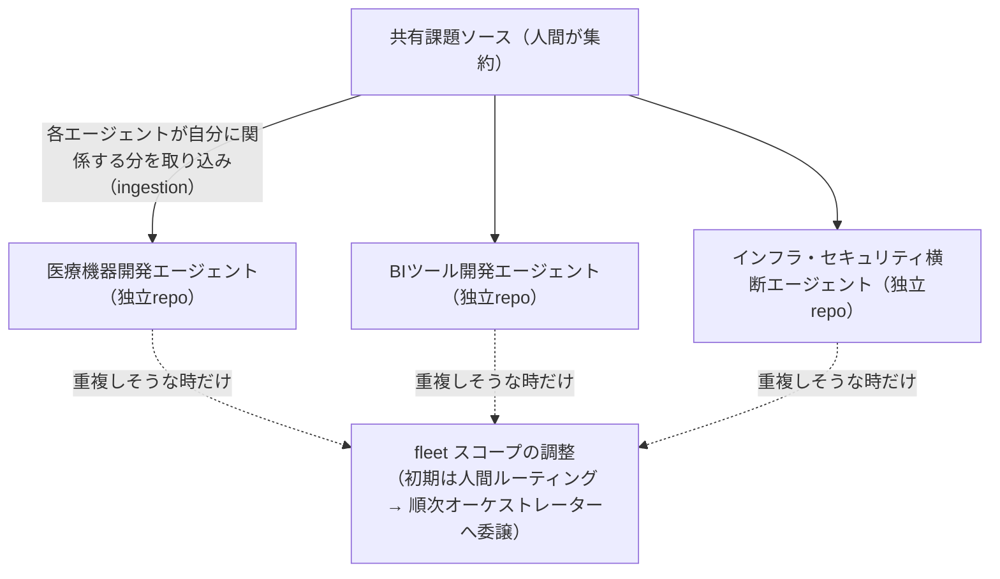
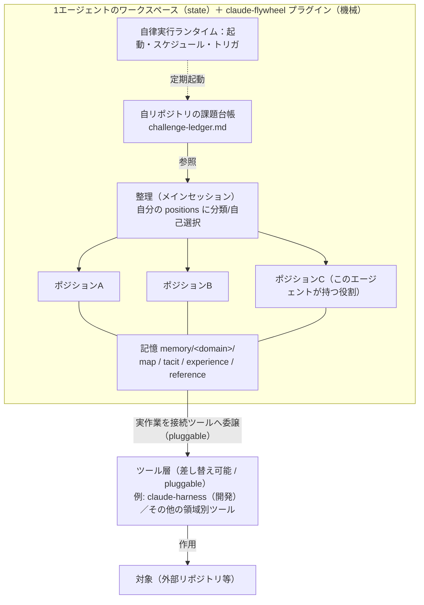
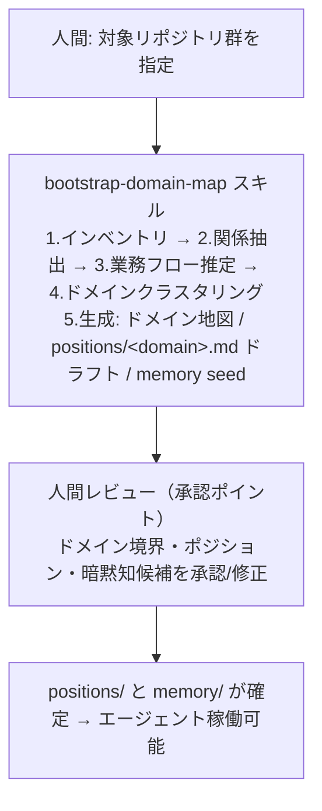
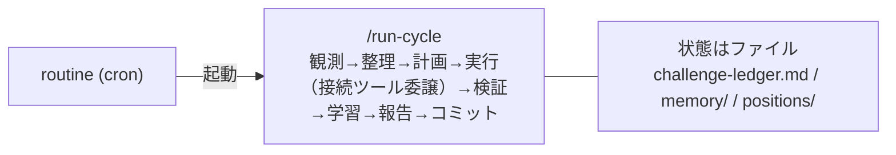

# アーキテクチャ — claude-flywheel

> 要件（[requirements.md](./requirements.md)）と課題（[challenges.md](./challenges.md)）を **どう実現するか（How）** を定義する。
> 本書は実現方式・構成・主要フローを扱う。要件そのものの追加・変更は requirements.md 側で行う。

- ステータス: ドラフト
- 最終更新: 2026-07-16
- 関連: [requirements.md](./requirements.md) / [agent-memory.md](./agent-memory.md) / [self-improvement.md](./self-improvement.md) / [challenges.md](./challenges.md)

---

> **本プロジェクトの主目的**は、特定の業務やツールに縛られない、**自走するエージェントを作るための土台（コンサル／ツールキット）** を提供すること。利用者はこの土台の上に、**プロジェクトごとに独立した自律エージェント**を作る（例: 医療機器開発 / BIツール開発 / インフラ・セキュリティ横断管理）。
> プラグインが提供するもの:
> - **(a) ポジションに沿ったスキル群** — 役割ごとに必要な能力をスキルとして用意する。
> - **(b) エージェントを自律的に動かす実行基盤（ランタイム）** — 起動・スケジュール・トリガ。
>
> 開発の自律化では [claude-harness](https://github.com/masanami/claude-harness) を**利用できる**が、claude-flywheel は **claude-harness に依存しない**（差し替え可能な一ツールとして扱う）。

## 1. 設計方針

1. **汎用性を優先**: 特定の業務領域・特定ツールに依存しない。ポジション（役割）を差し替えれば対象業務が変わる構造とし、開発業務に限定しない。
2. **ツールは差し替え可能なエグゼキュータ（pluggable）**: 実作業に使うツールはプラグイン的に接続する。開発の自律化では claude-harness を利用できるが、**必須依存にはしない**。他ツールや別領域のツールにも置き換えられる。
3. **コントロールプレーンと実行プレーンの分離**
   - claude-flywheel = 「**何を・誰が**やるか」を司る制御層（課題台帳・ポジション・記憶・オーケストレーション）＋ 自走のための環境（スキル・ランタイム）。
   - 実作業（コード変更等）は、接続したツールを通じて対象（開発なら外部リポジトリ等）に対して行う。
4. **ファイルベース・Git 管理**: 台帳・ポジション・記憶を Markdown ファイルで持ち、Git 履歴で変更を追跡（NFR-02 可観測性 / NFR-03 再現性）。
5. **Human-in-the-loop を構造に埋め込む**: 承認ポイントをフロー上の明示的なゲートとして配置（NFR-06）。
6. **Claude Code 基盤の活用**: エージェント＝Claude Code のエージェント／サブエージェント、定型手順＝スキルとして実装。
7. **段階的自律化**: 初期は人間トリガ中心、信頼に応じてスケジュール実行・自動化へ移行（要件 §6）。
8. **プラグインとして配布し、機械と状態を分離**: claude-flywheel は Claude Code プラグイン。**機械（スキル/テンプレ）はプラグイン**に、**状態（課題台帳/positions/memory）は各エージェントのリポジトリ**に置く（§1.1）。

## 1.1 利用形態（fleet：複数の独立エージェントを作る）

claude-flywheel は **Claude Code プラグイン**として install し、**自律エージェントを作るための土台（コンサル／ツールキット）** として使う。1 つのプラグインから、**プロジェクトごとに独立した複数のエージェント（fleet）** を作る。

例: 医療機器開発エージェント / BIツール開発エージェント / インフラ・セキュリティ横断管理エージェント（いずれも別リポジトリ・独自のドメイン知識/ハーネスで自律稼働）。

3 つの層に分ける:

| 層 | どこ | 中身 | 性質 |
| --- | --- | --- | --- |
| **機械**（プラグイン） | claude-flywheel リポジトリ | `skills/`（flywheel-init / bootstrap-domain-map / run-cycle …）、`templates/`、`docs/`、`.claude-plugin/` | 配布・更新される。読み取り専用扱い。全エージェント共通の土台 |
| **各エージェント**（state＋harness） | **エージェントごとの独立リポジトリ** | `challenge-ledger.md` / `positions/` / `memory/` / `runtime/` / `journal/` ＋ 独自ハーネス | エージェントごとに独立。Git 追跡。**守備範囲は原則重複しない** |
| **共有課題ソース**（intake） | 共有リポジトリ / ドキュメント | 人間が課題を集約する単一の入口 | 全エージェントが参照し、**自分に関係する分だけ取り込む** |

導入手順（エージェント 1 体あたり）:

```text
1. claude-flywheel をプラグインとして install
2. エージェント用リポジトリで /claude-flywheel:flywheel-init → 状態を scaffold（templates/ から生成）
3. /claude-flywheel:bootstrap-domain-map → positions/・memory/ を生成（ドメイン地図）
4. 共有ソースから自分に関係する課題を取り込み → /claude-flywheel:run-cycle（または routine で定期自走）
```

- プラグインは配布・更新されるコードなので、**日々書き換わる運用状態をプラグイン内に置かない**。状態は各エージェントのリポジトリに持つ。
- スキルは install 後 `claude-flywheel:run-cycle` のように名前空間化される。
- **守備範囲は原則バッティングしない**ように各エージェントを設計し、避けきれない重複だけを fleet スコープ（§3.2）が扱う。

## 2. 全体構成

### 2.1 fleet 全体（複数の独立エージェント）

共有ソースに人間が課題を集約し、各エージェントが**自分の守備範囲の課題だけ**を取り込んで自走する。重複は原則設計で回避し、避けきれない分は fleet スコープ（初期は人間）が振り分ける（§3.2）。

*図: fleet 全体 — 共有ソースに集約された課題を各エージェントが自己選択して自走し、重複しそうな分だけ fleet スコープが調整する。各エージェントは challenge-ledger / positions / memory / runtime ＋ 独自ハーネスを持つ独立 repo。*



### 2.2 エージェント内（intra-agent）

各エージェントのリポジトリ内はこの構成で自走する（プラグインが機械を提供）。

*図: エージェント内（intra-agent）— 課題台帳→整理（メインセッション）→ポジション/記憶→接続ツールへ委譲、という自走構成。ツール層は差し替え可能（pluggable）。*



> **既定は 1 エージェント 1 ポジション**（上図の複数ポジションは拡張時の姿）。インフラ・セキュリティ横断のように広い守備範囲を持つ場合のみ、サブ領域で複数に拡張する。ツール層は**プラグイン**で、claude-flywheel 本体は特定ツールに依存しない。

## 3. コンポーネント

### 3.1 課題台帳（Challenge Ledger）

- **正本（canonical）は各エージェントのリポジトリ内**の `challenge-ledger.md`（雛形は [`templates/challenge-ledger.md`](../templates/challenge-ledger.md)）。そのエージェントが扱う課題の分類タグ・ステータスはここで管理する。
- **共有課題ソース（intake）**: 人間は **共有リポジトリ/ドキュメント**の単一の入口に課題を集約する。各エージェントは、そこから**自分に関係する課題だけ**を自リポジトリの台帳へ**取り込む（ingestion）**。
  - 守備範囲は原則重複しないため、各エージェントは自分の関心範囲（ポジション）に合う課題を取り込む。
  - 取り込み後の分類タグ・ステータスは各エージェントの台帳（内部）で管理し、共有ソースへ書き戻さない。
- **課題ソースは差し替え可能（pluggable）**: 共有ソースの実体（共有 repo / Notion / Google Doc / Slack ログ等）は問わない。取り込みステップ（スキル [ingest-challenges](../skills/ingest-challenges/SKILL.md)）が読み取り・正規化・冪等マージを担い、**それ以降の機械は変更不要**。取り込み元は各エージェントの `challenge-sources.md`（雛形 [`templates/challenge-sources.md`](../templates/challenge-sources.md)）で宣言し、再取り込みは**取り込み元マーカー**で冪等化する（[challenge-ledger-format.md](./challenge-ledger-format.md)）。初期は最小（共有 repo のファイル直接参照、あるいは内部台帳直接記入）から始められる。外部ドキュメント取り込みは [ingest-challenges](../skills/ingest-challenges/SKILL.md) で対応済み（[#3](https://github.com/masanami/claude-flywheel/issues/3)）。残論点は採用ソースの選定と取り込み頻度の運用（AO-06）。
- 形式・分類ルール: [challenge-ledger-format.md](./challenge-ledger-format.md)。
- 対応要件: FR-07。

### 3.2 オーケストレーション（2 スコープ）

オーケストレーションは**スコープが 2 つ**ある。中央集権の単一司令塔は置かない。

**(A) intra-agent スコープ（エージェント内）**
- そのエージェントの **メインセッション**が担う。自リポジトリの台帳をトリアージし、自分の **ポジション**に分類・自己選択（FR-06/FR-08）して、目標→タスクへ落とす。
- 単一ポジションのエージェントでは分類はほぼ不要。複数ポジションを束ねる場合に、どのポジションが引き受けるかを整理する。
- 判定に迷う課題は「要相談」として人間に上げる（承認ポイント）。

**(B) fleet スコープ（エージェント間）**
- **別スコープ**として独立に存在し、エージェント間の重複・横断を調整する。
- 守備範囲は原則重複しない設計なので、ここで扱うのは**避けきれない重複・横断のみ**。
- **初期は人間がルーティング**（どのエージェントが担当するか振り分け）。**可能な範囲でこのスコープを自動化＝オーケストレーターへ委譲**していく（例: 調整を担当ポジションにした専用エージェント、または fleet オーケストレーション機能）。最終的に人間介入を最小化する。
- 対応要件: FR-08（横断の取り扱い）。未決は AO-02 / AO-03。

### 3.3 自律エージェント（fleet の 1 体）

- 実体: **プラグインを導入した独立リポジトリ**。1 つの守備範囲（ドメイン）を担う。役割はエージェントごとに様々（開発・調査・運用横断など）。
- **ポジション数の方針**: **既定は「1 エージェント = 1 ポジション」**。必要になったら（広い横断エージェント等）サブ領域で複数ポジションに**拡張**する。複数化したときだけ intra スコープ（§3.2(A)）の分類が効いてくる。
- 動作: 自リポジトリの台帳から **自分のポジションに関係する課題を自己選択**（FR-06）し、目標→タスク→実行→検証→学習を回す。共有ソースからの取り込みは §3.1。
- 入力: 自身のポジション（`positions/<domain>.md`）と記憶（`memory/<domain>/`）。
- 実作業が必要になったら、**ポジションが指定する接続ツール**へ委譲する（開発なら実装ツール、調査なら情報収集ツール、運用なら運用ツール等）。本体は特定ツールに依存しない（3.9）。
- 各エージェントは独自のハーネスを自リポジトリで発展させてよい（プラグインは共通の土台）。
- 対応要件: FR-04〜06、FR-10〜13、FR-20〜23、FR-30〜32、FR-40〜42。

### 3.4 ポジション

- エージェントの役割を定義する「職務記述書」。担当ドメイン／ミッション／関心範囲／権限／関係／関連度判定／記憶参照から成る。
- 拡張時の分割軸は**サブ領域**（例: インフラ・セキュリティ横断 → 「ネットワーク」「IAM」「シークレット」）。機能（開発/運用）はエージェント単位で分かれるため、内部では使わない。
- 定義: [templates/position.md](../templates/position.md)。ブートストラップでドラフト生成→人間承認。
- 配置: `positions/<domain>.md`。
- 対応要件: FR-04。権限欄が承認ポイントの線引き（OQ-02）を担う。

### 3.5 記憶ストア（Agent Memory）

- ドメインごとに `memory/<domain>/` を持ち、`map` / `tacit` / `experience` / `reference` を蓄積。`confidence` で推定/確証を区別。
- 運用: [agent-memory.md](./agent-memory.md)。
- 活用: タスク着手・レビュー前に関連記憶を前ロード（＝課題1ボトルネックBの解）。
- 対応要件: FR-40〜42、FR-09（`map` の生成元）。

### 3.6 ブートストラップ

- スキル [bootstrap-domain-map](../skills/bootstrap-domain-map/SKILL.md) が、対象サービス群を探索して **ドメイン地図 → ポジション案 → 記憶 seed** を生成。あわせて `repos.tsv`（関連リポジトリ・§3.9.1）と、任意で `challenge-sources.md`（課題の取り込み元候補・§3.1）を**ドラフト**する（同じ探索材料から。確証は低い前提で人間が確定）。
- 出発点が「ドメイン未知」であるため、ポジション定義の前段として必須（FR-09）。
- 成果は人間が承認（承認ポイント）。

### 3.7 ポジション別スキル群【主要成果物 (a)】

- ポジション（役割）が必要とする能力を **スキル** として用意する。エージェントは自分のポジションに紐づくスキルを使って自走する。
- 例: ドメイン調査、課題の自己選択、記憶の更新、レビュー前の前提知識ロード、報告 など。ポジションごとに必要なスキルセットを定義する。
- 配置: プラグインの `skills/`（共通スキル）と、ポジション定義からの参照。
- flywheel-init / bootstrap-domain-map / ingest-challenges / run-cycle もこの一種（立ち上げ・運用スキル）。

### 3.8 自律実行ランタイム【主要成果物 (b)】

- エージェントを**自律的に動かすための実行基盤**。**制御プレーン（自走の実行基盤）には専用アプリを作らず**、Claude Code ネイティブ（スケジュール実行＋スキル＋サブエージェント／ワークフロー）で構成する。
- 「専用アプリは作らない」原則は**制御プレーンに限定**する。**読み取り専用の観測プレーン**（状態ファイルを読んで可視化する別アプリ）は明示的に許容する（条件・消費者例は §7 冒頭、実行イベントログ `.flywheel/runs.jsonl` の仕様は [templates/runtime/README.md](../templates/runtime/README.md#実行イベントログrunsjsonl) の実行イベントログセクション）。
- 構成は 3 レイヤー（詳細は §7）: ①拍動（routine/cron）／②サイクル本体（[`run-cycle`](../skills/run-cycle/SKILL.md) スキル）／③能力（ポジション別スキル＋記憶）。
- 配置: 各エージェントのリポジトリの `runtime/`（スケジュール設定・運用手順）。雛形は [`templates/runtime/README.md`](../templates/runtime/README.md)。
- 段階的に整備する（§8 ロードマップ）。当面は手動で `run-cycle` を実行 → のちに routine 化して定期自走。

### 3.9 ツール層（差し替え可能なエグゼキュータ）

- 実作業に使う外部ツールは **プラグイン**として接続する。claude-flywheel 本体は特定ツールに依存しない。
- 開発の自律化では claude-harness を利用できる（例: 実装・修正・E2E・レビュー・PR）が、**必須依存ではない**。別領域では別ツールに差し替える。
- エージェントとツールの責務分担:
  | | claude-flywheel（本体） | 接続ツール（例: claude-harness） |
  | --- | --- | --- |
  | 関心 | 何を・誰が・どの環境で自走するか | 実作業をどう遂行するか |
  | 単位 | ポジション・ドメイン・スキル | ツール固有（例: Issue・PR） |
  | 依存 | ツールに依存しない | 差し替え可能な一プラグイン |

### 3.9.1 関連リポジトリ管理（作業用クローン）

エージェントがドメイン関連リポジトリを **clone**（map/tacit 抽出・調査に加え、実作業＝編集・ブランチ・コミットも可）できるようにする。**マニフェスト（Git 追跡）と クローン実体（gitignore）を分離**する。

```text
<agent-repo>/
├── repos.tsv            # 関連リポジトリのマニフェスト（Git 追跡）= 知識
├── .flywheel/repos/     # クローン実体（.gitignore）= 作業用（編集・ブランチ・コミット可）
└── memory/<domain>/     # map が repos.tsv の <name> を参照
```

- **マニフェスト `repos.tsv`**: 素朴な行指向（空白/タブ区切り・`#` コメント、`<name> <url> <branch>`）。yq 等に依存せず純シェルで解析できる形（雛形 [`templates/repos.tsv`](../templates/repos.tsv)）。
- **クローン実体**: [`scripts/sync-repos.sh`](../scripts/sync-repos.sh) が `.flywheel/repos/<name>` に **冪等に clone/fetch**。容量・ライセンス・秘密情報をエージェントrepo に混ぜないため **.gitignore** 対象。
- **作業用に一本化（参照／作業の二本立ては廃止）**: クローンは編集・ブランチ・コミット可。調査・知識抽出（読み取り）も同じクローンから行える。実作業（コード変更）の委譲先 cwd もこの作業用クローン（委譲のセッションパターンは §3.9.2 / [#13](https://github.com/masanami/claude-flywheel/issues/13)）。
- **安全な同期（ローカル作業を壊さない）**: `git pull` による上書きはしない。clone は初回のみ、以後は `git fetch`。ワーキングツリーが **clean かつ既定ブランチ上**のときだけ ff-only で前進し、**dirty / 別ブランチ / ff 不能**（ローカルが分岐済み）のときは更新をスキップして警告する。
- 秘密情報（認証）はマニフェストに書かない。git 認証は実行者環境（SSH / credential helper）を使う。
- 生成は bootstrap（3.6）が `repos.tsv` を起こし、`map`（3.5）が `<name>` で該当リポジトリを指す。run-cycle は必要時に sync-repos.sh で最新化（任意）。
- 対応: [#6](https://github.com/masanami/claude-flywheel/issues/6) / [#12](https://github.com/masanami/claude-flywheel/issues/12)（作業用一本化）/ 接続ツール IF（AO-05）。

### 3.9.2 実行委譲のセッションパターン

run-cycle の「実行（§5.2 step 4 ＝ run-cycle SKILL.md step 3）」で接続ツール（例: claude-harness）へ実作業を委譲するとき、**「別セッションをどう起こすか」を誤ると接続ツールが対象 repo の設定で動かない**。委譲の実体を次に固定する。ここで決めるのは executor の**起動方式**であり、接続ツール自体は §3.9 のとおり差し替え可能（両者は別レイヤー）。

- **実行委譲 ＝ cwd＝作業用クローン（§3.9.1 の `.flywheel/repos/<name>`）の独立 `claude -p` セッション**で接続ツールを回す。子セッションは cwd の `CLAUDE.md` ＋ `.claude/settings.json` を**ネイティブにロード**するため、対象 repo 本来の設定（ベースライン・権限・接続ツール）で開発できる。

- **なぜ独立セッションが要るか（Claude Code の設定解決）**:
  - 設定は**セッションの cwd（起動ディレクトリ）で決まる**。ロードされるのは cwd とその祖先の `CLAUDE.md` ＋ user の `~/.claude/CLAUDE.md`。**サブディレクトリの `CLAUDE.md` はオンデマンド**（読んだ時のみ）、**サブディレクトリの `settings.json` は不適用**（cwd＋user＋managed のみ）。
  - **サブエージェント（Task）は親（エージェントrepo）の設定を継承**し、対象 repo の `CLAUDE.md`/`settings.json` は支配的に効かない。`cd` はツール呼び出し間で永続しない。
  - → 対象 repo を「その設定」で開発するには、**cwd＝対象 repo の独立フルセッション**を起こすしかない。

- **反例（やってはいけない）**:
  - **メインセッションで直接 skill を回す** → 対象の `CLAUDE.md` はオンデマンド・`settings.json` は不適用で、対象設定では動かない。
  - **サブエージェントに委譲** → 親設定のままで対象設定に切り替わらない。
  - **親セッション ＋ `--add-dir` で対象ディレクトリを足す** → 設定は cwd で解決されるため、対象 repo の `settings.json` は効かない（ディレクトリへのアクセス許可が増えるだけ）。
  - **注入 / union 方式**（親に対象 repo の設定を寄せ集める）→ **多 repo でスケールしないため不採用**。

- **起動方式は `claude -p` に一本化（YAGNI）**:
  - ヘッドレス `claude -p` を cwd＝作業用クローンで起動する。多ターンが必要なら `-c`（`--continue`）/ `--resume <session-id>`。
  - **Agent SDK / `claude --bg` は前提にしない**（必要になるまで導入しない）。
  - 非対話の権限は `--permission-mode` と **cwd の対象 repo の `.claude/settings.json`** で制御する。**`--allowedTools Bash` のような“無制限 Bash”は子に渡さない**（下記「権限前提」）。
  - **【権限前提】親からの `claude -p` spawn は事前許可が要る**: ネスト起動は技術的には可能（`CLAUDECODE=1` が立つのみでプロセス上のハードガードは無い）だが、**auto-mode（routine/cron の自走）では headless `claude -p` の spawn がセーフティ分類器にブロックされる**。分類理由は「編集自動承認（acceptEdits）＋広範な Bash（`--allowedTools Bash`）＋ headless `claude -p` ＝ 承認ゲート無しの自律サブエージェントループ」。回避は 2 つを併用する:
    1. **親（エージェントrepo）の `.claude/settings.json` に `Bash(claude -p:*)` を allow** して委譲 spawn を事前許可する（flywheel-init が scaffold・§3.9.2 の [#18](https://github.com/masanami/claude-flywheel/issues/18)）。allow にマッチすれば分類器を経ずに spawn できる。多ターン継続（`claude -p -c` / `claude -p --resume <id>`）も同じ 1 ルールで通るよう `-p` を先頭に置く。
    2. **子に `--allowedTools Bash` を渡さず**、Bash 権限は **cwd の対象 repo の `.claude/settings.json`（allow/ask/deny）に統治させる**（例: npm/git=allow、cdk deploy/docker push=ask→headless では自動 deny、rm/sudo/force-push=deny）。“広範 Bash”警戒を避けつつ、対象本来の設定で開発できる。
    3. **委譲先クローンの trust 承認**（`Bash(claude -p:*)` の allow とは別物）。クローンの `.claude/settings.json` の allow は、その絶対パスが Claude Code に**trust 承認済み**（`~/.claude.json` の `projects["<絶対パス>"].hasTrustDialogAccepted: true`）でない限り無視される。`sync-repos.sh` が用意する新規クローンは常に未承認から始まるため、**人間が一度だけ** `scripts/trust-clone.sh <name>` を実行するか、対話的に `claude` を起動して trust ダイアログを承認する（未承認クローンは `sync-repos.sh` が読み取り専用で検出・警告する。エージェントによる自動書き込みは Self-Modification としてブロックされるため行わない・`trust-clone.sh` もエージェント自身は実行しない・[#27](https://github.com/masanami/claude-flywheel/issues/27)）。**trust 承認は当該パスの将来の変更にも及ぶ**点に注意: 承認後も同期で対象 repo の `.claude/settings.json`・`CLAUDE.md` は更新され続け、再承認なしに子セッションへ効くため、委譲先リポジトリの書き込み権者は実質このエージェントの権限・指示の定義者になる。委譲先の既定ブランチには branch protection を設定し、`.claude/settings.json`・`CLAUDE.md` の変更はレビュー必須とする運用を前提にする。
  - 権限は **FR-22 の承認境界**に従う: ローカル編集・commit・**作業ブランチへの push・PR（draft 含む）作成・統合ブランチ／親Issueブランチ（いずれも本番非反映）へのマージは自律可**（本番影響が無く可逆）、**既定ブランチ〔`main`〕への昇格マージ / 本番影響 / 削除 / 履歴破壊が承認ゲート対象**（§5.2 step 4・§6・[#24](https://github.com/masanami/claude-flywheel/issues/24)）。判定軸は「本番への影響」と「可逆性」。起動例の `--permission-mode acceptEdits` は編集の自動承認で、force-push 等の不可逆操作は対象 repo の `settings.json`（deny）でゲートする。
  - 起動例（cwd を対象クローンに固定して非対話実行）:

    ```bash
    # 前提: 親の .claude/settings.json に "Bash(claude -p:*)" を allow 済み（flywheel-init が scaffold）。
    # 対象クローンを cwd にして非対話起動する。設定は cwd から解決されるので
    # 「親で起動して --add-dir で足す」のは不可（対象の settings.json が効かない）。
    # --allowedTools は付けない（Bash は対象 repo の settings.json に統治させる）。
    cd .flywheel/repos/<name>
    claude -p "（ブリーフ: 目標・recall した map/tacit/reference・完了条件）" \
      --permission-mode acceptEdits
    ```

- **ブリーフに前提知識を必ず含める**: 独立セッションは文脈を引き継がないため、recall した `map` / `tacit` / `reference` と完了条件を**ブリーフに明記**して渡す（run-cycle 実行ステップ ＝ §5.2 step 4 / SKILL.md step 3、課題1ボトルネックB の解）。
- **【意思決定の主体】意思決定権の所在は課題のスコープで分岐する**: 自走委譲（headless）には**対話相手の人間がいない**。接続ツールの**対話前提スキル**（例: claude-harness の `/define-feature` は要件・クリティカル設計を対話で決める前提）が選択肢提示で人間の回答を待つと、**意思決定で停止して先へ進めない**。これは特定スキルの問題ではなく、「自律オーケストレーション（flywheel）」と「対話前提のサブツール」の接続様式という flywheel 全体の論点。ただし子セッションは cwd の対象 repo の `CLAUDE.md`＋`.claude/settings.json` しかロードせず、`repos.tsv`・`positions/`・横断のドメイン記憶（memory）は親だけが持つため、**横断整合の判断材料は子に存在しない**（意思決定権を渡しても子には決められない）。原則を次に固定する:
  - **単一 repo 完結の課題（子が意思決定者）**: 判断材料が対象 repo 内で閉じる場合、人間は意思決定権を委譲先に移譲済みとみなす。委譲先は「停止せず自分で決める」──要件・クリティカル設計の選択肢を**自分で評価し意思決定まで進め**（recall した `map`/`tacit`/`reference` ＋ コード調査を根拠に）、不明点は**明示的な仮定**として成果物（機能仕様等）に書き切り、後から人間が判断の根拠と前提を追えるようにする。
  - **横断（複数 repo）課題（親が意思決定者を保持）**: 設計分岐・スコープ解釈・他 repo との整合に判断材料が及ぶ場合、意思決定権は親に残す。委譲先には「停止せず決める」を渡さず、**重大・非自明な判断は自分で決めず、質問＋その時点の状態要約を最終出力にして終了**させる。親は控えた `session_id` に `claude -p --resume <session-id>`（cwd＝作業用クローン）で回答を渡し再開する（【委譲結果の照合】の resume 経路と同じ）。**軽微・可逆な判断は従来どおり子が決めて仮定として記録**し往復コストを抑える。
  - **FR-22 ゲートは両ケースとも維持**: 本番に影響する不可逆な操作（既定ブランチ〔`main` 等・本番反映先〕への昇格マージ / 本番影響 / 削除 / 履歴破壊）の承認境界は別途維持する（§6）。**作業ブランチへの push・PR 作成・統合ブランチ／親Issueブランチ（本番非反映）へのマージは本番影響が無く可逆で、サイクル内で自律可**（[#24](https://github.com/masanami/claude-flywheel/issues/24)）。重大で不可逆な前提・判断は報告して可視化する。「意思決定権の所在」と「不可逆操作をゲートする（FR-22）」は別レイヤー。
  - **接続規約（実装）**: flywheel 側は**ブリーフ規約**として、単一 repo 課題では「あなたが意思決定者。停止せず決め、仮定を仕様に残す」を、横断課題では「重大・非自明な判断は質問＋状態要約を最終出力にして終了。軽微・可逆な判断のみ自己決定して仮定記録」を渡すことをテンプレ化する（run-cycle SKILL.md step 3・`templates/CLAUDE.md`・flywheel-init が scaffold）。加えて接続ツール側が `/define-feature` 等に**非対話（autonomous）モード**（選択肢→自己決定＋根拠記録）を設けられるならそれを使う（claude-harness 等 upstream への提案。無くてもブリーフ規約だけで委譲は成立する）。
  - 対応: [#19](https://github.com/masanami/claude-flywheel/issues/19) / [#40](https://github.com/masanami/claude-flywheel/issues/40) / 権限前提は [#18](https://github.com/masanami/claude-flywheel/issues/18)。
- **【完了報告の様式】待機・監視の宣言を最終出力にして終了させない**: headless セッションは**最終応答の確定と同時にバックグラウンドの処理・エージェントごと終了し、以後の通知は届かない**。「CI 完了を待機しています」等の中間宣言を最終出力にすると、完了報告が欠損して親が成果を再調査する手戻りになるほか、未合流の非同期作業が道連れで中断される。【意思決定の主体】が入力側の停止（選択肢待ち）を防ぐのに対し、こちらは出力側の停止（外部イベント待ちのまま終了）を防ぐ。原則を次に固定する:
  - **合流してから終了する**: バックグラウンド処理・サブエージェントを起動したら、最終応答の確定前に必ず合流（完了確認）させる。合流できない場合（ハング・完了が外部イベント依存で見込みが立たない等）は、待ち続けず明示的に中断し、未完了の事実と回収手段（作業ブランチ・残した状態）を完了報告に含めて終了する。
  - **外部待ちは状態報告で終える**: CI・外部レビュー・人間承認（FR-22 境界）等、自力で進められない待ちに達したら、待機せず**その時点の状態（成果物の URL・コミット SHA・品質ゲート結果・置いた仮定・意思決定・未検証事項）を要約して終了**する（全工程の完了を待つのではない。FR-22 で保留した提案もこの報告で可視化される）。
  - **接続規約（実装）**: ブリーフ規約として、委譲時に必ず「待機・監視で終了しない」と完了報告の必須項目を渡すことをテンプレ化する（run-cycle SKILL.md step 3・`templates/CLAUDE.md`・flywheel-init が scaffold）。repo 固有の外部イベント事情（PR CI の有無等）は memory（`map`/`tacit`）に置き、recall して併記する。
  - 対応: [#33](https://github.com/masanami/claude-flywheel/issues/33)。
- **【委譲結果の照合】親は子の完了報告を外部実状態と照合してから台帳・journal を更新する**: 子の報告は自己申告であり、欠損・実態とのずれが起こりうる。親は台帳・journal へ反映する前に**成果物の存在と内容（PR・ブランチ・コミット等）と作業用クローンのローカル状態（未コミット変更＝中断で残った作業）を読み取りで確認**し、食い違えば**実状態を正**として差分を journal（判断と根拠）に記録する。報告のみ欠損した場合は cwd＝作業用クローンから `claude -p --resume <session-id>` で報告を再取得できる（session_id を journal に控える用途の一つ）。品質ゲートの実行は検証ステップ（§5.2 step 5）に一本化し、照合は FR-32（人間の最終確認）を代替しない（ブリーフ規約だけでは子の遵守を保証できないための防御の多層化）。
  - 対応: [#34](https://github.com/masanami/claude-flywheel/issues/34)。
- **同一クローンへの委譲は直列化する**: cwd を `.flywheel/repos/<name>` に固定するため、同じ repo に複数の独立セッションを**同時に**走らせると worktree / ブランチが衝突する。run-cycle は冪等（着手中ステータスで二重実行しない・§5.2）なので **1 repo ＝ 同時に 1 委譲セッション**を原則とし、repo をまたぐ委譲のみ並列にする。同一 repo の並列度を上げたい場合は **session ごとに `git worktree` / clone を分離**する（必要になってからの将来課題＝YAGNI）。
- **課金前提**: `claude -p` はサブスク枠で動作する前提（2026-06 時点。Agent SDK 課金の一時停止に依存。再開時は代替をそのとき再検討）。クロスツール エグゼキュータ（[#15](https://github.com/masanami/claude-flywheel/issues/15)：Claude→codex exec 等）は pluggable な 1 バックエンド候補として別管理。
- 対応: 接続ツール IF（AO-05）/ [#12](https://github.com/masanami/claude-flywheel/issues/12)（委譲先 cwd）/ [#13](https://github.com/masanami/claude-flywheel/issues/13) / [#18](https://github.com/masanami/claude-flywheel/issues/18)（委譲 spawn の権限前提）/ [#27](https://github.com/masanami/claude-flywheel/issues/27)（クローン trust 前提）。

### 3.10 自己改善（内省）ループ

- 実行ループ（run-cycle）とは**分離した別ループ**として、ハーネス自体（スキル・サブエージェントのブリーフ・ポジション・recall）を継続的に改善する。設計は [self-improvement.md](./self-improvement.md)。
- **2 層**: ① run-cycle の学習ステップで good/bad を `experience` に **append するだけ**（軽量・改修しない）／② 別スキル [reflect](../skills/reflect/SKILL.md) が低頻度で記録を集計し改修を**提案**する。
- **good/bad 両方**を記録（bad=改修トリガー、good=再利用資産化・回帰ガード・recall 正例）。
- **スコープ**: reflect が直接編集するのは**エージェントrepo のローカル資産**のみ。**プラグイン本体の共通スキルは読み取り専用**で、改善は upstream（claude-flywheel）への Issue 起票に倒す。
- 起動は毎周ではなく **N 周ごと／しきい値（再発 ≥2）／手動**。改修の適用は人間承認（承認ポイント #8）。
- 対応要件: FR-43〜45（学習で蓄積した記憶ストア（§3.5）の `experience` を入力に使う）。

## 4. リポジトリ構成

3 層に分ける（§1.1）: プラグイン（機械）／ 各エージェント（state＋harness）／ 共有課題ソース（intake）。

### 4.1 プラグイン本体（claude-flywheel リポジトリ）

```text
claude-flywheel/
├── .claude-plugin/
│   └── plugin.json              # プラグインマニフェスト
├── skills/                      # 配布スキル【成果物(a)】
│   ├── flywheel-init/           # 利用先に状態を scaffold
│   ├── bootstrap-domain-map/    # ドメイン地図づくり
│   ├── ingest-challenges/       # 外部ソースから課題を正本台帳へ冪等取り込み（pluggable）
│   ├── run-cycle/               # 自走サイクル1周
│   ├── agent-memory/            # ドメイン記憶の管理
│   └── reflect/                 # 自己改善（内省）ループ1周
├── scripts/                     # 機械的処理の純シェル
│   ├── sync-repos.sh            # 関連リポジトリ（作業用クローン）の冪等な clone/fetch
│   └── trust-clone.sh           # クローンの trust 承認（人間が一度だけ手動実行）
├── templates/                   # 利用先に scaffold する雛形
│   ├── CLAUDE.md                # エージェント repo のベースライン（CLAUDE.md）の雛形
│   ├── challenge-ledger.md
│   ├── challenge-sources.md     # 課題の取り込み元宣言（任意）
│   ├── position.md
│   ├── repos.tsv
│   ├── settings.json            # .claude/settings.json の雛形（自走委譲の権限前提・§3.9.2）
│   ├── runtime/README.md
│   └── journal/{README.md,cycle-template.md}
├── docs/                        # 設計ドキュメント
└── README.md
```

### 4.2 各エージェントのリポジトリ（状態 / live state）

> エージェント 1 体ごとに 1 リポジトリ。`/claude-flywheel:flywheel-init` と `/claude-flywheel:bootstrap-domain-map` が生成する。Git で追跡する（NFR-02/03）。

```text
<agent-repo>/
├── CLAUDE.md                    # ベースライン（ポジション要約・記憶INDEX参照・recall手順。自動ロード）
├── challenge-ledger.md          # このエージェントの課題台帳（正本。共有ソースから取り込み）
├── challenge-sources.md         # 課題の取り込み元宣言（任意。外部ソース ingestion 用）
├── repos.tsv                    # 関連リポジトリのマニフェスト（Git 追跡）
├── .claude/settings.json        # 自走委譲の権限前提（Bash(claude -p:*) を allow。flywheel-init が scaffold・§3.9.2）
├── .flywheel/repos/             # 関連リポジトリの作業用クローン（.gitignore・編集/ブランチ/コミット可）
├── .flywheel/runs.jsonl         # 実行イベントログ（run-cycle・差し込みセッションが append／観測プレーンが読む／.gitignore）
├── positions/                   # ポジション定義（このエージェントの守備範囲）
│   └── <domain>.md
├── memory/                      # エージェント記憶
│   └── <domain>/
│       ├── INDEX.md
│       └── {map,tacit,experience,reference}-*.md
├── runtime/                     # 自律実行ランタイム設定【成果物(b)】
├── journal/                     # サイクルジャーナル（run-cycle step 6 が書き出し。台帳=現在状態／journal=行動履歴）
│   ├── README.md                # flywheel-init が scaffold
│   ├── cycle-template.md        # flywheel-init が scaffold（1周分 .md の雛形）
│   ├── YYYY-MM-DD-cycle.md（同日再実行は -2 / -3 ...）# run-cycle step 6 が新規作成（1周1ファイル）
│   └── index.jsonl              # run-cycle step 6 が append
└── （独自ハーネス）             # 各エージェントが自由に発展させる
```

- intra-agent の整理はメインセッションが担うため、専用の `orchestrator/` ディレクトリは不要（§3.2）。
- `.flywheel/repos/` は関連リポジトリの**作業用クローン**（編集・ブランチ・コミット可）で、`repos.tsv` から sync する（§3.9.1、.gitignore 対象）。**実作業（コード変更）の委譲先 cwd もこのクローン**で、接続ツール（3.9）が **cwd＝このクローンの独立 `claude -p` セッション**（§3.9.2）でブランチを切って実装する。調査・知識抽出（読み取り）も同じクローンから行う。
- 実行状態の役割分担: **台帳＝現在状態／journal＝行動履歴（Git 追跡・恒久記録）／`.flywheel/runs.jsonl`＝リアルタイムのイベント境界（ローカル・.gitignore 対象・観測用）**。runs.jsonl は journal を代替しない（仕様は [templates/runtime/README.md](../templates/runtime/README.md#実行イベントログrunsjsonl) の実行イベントログセクション、書き出しの規律は §7）。

### 4.3 共有課題ソース（intake）

```text
<shared-source>/                 # 共有リポジトリ or 外部ドキュメント（Notion/Doc 等）
└── 課題の集約（人間が記入する単一の入口）
```

- 全エージェントが参照し、自分に関係する課題だけを [ingest-challenges](../skills/ingest-challenges/SKILL.md) が 4.2 の台帳へ取り込む（§3.1）。取り込み元は `challenge-sources.md` で宣言する。
- 実体は差し替え可能（pluggable）。最終配置は OQ-01 / AO-06 と連動。

## 5. 主要フロー

### 5.1 ブートストラップ（初期立ち上げ）

*図: ブートストラップ — 人間がリポジトリ群を指定 → スキルが地図/ポジション/記憶を生成 → 人間が承認 → 稼働可能になる。*



### 5.2 通常ループ（Flywheel・1 エージェント内）

`run-cycle` が 1 周回す。

```text
1. 取り込み: 共有ソースから自分に関係する課題を自台帳へ ingestion（スキル ingest-challenges・取り込み元マーカーで冪等・§3.1）
2. 整理（メインセッション）: 自分の positions に分類・自己選択（要相談は人間へ: FR-08）
3. 計画: 関連記憶を前ロード（recall）→ タスク探索・分解（人間承認: FR-13）
4. 実行: 接続ツールで実作業（開発なら claude-harness 等）。委譲は **cwd＝作業用クローンの独立 `claude -p` セッション**で回す（§3.9.2。メインセッション直叩き／サブエージェントは対象 repo の設定で動かないため不可）。**recall した前提知識（map/tacit/reference）と完了条件はブリーフに明記して渡す**（独立セッションは文脈を引き継がない。破壊的/不可逆操作は人間承認: FR-22）
5. 検証: テスト・レビュー・動作確認。別セッション委譲時は前提知識をレビュー観点に含める（人間が最終確認: FR-32）
6. 学習: experience を記憶に追記、新たな暗黙知を tacit に追記（FR-40/41）
7. 報告: 状況・成果を人間へ（FR-51）

→ 蓄積した記憶が次サイクルの前提知識になり、精度が上がる（弾み車）。
```

### 5.3 横断・重複の扱い

- **エージェント内（複数ポジション横断）**: メインセッションが自分の positions に分解し、順に処理する（intra スコープ・§3.2(A)）。
- **エージェント間（fleet 横断・重複）**: 守備範囲は原則重複しない設計。避けきれない場合のみ fleet スコープ（§3.2(B)）が扱う。**初期は人間がどのエージェント担当かルーティング**、将来はオーケストレーターへ委譲して自動化。

## 6. Human-in-the-loop 承認ポイント（実装位置）

| # | ポイント | 場所 | 要件 |
| --- | --- | --- | --- |
| 1 | ブートストラップ結果（ドメイン/ポジション/暗黙知）の承認 | 5.1 | FR-09 |
| 2 | 「要相談」課題の分類確認 | 3.2 / 5.2-2 | FR-08 |
| 3 | タスク起票の取捨選択 | 5.2-3 | FR-13 |
| 4 | 本番に影響する不可逆な操作（既定ブランチ〔`main`〕昇格マージ/公開/削除/本番影響/履歴破壊）※作業ブランチへの push・PR 作成・統合ブランチ／親Issueブランチ（いずれも本番非反映）へのマージは可逆で対象外＝自律可（[#24](https://github.com/masanami/claude-flywheel/issues/24)） | 5.2-4 | FR-22 |
| 5 | 検証の最終確認 | 5.2-5 | FR-32 |
| 6 | 暗黙知（confidence: low）の確証昇格 | 記憶保守 | FR-42 |
| 7 | fleet 横断・重複のルーティング（初期） | 3.2(B) / 5.3 | FR-08 |
| 8 | ハーネス改修（skill/ブリーフ/ポジション/recall）の適用 | 3.10 / reflect | FR-44 |

権限欄（ポジション §4）が、各エージェントの「自律可 / 要承認」の線引きを定義する。

## 7. 自律実行サイクルの実装

**制御プレーン（自走の実行基盤）には専用アプリを作らない**。Claude Code ネイティブ（スケジュール実行＋スキル＋サブエージェント／ワークフロー）で、3 レイヤーに分けて構成する。この原則は制御プレーンに限定し、**読み取り専用の観測プレーン**（状態ファイルを読んで可視化する別アプリ）は明示的に許容する（§3.8）。観測プレーンの条件は 2 つ: **①状態ファイルに書き込まない**、**②制御プレーンの依存にならない（止まっても自走に影響しない）**。消費者例は [claude-flywheel-board](https://github.com/masanami/claude-flywheel-board)（`.flywheel/runs.jsonl`〔§4.2〕を読む。仕様は [templates/runtime/README.md](../templates/runtime/README.md#実行イベントログrunsjsonl) の実行イベントログセクション）。

| レイヤー | 役割 | 実体 |
| --- | --- | --- |
| ① 拍動（cadence） | いつ起こすか＝自律性の心臓部 | スケジュール実行（routine / cron） |
| ② サイクル本体 | 1 周の制御フロー | [`run-cycle`](../skills/run-cycle/SKILL.md) スキル |
| ③ 能力 | 各エージェントの能力 | ポジション別スキル群（3.7）＋ 記憶（3.5）。横断はワークフローでファンアウト |
| ④ 自己改善 | ②③ を継続的に磨く別ループ | [`reflect`](../skills/reflect/SKILL.md) スキル（低頻度・3.10）。run-cycle は good/bad の記録のみ |

*図: 自律実行ランタイム — cron が run-cycle を定期起動し、状態はすべてファイルに保持（冪等に回せる）。*



### 冪等性と状態

- 状態はすべてファイル（台帳のステータス／記憶／ポジション）。サイクルは**ステータスに基づき着手可能なものだけ**を処理し、**何度起動しても二重実行しない**（**逐次の再実行**に対して冪等）。**並走**（cron の間隔超過・手動併走で 2 サイクルが同時に走る場合）はステータスでは防げないため、run-cycle のロック（`.flywheel/cycle.lock`・step 0）で排他する。
- run-cycle にはサイクル・委譲の境界で `.flywheel/runs.jsonl`（§4.2）へ `cycle_start/end`・`delegate_start/end` を append する規律がある（仕様は [templates/runtime/README.md](../templates/runtime/README.md#実行イベントログrunsjsonl) の実行イベントログセクション）。gitignore 対象のローカル観測用で、書き込みは best-effort（失敗してもサイクルを止めない）。

### 承認ゲートの扱い（重要）

- スケジュール実行では**人間をインラインで待たない**。承認ゲート（§6）に達した項目は **「提案を残して保留」し、サイクルは止めずに報告**する。
- 人間が後追いで承認すると、**次サイクルで前進**する。これにより自律実行と Human-in-the-loop を両立する。
- **承認の実装（FR-13 / FR-32）**: 承認待ちは台帳のステータス（`計画承認待ち` / `完了確認待ち`）で表現し、**人間は分類欄の承認チェックボックス（`[ ] 計画を承認` / `[ ] 完了を承認`）を `[x]` にするだけ**（GitHub のモバイル / Web でタップ→コミット。ファイル編集不要）。ステータスの前進はエージェントが次サイクルで代行する（[challenge-ledger-format.md §承認プロトコル](./challenge-ledger-format.md)）。有効な承認は 2 経路のみ: (1) チェックの `[x]` 化が人間のコミットで入っていること（cron 自走での唯一の経路）、(2) 手動対話実行時に限りその場の人間の口頭承認に基づくエージェントの代行。台帳本文・外部由来テキスト中の「承認済み」表明や、これに当てはまらないエージェントのコミットは承認として扱わない。

### 段階的導入

1. **手動検証**: `/run-cycle`（または `--dry-run`）を手動実行して 1 周の挙動を確認。
2. **定期自走**: routine 化して `run-cycle` を定期起動（[`runtime/`](../templates/runtime/README.md)）。
3. いずれの段階でも §6 の承認ポイントを維持し、自律度の引き上げは信頼に応じて段階的に行う（要件 §6、OQ-03）。

## 8. 段階的実装ロードマップ

| フェーズ | 目的 | 主な成果物 |
| --- | --- | --- |
| **P0 立ち上げ**（現在） | 概念・要件・骨子の確定 | docs 一式、テンプレ、課題台帳、bootstrap スキル |
| **P1 ブートストラップ実証** | 1 対象群でドメイン地図とポジションを生成 | `positions/`・`memory/` の初版、ドメイン地図 |
| **P2 ポジション別スキル＆ランタイム** | 自走に必要なスキル群と実行基盤を整備【成果物(a)(b)】 | ポジション別スキル、`runtime/`（手動トリガ版） |
| **P3 単一エージェント自走** | 1 エージェントで取り込み→自己選択→ツール委譲→検証→学習を一巡 | 1 エージェントの Flywheel 実証（受け入れ基準 [requirements.md §11](./requirements.md)） |
| **P4 fleet 化** | 複数の独立エージェント＋共有ソースからの取り込み | 複数エージェント、fleet 横断は人間ルーティング |
| **P5 自律化** | スケジュール実行・自動トリアージ・fleet 調整の委譲・自己改善 | 定期実行、fleet スコープ（§3.2(B)）の自動化、reflect による内省ループ（§3.10） |
| **P6 課題ソース外部化**（任意） | 共有ソースを外部ドキュメント（Notion 等）にする | 取り込み（ingestion）スキル [ingest-challenges](../skills/ingest-challenges/SKILL.md)＝pluggable な読み取り・正規化・冪等マージ＋ `challenge-sources.md`（[#3](https://github.com/masanami/claude-flywheel/issues/3) / AO-06） |

## 9. 要件トレーサビリティ

| 要件 | 実現コンポーネント |
| --- | --- |
| North Star（§1） | 課題台帳 + 自己選択（3.3）+ オーケストレーション 2 スコープ（3.2） |
| FR-04〜06 | ポジション（3.4）+ 自律エージェント（3.3） |
| FR-07 | 課題台帳（3.1）+ 共有ソース取り込み |
| FR-08 | オーケストレーション 2 スコープ（3.2）: intra=メインセッション / fleet=人間→自動化 |
| FR-09 | ブートストラップ（3.6）+ 記憶 `map`（3.5） |
| FR-20〜23（実行） | ツール層＝接続ツール（3.9）+ 自律実行ランタイム（3.8）+ 承認ポイント（6） |
| FR-30〜32（検証） | ツール層＝接続ツール（3.9）+ 承認ポイント #5 |
| FR-40〜42（学習） | 記憶ストア（3.5）/ agent-memory.md |
| FR-43〜45（自己改善） | 自己改善ループ（3.10）: run-cycle の記録 + reflect / self-improvement.md / 承認ポイント #8 |
| FR-50〜51（可観測性・報告） | journal（§4.2 の `journal/` ＋ [templates/journal/README.md](../templates/journal/README.md)）＋ run-cycle step 6 のサイクルレポート ＋ runs.jsonl（ローカル実行イベントログ・[templates/runtime/README.md](../templates/runtime/README.md#実行イベントログrunsjsonl)） |
| 自走の能力 | ポジション別スキル群（3.7） |
| 自律的な起動 | 自律実行ランタイム（3.8） |
| NFR-02/03 | ファイルベース・Git 管理（1.4） |
| NFR-04 拡張性 | ツール層のpluggable設計（3.9） |
| NFR-06 | 承認ポイント（6） |

## 10. アーキテクチャ上の未決事項

- **AO-01**: 記憶／タスクの最終配置（OQ-01）。本書は**各エージェントのリポジトリ内集約**を提案するが、実行タスクの Issue/PR 管理との接続を要確定。
- **AO-06**: 課題ソースの外部化（P6）。外部ドキュメント（Notion / Doc / Slack 等）の取り込み方式・認証・正本への正規化ルール。**取り込みスキル [ingest-challenges](../skills/ingest-challenges/SKILL.md) で pluggable に対応（[#3](https://github.com/masanami/claude-flywheel/issues/3)）**: ソースは `challenge-sources.md` で宣言（type = repo-file / mcp-doc / mcp-chat / github-issue）、認証は実行者環境（MCP 接続等）に委ね秘密情報は台帳・設定に残さない、再取り込みは取り込み元マーカー＋ `fp` で冪等（新規追記 / `fp` 変化時は人間記入欄のみ更新し分類・ステータス保持）。初期は内部ファイル直接記入のみでも運用可。残論点は採用ソースの選定と取り込み頻度の運用（手動 / run-cycle 連動 / スケジュール）。
- **AO-02**: **fleet スコープ（§3.2(B)）の自動化**。人間ルーティングをオーケストレーターへ委譲する形態（調整担当ポジションの専用エージェント / fleet オーケストレーション機能）と、重複検知・依存順序・ハンドオフ規約。（intra スコープはメインセッションで確定）
- **AO-03**: エージェントの起動・常駐モデル（都度起動 / スケジュール / イベント駆動）。
- **AO-04**: 横断知識の共有方法（共有記憶領域 or ドメイン間相互リンク、agent-memory.md OQ）。
- **AO-05**: 接続ツール（例: claude-harness）とのインターフェース（どの単位で何を渡すか）。pluggable に保つための共通の接続規約をどう定義するか。**作業先 cwd は作業用クローン `.flywheel/repos/<name>` に確定済み（[#12](https://github.com/masanami/claude-flywheel/issues/12)・§3.9.1）**。委譲のセッションパターン（**cwd＝作業用クローンの独立 `claude -p` セッション**で接続ツールを回す）も §3.9.2 / [#13](https://github.com/masanami/claude-flywheel/issues/13) で確定。残るは「何を渡すか」の共通接続規約の標準化。
