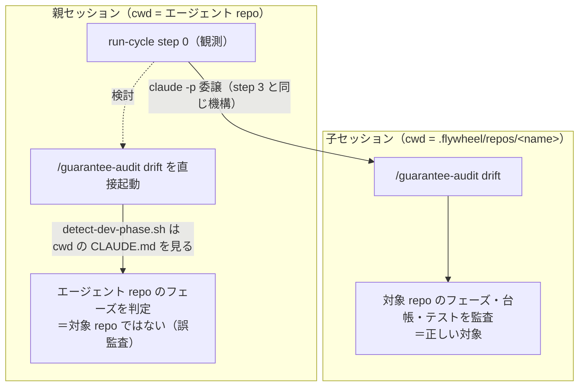

# GDD 意味ドリフト検知（`/guarantee-audit drift`）の run-cycle 接続設計（検討）

> **本ドキュメントのステータス: 検討（未決あり）。決定は人間。**
> claude-harness の GDD 導入（[masanami/claude-harness#152](https://github.com/masanami/claude-harness/issues/152)）P4 が指定する flywheel 側の接続課題（[#81](https://github.com/masanami/claude-flywheel/issues/81) / 台帳 C-012）について、4 つの検討事項に対する選択肢・比較・見解をまとめる。
> **本課題は claude-flywheel と claude-harness にまたがる横断課題**であり、設計分岐の最終決定は人間が行う。本ドキュメントは判断材料であって決定ではない（§7 の未決事項 Q-1〜Q-5 が決定待ち）。
> 本ドキュメントの時点では **run-cycle SKILL.md への変更は行っていない**（決定後に別途反映する。想定インパクトは §8）。

## 1. 確証した前提（2026-08-17 時点・実コード確認済み）

harness 側の実装は **P2 が main にマージ済み**（`e699251` / PR #163）。以下はローカルクローン `.flywheel/repos/claude-harness`（`e699251`）の実コードで確認した事実であり、推論ではない。

| ID | 事実 | 確証方法 |
| --- | --- | --- |
| F-1 | `/guarantee-audit` は `bootstrap` / `drift` の 2 モード。`drift` は **検出のみで修正しない**（台帳の正本・テスト・実装のいずれも書き換えず、コミット・PR・Issue 起票も行わない） | `skills/guarantee-audit/SKILL.md` 冒頭の明示的な禁止リスト |
| F-2 | `drift` は機械可読 JSON（`{mode, scope, phase, index, semantic, reverse_check, gap_candidates, human_review_required}`）＋人間向けサマリーを返す | `references/drift-mode.md` Step D5 |
| F-3 | 各工程は `analyzed` / `partial` / `not_analyzed` の 3 値を持ち、**「0 件」「下限」「未解析」を書き分ける**ことが規律として課されている。`partial` の集約値は網羅ではなく**下限** | `SKILL.md`「共通規約 / 部分成功の扱い」・`drift-mode.md` Step D5 |
| F-4 | フェーズ判定は `detect-dev-phase.sh` の出力のみを正とし、**各スキルが `CLAUDE.md` を独自に grep することを禁止**している（判定規約の重複実装を防ぐ＝D-16） | `SKILL.md` Step 1・`scripts/specs/detect-dev-phase.md` |
| F-5 | `drift` は `phase: gdd` で実行、`sdd` は**台帳があれば警告付きで実行・無ければ停止**、`invalid` / スクリプト実行不能は**停止**（`sdd` に読み替えない） | `SKILL.md` Step 1 の分岐表 |
| F-6 | `/guarantee-audit` は **対象リポジトリのパスを引数に取らない**（`argument-hint: <bootstrap\|drift> [--scope <base>..<head>]`）。`detect-dev-phase.sh` は cwd の `CLAUDE.md`、`guarantee-index-check` は `docs/guarantees.md`、`list-test-files` は cwd 起点で列挙する＝**監査は cwd 束縛** | `SKILL.md` frontmatter・Step 1・`drift-mode.md` Step D2/D4 |
| F-7 | harness のスクリプトは**ランチャー `claude-harness-run` 経由の呼び出しのみが allowlist 可能**（`Bash(claude-harness-run:*)` の 1 行）。絶対パス直接実行は permission ルールで書けない（実測済み・Issue #154 で 4 回再発） | `docs/script-launcher.md` §1 の実測表 |
| F-8 | 本エージェントワークスペース（`/Users/masami/Tom`）に **`claude-harness-run` は PATH 上に存在しない**（`which` が exit 1）。親の `.claude/settings.json` の allow は `Bash(claude -p:*)` の 1 行のみ | `which claude-harness-run` / `cat .claude/settings.json` |
| F-9 | GAP は **人間の台帳 PR でのみ採番・追記される**。drift が検出した項目は「Issue を起こし通常の実装フローで対応」が harness 側の想定 | `drift-mode.md` Step D4-4・Step D5 末尾 |
| F-10 | D4（逆方向チェック）は対象ファイル**全件**に `guarantee-auditor` を fan-out する（ファイル単位の事前絞り込みを明示的に禁止）。コストは対象ファイル数に比例 | `drift-mode.md` Step D4-2 |

flywheel 側の確証事実:

| ID | 事実 | 確証方法 |
| --- | --- | --- |
| F-11 | flywheel に CI・lint・test 基盤は無い。決定的スクリプトは `scripts/` の 4 本のみ（`cycle-lock.sh` / `log-run-event.sh` / `sync-repos.sh` / `trust-clone.sh`） | `ls scripts/` |
| F-12 | run-cycle は「**ツール非依存**」を明示原則とし、実作業は接続ツールへ委譲する（`claude-harness` は開発例の 1 つ） | `skills/run-cycle/SKILL.md` 冒頭 |
| F-13 | 対象 repo での実作業は **step 3 の cwd＝作業用クローンの独立 `claude -p` セッション**で行う。step 0 は親ワークスペース cwd での観測に閉じる | `skills/run-cycle/SKILL.md` step 0 / step 3 |
| F-14 | reflect は run-cycle からは呼ばれず、**start-day の締めジョブ**が `journal/index.jsonl` の行数でしきい値判定して起動する（`reflect.every_n_cycles` 既定 10） | `skills/start-day/SKILL.md` 手順 5-3・`skills/reflect/SKILL.md`「起動タイミング」 |
| F-15 | `.flywheel/*` は gitignore 対象（`.flywheel/cadence.json` のみ negate で追跡）。`runtime/README.md`・`journal/` は追跡済み | `/Users/masami/Tom/.gitignore` / `git ls-files` |
| F-16 | ingest-challenges は「**入力＝外部（人間が課題を書く場所）、正本＝内部**」の ingestion であり、外部キー＋`fp`（人間記入欄の SHA-256 先頭 12 桁）で冪等マージする。分類欄は埋めない | `skills/ingest-challenges/SKILL.md` |

## 2. 前提から導かれる制約

F-6・F-13 から、本課題の設計空間はかなり強く絞られる。

*図: 監査の cwd 束縛（F-6）が組み込み位置を決める — 親セッションで直接起動すると誤った repo を監査する*



| ID | 制約 | 根拠 |
| --- | --- | --- |
| K-1 | **監査は cwd＝対象クローンで実行するほかない**。親セッションから `/guarantee-audit drift` を Skill 起動すると、`detect-dev-phase.sh` は親（エージェント repo）の `CLAUDE.md` を、`list-test-files` は親のファイル群を見る＝別の repo を監査してしまう | F-6 |
| K-2 | **親が `detect-dev-phase.sh` を直接呼ぶ経路は現状塞がっている**。ランチャーが PATH に無く（F-8）、絶対パス直接実行は allowlist できない（F-7）。仮に通しても、flywheel が harness プラグインの配置に依存することになりツール非依存原則（F-12）に反する | F-7・F-8・F-12 |
| K-3 | **flywheel 側に決定的スクリプトを足す判断基準は「実痛が出てから」**（[#46](https://github.com/masanami/claude-flywheel/issues/46) の抽出基準）。本課題のために新スクリプトを前倒しで作る理由は現時点で無い | F-11・start-day 手順 3 の注記 |
| K-4 | **`partial` / `not_analyzed` を「問題なし」へ切り上げてはならない**。検出結果を台帳・レポートへ流す際、この 3 値の区別を必ず保存する必要がある | F-3 |
| K-5 | **flywheel は台帳（`docs/guarantees.md`）を書き換えない**。GAP 採番は人間の台帳 PR のみ（F-9）。flywheel 側の出口は「起票」か「報告」に限られ、「自動修正」は選択肢に無い | F-1・F-9 |

## 3. 論点 1 — 組み込み位置

### 3.1 選択肢

| 案 | 内容 | 起動主体 |
| --- | --- | --- |
| **A: run-cycle step 0 内で条件付き実行** | 観測ステップにしきい値判定を置き、成立した周だけ対象 repo へ委譲する（設計ドラフトの字義どおりの接続点） | run-cycle |
| **B: 独立スキル＋締めジョブからのしきい値起動** | `reflect` と同型。新スキル（仮 `audit-drift`）を作り、start-day の締めジョブが `journal/index.jsonl` でしきい値判定して起動する | start-day 締めジョブ |
| **C: 独立スキル＋run-cycle step 0 からのしきい値起動** | スキルとしては独立（A の肥大化を回避）だが、起動点は run-cycle step 0 に置く（B より周回に密着） | run-cycle |

### 3.2 比較

| 観点 | A（step 0 内蔵） | B（独立＋締めジョブ） | C（独立＋step 0 起動） |
| --- | --- | --- | --- |
| 設計ドラフトとの整合 | ◎ 字義どおり（「step 0 から低頻度で呼ぶ」） | △ 接続点が締めジョブへずれる | ○ 起動点は step 0 のまま |
| step 0 の肥大化 | ✗ 観測ステップに LLM fan-out 委譲が入る（step 0 は現状すでに最長） | ◎ 影響なし | ◎ 影響なし |
| reflect との一貫性 | △ 低頻度処理の起動点が 2 種類に分かれる | ◎ 完全に同型（低頻度＝締めジョブ、が 1 箇所に集約） | △ 同上 |
| 委譲機構の再利用 | ○ step 3 の規律（`--session-id` 採番・`delegate_start/end`・trust 確認）を step 0 でも使う必要がある | ○ 同左（スキル内に再掲） | ○ 同左 |
| ロック・並走 | ◎ `cycle.lock` 保持下で直列化される | △ 締めジョブは run-cycle 外＝ロック外。長時間の fan-out が翌周と重なりうる | ◎ ロック保持下 |
| 失敗時の影響 | ✗ 観測失敗がサイクル全体を巻き込みうる | ◎ サイクルから隔離される | ○ 隔離しやすい |
| 実行頻度の自然さ | ○ N 周ごと | ◎ 1 日 1 回の判定＝「週 1」を素直に表現できる | ○ N 周ごと |

### 3.3 見解（決定ではない）

**C を推す**。理由:

1. **step 0 に置くべきではない実体がある**（A を退ける理由）。step 0 は「観測・取り込み」であり、現状すでにロック取得・ingest・`priority-policy.md` 検証で最も重い。そこへ**対象 repo ごとの `claude -p` 委譲と LLM fan-out**（F-10 によりコストはテストファイル数に比例）を入れると、観測ステップの責務と実行時間が質的に変わる。run-cycle 自身が「ハーネス改修は reflect に分離する（コストを抑えるための分離）」という分離原則を持っており、同じ論理が drift にも当てはまる。
2. **起動点は step 0 に残すべき**（B より C）。B の締めジョブ起動は reflect と完全に同型で魅力的だが、**締めジョブは `cycle.lock` の外**で走る。drift の fan-out は分単位で伸びうるため、締めジョブの drift と翌営業日朝の run-cycle が重なる余地がある（reflect はエージェント repo 内の集計で軽く、この問題が顕在化しない）。step 0 起動ならロック保持下で構造的に直列化される。
3. ただし **B の「低頻度処理の起動点を締めジョブに集約する」という一貫性は本物の利点**であり、ロック問題を「締めジョブ内で drift を起動する前に `cycle-lock.sh acquire` を取る」で解けるなら B が勝つ余地がある。**この判断は fleet 全体の運用方針（1 日の拍動をどう設計するか）に属するため、親の決定事項**（→ Q-1）。

## 4. 論点 2 — 対象 repo の選別（GDD 期の判定をどこで行うか）

### 4.1 「flywheel から `detect-dev-phase.sh` を呼べるか」への回答

**呼ぶべきではないし、現状の環境では呼べない**（K-2）。

- **呼べない（環境）**: `claude-harness-run` が PATH 上に無く（F-8）、絶対パス直接実行は Bash permission ルールとして記述不能（F-7 の実測表）。親の allow は `Bash(claude -p:*)` のみ。
- **呼ぶべきでない（設計）**: flywheel は**ツール非依存**を明示原則とする（F-12）。`detect-dev-phase.sh` は harness プラグイン配下のスクリプトであり、flywheel がそのパス解決・出力仕様に依存すると、harness のプラグイン配置変更やバージョン更新で flywheel が静かに壊れる。D-16 が「判定は `detect-dev-phase.sh` に一元化」と言っているのは**判定ロジックの重複実装を禁じている**のであって、**すべての呼び出し元が直接 exec すべき**という意味ではない。

### 4.2 選択肢

| 案 | 判定場所 | 内容 |
| --- | --- | --- |
| **a: 子セッションに委ねる（判定を持たない）** | 子（`/guarantee-audit` の Step 1） | 親は対象 repo を絞らず委譲し、フェーズ判定・停止判断は監査スキル自身の Step 1 に任せる。親は返ってきた JSON の `phase` / `phase_reason` を読むだけ |
| **b: 親が安価な事前フィルタを掛ける** | 親（ファイル存在確認）＋子（正式判定） | 親が `.flywheel/repos/<name>/docs/guarantees.md` の存在を確認し、無ければ委譲自体をスキップする。フェーズの正式判定は子に残す |
| **c: `repos.tsv` に GDD フラグ列を足す** | 人間（マニフェスト宣言） | 対象 repo を人間が明示的に opt-in する |

### 4.3 比較

| 観点 | a（子に委ねる） | b（事前フィルタ） | c（repos.tsv 宣言） |
| --- | --- | --- | --- |
| ツール非依存（F-12） | ◎ 保たれる | ○ `docs/guarantees.md` という harness 規約に薄く依存 | ◎ 保たれる |
| D-16 との整合 | ◎ 判定は 1 箇所（スクリプト）のまま | ○ 判定はしていない（存在確認のみ） | ✗ フェーズ宣言の二重管理＝宣言自体がドリフトする |
| コスト | ✗ 非 GDD repo にも毎回セッションを起動する | ◎ 台帳の無い repo を無料で除外 | ◎ 最小 |
| **運用前提の破れの検出** | ◎ 「GDD 宣言なのに台帳が無い」を子が検出し報告できる（F-5） | ✗ **その事故を静かに握りつぶす**（台帳が無い＝スキップ、で終わる） | ✗ 同左 |
| 人手の要否 | ◎ 不要 | ◎ 不要 | ✗ repo 追加のたびに人間が更新 |

### 4.4 見解（決定ではない）

**a を推し、b は採らない**。

b の事前フィルタは一見コスト面で明らかに得だが、**除外する集合が「監査対象外」ではなく「最も危険な状態」を含む**。`phase: gdd` かつ `docs/guarantees.md` 不在は、harness 側が**運用前提の破れとして停止・要人間判定**に分類しているケース（F-5、`drift-mode.md` Step D1）であり、GDD を宣言したのに駆動文書が無い＝ゲート群が空回りしている状態である。b はこれをファイル存在確認だけで「対象なし」に丸めてしまい、検知したい事故そのものを隠す。K-4（`partial`/`not_analyzed` を「問題なし」に切り上げない）と同種の誤りである。

a のコスト問題（非 GDD repo にもセッションを起動する）は、実際には小さい: `/guarantee-audit drift` は Step 1 でフェーズ判定 → Step D1 で台帳確認と進み、`sdd` かつ台帳無しなら **fan-out に入る前に停止**する（F-5）。無駄になるのは短いセッション 1 本であり、fan-out コストは発生しない。現在の対象は 3 repo（`repos.tsv`）で、そのすべてが現時点では非 GDD 期である。

**ただし** repo 数が増えた場合の「毎回全 repo に空振りセッションを起動する」コストが許容できるかは fleet 運用の判断であり、b を採るなら握りつぶし事故を別経路で拾う設計（例: 台帳不在でも `CLAUDE.md` に GDD 宣言があれば委譲する）が必要になる。**この選択は親の決定事項**（→ Q-2）。

## 5. 論点 3 — 検出結果の流し込み先

### 5.1 ingest-challenges は使えるか

**そのままでは使えない**。ingest-challenges は「**外部の共有課題ソース（人間が課題を書く場所）から、人間記入欄を冪等に取り込む**」ものであり（F-16）、drift 出力とは以下が構造的に噛み合わない:

| ingest-challenges の前提 | drift 出力の実態 |
| --- | --- |
| ソースは人間が書いた自由記述。`type` は `repo-file` / `mcp-doc` / `mcp-chat` / `github-issue` | 機械生成の JSON。既存 `type` のいずれでもない（新 `type` の追加が要る） |
| 外部キーはソース側の安定 ID | 安定キーを別途定義する必要がある（`semantic.drifted` は `guarantee_id`、`gap_candidates` は `test_ref` が候補。ただし `test_ref` は動的生成テストで不安定＝`drift-mode.md`「突き合わせの限界」） |
| `fp` は人間記入欄の SHA-256 | 人間記入欄に相当するものが無い（起票者＝エージェント） |
| 外部へは書き戻さない read-only | 同左（問題なし） |
| 「起票者 / 起票日」を外部から取得 | 「不明」または「エージェント」になる |

つまり ingest 経路を使うなら**新しいソース種別の設計が必要**であり、それは本課題のスコープを超える。

### 5.2 選択肢

| 案 | 出口 | 内容 |
| --- | --- | --- |
| **A: サイクルレポート＋journal 併記のみ** | 報告 | 台帳へは書かない。drift JSON の要約をサイクルレポートに出し、journal の「⑤ 判断と根拠」へ残す |
| **B: 台帳へ repo 単位のサマリ課題を 1 件起票** | 台帳 | repo ごとに 1 エントリ（キー＝repo 名）。個別 finding は本文に列挙し、詳細 JSON は journal へ。既存エントリがあれば内容を更新 |
| **C: finding ごとに台帳エントリを起票** | 台帳 | `guarantee_id` / `test_ref` ごとに 1 エントリ |
| **D: 対象 repo の GitHub Issue として起票** | 外部 | harness 側の想定（F-9「Issue を起こし通常の実装フローで対応」）に最も忠実 |

### 5.3 比較

| 観点 | A（報告のみ） | B（repo 単位サマリ） | C（finding 単位） | D（GitHub Issue） |
| --- | --- | --- | --- | --- |
| 検出が解決へ駆動されるか | ✗ 報告が流れて消える | ○ 台帳の通常フロー（分類→計画→承認→実行）に載る | ◎ 個別に追跡できる | ◎ 対象 repo の実装フローに直接載る |
| 台帳の肥大化 | ◎ なし | ○ 最大 repo 数ぶん | ✗ finding 数ぶん増える。`partial` の再実行で揺れる | ◎ 台帳は汚れない |
| 冪等性 | ◎ 自明 | ○ キー＝repo 名で安定 | ✗ `test_ref` が動的生成テストで不安定＝重複起票・消失を繰り返す | △ Issue 重複検知の実装が要る |
| K-4（3 値の保存） | ○ レポートに書けば保存できる | ○ サマリ本文に `analyzed`/`partial`/`not_analyzed` を明記できる | ✗ finding 単位に分解すると「未解析だった」情報が失われる | ○ 本文に書ける |
| FR-22（承認ゲート） | ◎ 抵触しない | ◎ 内部ファイルのみ＝可逆 | ◎ 同左 | ✗ **外部送信＝不可逆**。自律実行では起票できず人間承認待ちになる |
| harness 側の想定との整合 | △ | ○ | ○ | ◎ |

### 5.4 見解（決定ではない）

**B を推す**。理由:

1. **A は「検出したのに誰も直さない」で終わる**。harness 側が修正を明示的に責務外としている（F-1「監査と修正の分離」）以上、flywheel 側が検出を作業へ橋渡ししないと GDD のドリフト対策が閉じない。本課題の存在意義はまさにこの橋渡しにある。
2. **C は冪等性が壊れる**。`gap_candidates` のキー `test_ref` は「動的生成テストでは台帳に登録済みでも未登録として現れうる」と harness 側が明記している（`drift-mode.md`「突き合わせの限界」）。これを台帳エントリの外部キーにすると、監査のたびに現れたり消えたりするエントリが台帳に溜まる。さらに `partial`（下限）の結果を finding 単位に分解すると、K-4 が守れない。
3. **D は FR-22 に抵触する**。GitHub Issue 起票は組織外への外部送信に当たり、run-cycle の FR-22 は「送信済みは撤回困難＝不可逆」として人間承認ゲートの対象に置いている。自律サイクル内で起票できないため、結局「提案を残して保留」＝B に近い形になる。**ただし D は harness 側の想定に最も忠実**であり、「台帳に起票 → 承認後に対象 repo の Issue へ」という 2 段構成なら両立しうる（B の発展形）。
4. B のエントリは「人間記入欄＝機械生成」という台帳フォーマットの想定外の使い方になる。**起票者を `guarantee-audit`（機械）と明記し、人間記入欄には監査サマリを、分類欄は run-cycle step 1 に委ねる**という扱いが素直だが、これがフォーマット上許容されるかは判断が要る（→ Q-3）。

## 6. 論点 4 — コスト管理

### 6.1 コストの実体

F-10 のとおり、D4（逆方向チェック）は**対象テストファイル全件**に `guarantee-auditor` を fan-out する（10 件チャンク・チャンク間バリア）。D3 も保証件数ぶん fan-out する。したがって 1 repo あたりのコストは概ね「保証件数 / 10 ＋ テストファイル数 / 10」チャンク分のサブエージェント起動であり、**中規模 repo でも数十エージェント規模**になりうる。毎周回すのは論外という Issue の前提は正しい。

### 6.2 しきい値の選択肢

| 案 | 判定 | 状態の置き場 |
| --- | --- | --- |
| **i: N 周ごと** | `journal/index.jsonl` の行数（reflect と同じ算式 `floor(T/N) > floor((T−t)/N)`） | 既存ファイルで足りる（追加状態なし） |
| **ii: 週 1（壁時計）** | 最終監査日からの経過日数 | 監査日を記録する追跡ファイルが要る |
| **iii: 対象 repo に変更があったときだけ** | 前回監査時の SHA と現在の `HEAD` を比較し、同一ならスキップ | repo ごとの `last_audited_sha` を記録する追跡ファイルが要る |

### 6.3 見解（決定ではない）

**i を土台に、iii をゲートとして重ねる**構成を推す。

- **i** は reflect と同じ算式・同じ入力（`journal/index.jsonl`）で実装でき、**追加の状態ファイルが要らない**。cadence.json に `drift.every_n_cycles`（例: 30。1 周 90 分・1 日 6 周として概ね週 1 に相当）を足すだけで済み、reflect との一貫性も保てる。**ii の「週 1」は i でほぼ表現できる**ため、壁時計を持ち込む必要は薄い。
- **iii** は本質的なコスト削減になる。前回監査から対象 repo に 1 コミットも入っていなければ、監査結果は原理的に変わらない（台帳もテストも実装も同じ）。空振りの fan-out を丸ごと避けられる。
- ただし iii は**永続状態を必要とする**。`.flywheel/` は gitignore 対象（F-15）でマシンをまたぐと失われるため、追跡対象の場所（`runtime/` 配下など）に置くかどうかの判断が要る（→ Q-4）。状態を持たない構成に倒すなら i 単独でも運用は成立する（空振りの監査が走るだけで、正しさは損なわれない）。

cadence.json への追加案（形式は既存 `reflect` ブロックに揃える）:

```json
{
  "reflect": { "every_n_cycles": 10 },
  "drift": { "every_n_cycles": 30, "skip_if_unchanged": true }
}
```

start-day 手順 1 の値検証規律に従い、`drift.every_n_cycles` は正の整数、不正値は既定値へ補正して継続（`execution_mode` のような fail-closed 扱いにはしない＝隔離境界ではないため）。**`drift` ブロック自体が無い場合は「drift 監査を行わない」を既定とする**（後方互換。GDD を採用していないワークスペースで勝手にコストが発生しない）。

## 7. 未決事項（親の決定待ち）

| ID | 問い | 選択肢 | 本ドキュメントの見解 |
| --- | --- | --- | --- |
| **Q-1** | 組み込み位置をどうするか | A: step 0 内蔵 / B: 独立スキル＋締めジョブ起動 / C: 独立スキル＋step 0 起動 | **C**。ただし締めジョブ側で `cycle-lock` を取る設計を許すなら B も可（§3.3） |
| **Q-2** | 対象 repo の選別で親側の事前フィルタを許すか | a: 子に委ねる（フィルタなし） / b: `docs/guarantees.md` 存在で事前フィルタ / c: `repos.tsv` に宣言列 | **a**。b は「GDD 宣言なのに台帳が無い」事故を握りつぶす（§4.4） |
| **Q-3** | 検出結果の出口をどうするか。また機械生成エントリを台帳に置くことを台帳フォーマットとして許容するか | A: 報告のみ / B: repo 単位サマリ課題 / C: finding 単位 / D: GitHub Issue（＋B との 2 段構成） | **B**（将来 D を承認後の 2 段目に置く余地を残す）。§5.4-4 のフォーマット許容は要判断 |
| **Q-4** | `skip_if_unchanged`（前回監査 SHA との比較）を採るか。採る場合、状態を追跡対象（`runtime/` 配下等）に置いてよいか | 採る（追跡）/ 採る（`.flywheel/` ＝ローカルのみ）/ 採らない | **採る＋追跡**を推すが、状態ファイルを 1 つ増やす判断は親に委ねる（§6.3） |
| **Q-5** | harness 側 `docs/gdd-design-draft.md` の記述（「run-cycle の観測ステップ（step 0）から呼ぶ」）と Q-1 の決定がずれた場合、harness 側の記述を更新するか | 更新する（harness に別課題を起票）/ flywheel 側の実装コメントで吸収 / ドラフトは想定の例示なので更新不要 | ドラフトは「接続点の**想定**」と書いており拘束力は弱いが、**A-1（flywheel 側で受け入れられる前提）の検証結果は harness 側へ戻すべき**と考える |

Q-1〜Q-4 はいずれも claude-harness の実装・設計判断（D-6 の責務分界、D-16 のフェーズ判定一元化、F-9 の GAP 採番ポリシー）と噛み合うため、**本セッションでは決定していない**。

## 8. 決定後の実装インパクト（見積もり）

Q-1〜Q-4 が決まった場合に変更が要るファイル。**現時点では未着手**。

| ファイル | 変更内容 | 依存する決定 |
| --- | --- | --- |
| `skills/audit-drift/SKILL.md`（新規） | 監査の起動・委譲・結果解釈・出口処理の手順。step 3 の委譲規律（`--session-id` 事前採番・`delegate_start`/`delegate_end`・trust 未承認クローンの扱い・【完了報告の様式】）を再掲する | Q-1（B/C の場合） |
| `skills/run-cycle/SKILL.md` | step 0 にしきい値判定と委譲の分岐を追記。step 6 のサイクルレポート項目に drift 結果を追加 | Q-1（A/C の場合） |
| `skills/start-day/SKILL.md` | 手順 1 の cadence 値検証に `drift` ブロックを追加。手順 5-3 に drift しきい値判定を追加（B の場合） | Q-1・Q-4 |
| `templates/cadence.json` | `drift` ブロックを追加 | Q-4 |
| `docs/challenge-ledger-format.md` | 機械生成エントリ（起票者＝機械）の扱いを規定 | Q-3（B/C の場合） |
| `skills/ingest-challenges/SKILL.md` | 新ソース種別を足す場合のみ。§5.1 のとおり現状は推奨しない | Q-3 |
| `docs/README.md` | 本ドキュメントを一覧へ追加 | — |

## 9. 参照

- claude-harness: `docs/gdd-design-draft.md` §3.2（D-5 / D-6）・§2.1（D-16）・§7 の決定表・A-1
- claude-harness: `skills/guarantee-audit/SKILL.md`（Step 1 / 共通規約）・`references/drift-mode.md`（Step D1〜D5）
- claude-harness: `scripts/specs/detect-dev-phase.md`・`docs/script-launcher.md`
- claude-flywheel: `skills/run-cycle/SKILL.md`（step 0 / step 3 / FR-22）・`skills/reflect/SKILL.md`・`skills/start-day/SKILL.md`（手順 5-3）・`skills/ingest-challenges/SKILL.md`
- Issue: [claude-flywheel#81](https://github.com/masanami/claude-flywheel/issues/81)（台帳 C-012）・[claude-harness#152](https://github.com/masanami/claude-harness/issues/152)（GDD 親）・[claude-harness#163](https://github.com/masanami/claude-harness/pull/163)（P2 実装）
