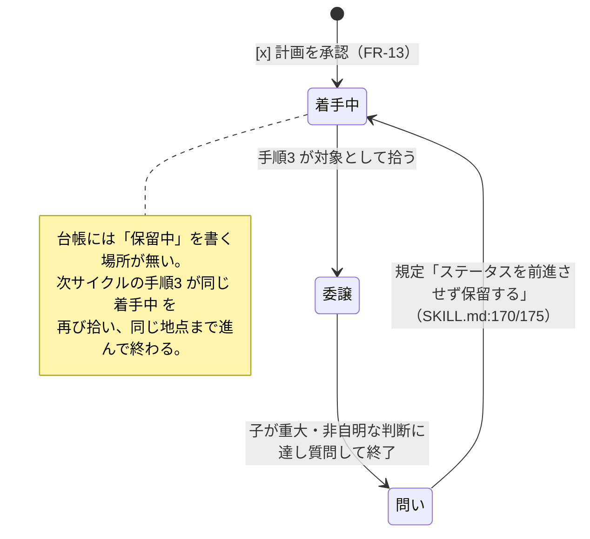
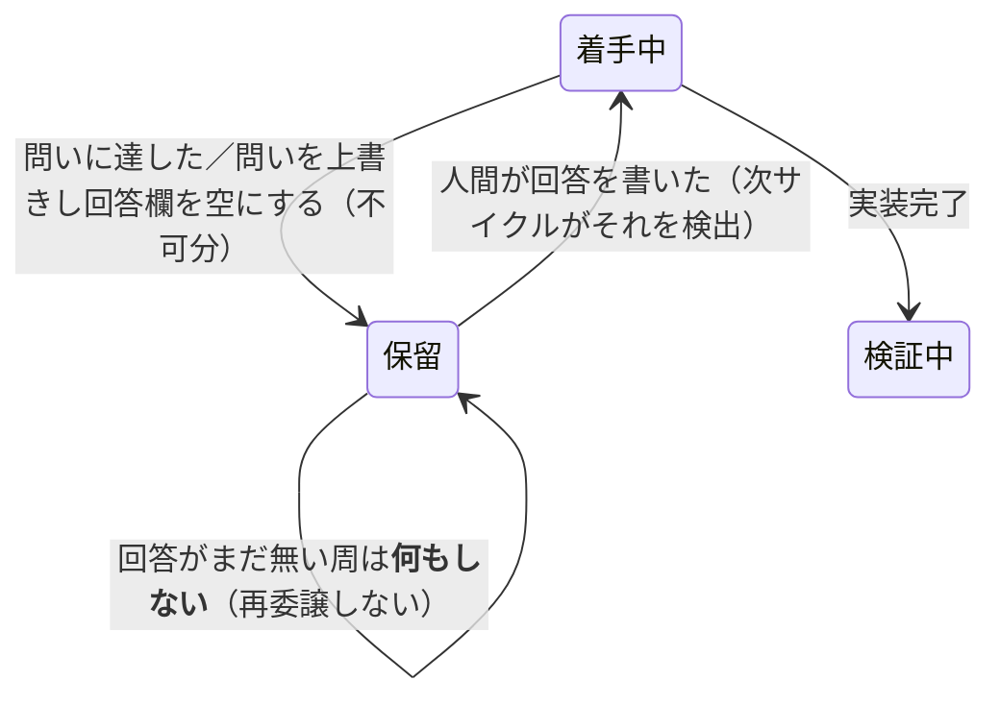

# 人間へ上げて保留した課題の台帳表現（#116）

> **本ドキュメントは判断材料として作成され、その結果 2026-08-29 に人間が「案 A（専用ステータス `人間対応待ち`）を採用する」ことを決定した。**
> [#116](https://github.com/masanami/claude-flywheel/issues/116) が挙げる 3 案（＋本ドキュメントで追加した 1 案）を、
> `claude-flywheel` と `claude-flywheel-board` の**実コードで波及先を確定**したうえで評価したものである。
> 決定後も §4 の比較・§5 の不変条件・§6 の実装計画はそのまま**実装の入力**として使う（採否の記録は §4.5・§7）。
> **§7 の Q1〜Q4（新ステータス名 / board の `needsHuman` / T10 の先行投入 / バリデータへの語彙検査）も 2026-08-29 に決定済み**であり、本ドキュメントに未決の論点は残っていない。

## 0. 要旨

- **症状**: run-cycle 手順3 の対象は**ステータス `着手中`**（[`skills/run-cycle/SKILL.md:113`](../skills/run-cycle/SKILL.md)）である。一方、親が人間へ問いを上げたときの規定は「**ステータスを前進させず保留する**」（同 `:170` / `:175`）＝ `着手中` のまま留まる。したがって**次サイクルの手順3 が同じ課題を再び拾って委譲する**。
- **保留は台帳に表現手段が無い**のが原因であり、`--resume` の宛先（`session_id`）は**すでに `runs.jsonl` から復元できる**（§3.2）。不足しているのは **(a) 手順3 が読む「保留中」の印**と **(b) 人間が回答を書き戻す場所**の 2 つだけ。
- **実測で確定した波及先**（推測ではない。測った経路は §1.1）:
  - 台帳のステータス語彙は `claude-flywheel` 内に **6 箇所**、`claude-flywheel-board` に **2 箇所**の複製がある（§2.1・§2.3）。うち **`contracts/schemas/journal-index.schema.json:22` の `enum` はどのテストにも固定されていない**（§2.2）。
  - board は**未知ステータスのエントリをカードから落とす**（`errors` へ回す。例外は投げず他エントリは無事）。**未知フィールド行は完全に無視する**（クラッシュしない）。いずれも実行して確認した（§2.4）。
  - **上流バリデータ `scripts/validate-artifact.rb` はステータス語彙を検査していない**（未知ステータスでも exit 0）。fail-closed で止めているのは board ではなく**書き手側**という設計方針に穴がある（§2.2）。
- **推奨は案 A（専用ステータス `人間対応待ち`）——2026-08-29 に人間がこれを採用と決定した**。理由は「保留」が**課題の現在状態**であり、状態の正本はステータス行 1 箇所に置くのが本プロジェクトの不変則に合うため。加えて、案 A は**既存の承認ゲート（`計画承認待ち` ＋ `[x]`）と構造が同型**であり、新しい規律を発明しない（§4.1・§5）。
- ただし案 A には Issue 本文に無かった**追加の必須変更**が 2 つある（どちらも実測で判明）:
  1. **語彙の正本の符号化を変える必要がある**。語彙は `templates/challenge-ledger.md:34` の**括弧内の `→` 連鎖**から機械抽出されており（[`scripts/tests/ledger-index.test.sh:313-317`](../scripts/tests/ledger-index.test.sh)）、**直列の遷移列でない状態を表現できない**。連鎖の外に書くと**沈黙して語彙に登録されない**（§2.5 に 4 通りの符号化の実測）。
  2. **`contracts/schemas/journal-index.schema.json:22` の `enum` を同時に更新しないと、保留した周のコミットが fail-closed で止まる**（`touched_issues.to` に新語彙を書くと `validate-artifact.rb journal-index` が exit 1。実行して確認）。このファイルは **board が vendoring している**ため、board 側の `MANIFEST.json` 更新も連動する。

## 1. 実測

### 1.1 計測方法（再現手順）

すべて本ドキュメント作成時点の両リポジトリの `main` に対して実行した。

| 対象 | リビジョン |
| --- | --- |
| `claude-flywheel` | `093e8b8` |
| `claude-flywheel-board` | `091b6aa` |

```bash
# (1) 上流の既存テスト（ベースライン）
for t in scripts/tests/*.test.sh; do bash "$t" >/dev/null 2>&1 && echo "PASS $t" || echo "FAIL $t"; done
#   → 9 本すべて PASS

# (2) board のテスト（ベースライン。board クローンは read-only のまま。git status は空）
cd <board> && npm test
#   → Test Files 1 failed | 52 passed (53) / Tests 1 failed | 1127 passed (1128)
#   → 唯一の失敗は既存のドリフト（§2.3 の注記）。本件とは独立。

# (3) board パーサの実挙動（未知ステータス／未知フィールド）
#   mktemp した作業ディレクトリに probe を置き、board クローンのパーサを直接 import して実行
TMPD=$(mktemp -d); node "$TMPD/probe.mjs"   # probe の内容と結果は §2.4

# (4) 上流バリデータ・索引投影の実挙動
scripts/validate-artifact.rb ledger        "$TMPD/ledger-A.md"   # 案 A 形（未知ステータス）
scripts/validate-artifact.rb ledger        "$TMPD/ledger-B.md"   # 案 B 形（未知フィールド）
scripts/validate-artifact.rb journal-index "$TMPD/index.jsonl"   # touched_issues.to に新語彙
scripts/ledger-index.rb "$TMPD/ledger-A.md"

# (5) 語彙の正本の抽出器（テストと同一の式）に候補の符号化を通す  → §2.5
```

> **`git checkout --` は一度も使っていない。** 検証用のファイルはすべて `mktemp -d` した一時ディレクトリに作り、
> 両リポジトリの作業ツリーへは書き込んでいない（`git status` が両方とも空であることを実行後に確認済み）。

### 1.2 いま何が起きているか（ループの成立条件）



*図1: 保留が台帳に表現できないために生じる再委譲ループ。*

ループが成立するのは、次の 3 条件が同時に成り立つため:

1. 手順3 の対象条件が**ステータスだけ**で書かれている（`SKILL.md:113`「対象: ステータス「着手中」」）。
2. 保留の規定が**ステータスを動かさない**（`SKILL.md:170` / `:175`）。
3. 台帳エントリに**保留を表す欄が無い**（`templates/challenge-ledger.md:27-40` の分類欄に該当フィールドが無い）。

どの案も「1 と 2 の食い違いを、3 をどう埋めて解消するか」の選択である。

## 2. 波及先の確定（実コードで確認）

### 2.1 `claude-flywheel` 側: ステータスの閉じた集合に依存している箇所

| # | ファイル:行 | 依存の内容 | 案 A で必要な変更 | 案 B / C で必要な変更 |
| --- | --- | --- | --- | --- |
| 1 | [`templates/challenge-ledger.md:34`](../templates/challenge-ledger.md) | **語彙の正本**。`- ステータス: 未分類（未分類 → … → 完了）` の**括弧内 `→` 連鎖**がテストの抽出対象 | **必須**（§2.5 の制約あり） | なし |
| 2 | [`templates/challenge-ledger.md:1`](../templates/challenge-ledger.md) | 版マーカー `challenge-ledger.md@0.21.0`。内容を変えたら bump が要る（[`scripts/tests/migrate-workspace.test.sh:755`](../scripts/tests/migrate-workspace.test.sh) の bump ガード） | **必須** | 案 B は分類欄に記入例を足すなら必須 |
| 3 | [`contracts/ledger-read-scope.tsv:23-29`](../contracts/ledger-read-scope.tsv) | 台帳の読み込み範囲の経路表。**7 ステータス全部に行が要る**（行が無いと fail） | **必須**（新ステータスの行を追加） | なし |
| 4 | [`contracts/schemas/journal-index.schema.json:22`](../contracts/schemas/journal-index.schema.json) | `touched_issues.to` の **`enum`**（7 値の閉じた集合） | **必須**（漏らすとコミットが止まる。§2.2） | なし |
| 5 | [`skills/run-cycle/SKILL.md:88,93,95,106,111,113,170,175,201,203`](../skills/run-cycle/SKILL.md) | 各手順の対象条件・遷移列・承認プロトコル・保留規定 | **必須**（手順1 に検出・前進を追加、手順3 の対象から除外、保留規定を「→ 人間対応待ち」に） | **必須**（手順3 の対象条件に「マーカーが非空なら対象外」を追加） |
| 6 | [`docs/challenge-ledger-format.md:33,169-193`](./challenge-ledger-format.md) | ステータス定義と承認プロトコル節（`:181-184` の表・`:188` の前進規定・`:190` の差し戻し） | **必須** | **必須** |
| 7 | [`scripts/ledger-index.rb:56,161`](../scripts/ledger-index.rb) | 索引の投影。`status` 列は**語彙を検査せず素通し**、列定義は 10 列固定 | 任意（§4.1 の「索引で保留を判別する」を採るなら列追加） | **必須に近い**（マーカー列を足さないと索引だけで保留を判別できない） |
| 8 | [`scripts/migrate-workspace.rb:204-207`](../scripts/migrate-workspace.rb) | 分類欄フィールドの**正規順序**（欠落補完の挿入位置を決める） | 新フィールドを足すなら追記が望ましい | 同左 |
| 9 | [`scripts/tests/ledger-index.test.sh:313-319`](../scripts/tests/ledger-index.test.sh) | 語彙の抽出器と**`"7"` のリテラル** | **必須**（§2.5） | なし |

**行番号のスナップショットである点に注意**（`093e8b8` 時点）。実装時は語で再検索すること。

### 2.2 上流の機械検証がステータス語彙をどこで守っているか（と守っていない穴）

実行して確認した結果:

| 検証 | 対象 | 未知ステータスに対する挙動 | 実行したコマンド |
| --- | --- | --- | --- |
| 台帳のフォーマット契約 | `challenge-ledger.md` | **通る（exit 0）**。`validate-artifact.rb:412` は `- ステータス:` という**フィールド行の存在**しか見ておらず、値の語彙は検査していない | `scripts/validate-artifact.rb ledger <tmp>/ledger-A.md` → exit 0 |
| 索引の投影 | 同上 | **通る**。`ledger-index.rb:161` は値をそのまま `status` 列へ出す | `scripts/ledger-index.rb <tmp>/ledger-A.md` → `C-900  人間対応待ち  P1 …` |
| ジャーナル索引のスキーマ | `journal/index.jsonl` | **落ちる（exit 1）**。`touched_issues[0].to: 許可された語彙ではありません（実際: "人間対応待ち" / 許可: 未分類 \| … \| 完了）` | `scripts/validate-artifact.rb journal-index <tmp>/index.jsonl` → exit 1 |
| 語彙の 3 面一致 | テンプレート / 経路表 / SKILL.md | **落ちる**（`"7"` のリテラル・経路表の行数一致・双方向の包含・SKILL.md への出現をすべて検査） | `bash scripts/tests/ledger-index.test.sh` |

ここから 2 つの事実が出る:

- **`journal-index` の enum は「保留した周のコミット」を止める実効的なゲートである**。手順6 の検算は fail-closed（`contracts/README.md` の exit 3 値）なので、案 A で enum を漏らすと**保留を記録した周がコミットできない**。しかも失敗するのは台帳を書いた後・コミットの直前であり、原因が「ステータス語彙を足した」ことだと結びつきにくい。**案 A の実装では enum を最初に直す**。
- **`journal-index` の enum は語彙の 4 つ目の複製でありながら、どのテストにも固定されていない**（`grep -n "canon" scripts/tests/*.sh` の結果は `ledger-index.test.sh` のみ）。これは本プロジェクトの不変則「2 つのリストを同期させる形は必ずずれる」に該当する既存の負債であり、**案 A を採るならこの一致を機械検査に足すのが自然な同梱物**（§5）。

### 2.3 `claude-flywheel-board` 側: 追随が要る箇所

| # | ファイル:行 | 依存の内容 | 案 A | 案 B / C |
| --- | --- | --- | --- | --- |
| 1 | [`src/server/parsers/ledger.ts:8-15`](https://github.com/masanami/claude-flywheel-board/blob/main/src/server/parsers/ledger.ts) | `LedgerStatus` 型（7 値の union） | **必須** | なし |
| 2 | 同 `:17-25` | `VALID_STATUSES`（`ReadonlySet`） | **必須** | なし |
| 3 | 同 `:343-358` | 未知ステータスを `ParseError` にし、**そのエントリを `challenges` から落とす**判定 | 語彙追加で解消 | なし |
| 4 | 同 `:389` | `needsHuman: status === "計画承認待ち" \|\| status === "完了確認待ち"` | **要判断**（新ステータスを 🔔承認待ちに含めるか。含めないと保留が運用者のキューに出ない） | なし |
| 5 | `src/ui/styles.css:51-57` / `:543-562` | ステータス色の CSS 変数と `.status-dot[data-status=…]` の 7 規則 | 任意（`.status-dot` の**基底規則に `background: var(--board-muted-fg)` のフォールバックがある**ため、未定義でも灰色の点になるだけで壊れない） | なし |
| 6 | `tests/fixtures/contracts/**` ＋ `MANIFEST.json` | 上流 `contracts/` の**逐語 vendoring**（sha256 と `upstream.commit` を記録） | **必須**（`journal-index.schema.json` の変更＋ 台帳の新フィクスチャ追加が `upstream-changed` / `upstream-added` として出る） | 上流の `contracts/` を触らなければ不要 |
| 7 | `src/server/parsers/ledger.test.ts` ほか | 語彙に触れるテスト 16 箇所 | 追随が要る | なし |

**vendoring の追随は既に赤い**（本件とは独立の既存ドリフト）: `npm test` の唯一の失敗は
`scripts/verify-contract-fixtures.test.ts` の `upstream-added: ledger-read-scope.tsv`——上流 [#122](https://github.com/masanami/claude-flywheel/issues/122) が追加したファイルの収録可否が board 側で未判断のまま残っている。
この検査は**上流が手元にあるときだけ**動く（board の CI では skip になる）ため、赤いまま放置されうる。
**案 A を進めるなら、board 側の追随 PR でこのドリフトも同時に解消する**（既存の赤の上に新しい差分を積むと、どれが本件の差分か読めなくなる）。

### 2.4 board パーサの実挙動（Issue 本文の「要確認」を確定させた結果）

`mktemp -d` した一時ディレクトリに置いた probe から、board クローンの `parseLedger` を直接 import して実行した（board クローンには一切書き込んでいない）。

| ケース | 入力 | 結果（`challenges` / `errors`） |
| --- | --- | --- |
| (a) 未知ステータス | `- ステータス: 人間対応待ち` | `challenges: []` / `errors: ["ステータス が仕様外の値です: \"人間対応待ち\""]` |
| (b) 未知フィールド行（1 行） | `- ステータス: 着手中` ＋ `- 人間待ち: どの案を採るか（C-071）` | `challenges: [{status:"着手中", needsHuman:false, taskPlan:"保留中", position:"harness", priority:"P1"}]` / `errors: []` |
| (b') 未知フィールド＋ネスト継続行 | 同上 ＋ 2 スペースでネストした継続行 `- 問い: …` / `- session_id: …` | (b) と**完全に同じ**（継続行も無視され、他フィールドは無傷） |
| (b'') 未知フィールドがステータス行の直前 | `- 人間待ち: 問い` ＋ `- ステータス: 着手中` | (b) と**完全に同じ** |

**確定した事実**:

- **(a) 未知ステータス**: 例外は投げない。**当該エントリだけが `challenges` から消え、`ParseError` になる**（`ledger.ts:343-358`）。`ParseError` は `watcher.ts:137-143` で集約され、UI では `ErrorCard` として可視化される——つまり**無言では消えないが、課題カードとその承認導線は失われる**。Issue 本文の「パースエラーになり、カードが消える（承認導線ごと落ちる）」は**正しい**。
- **(b) 未知フィールド行**: **完全に無視される**（`ledger.ts:486-501` が任意の `- key: value` を汎用 `Map` に入れ、既知ラベル以外は誰も読まない）。`isMultilineFieldLabel`（`:131-137`）が `説明` / `タスク案` / `完了条件…` 以外で継続行を集めないため、**ネストした継続行も他のフィールドへ漏れない**。Issue 本文の「未知フィールドは無視される想定。**要確認**」は**確認済み・そのとおり**に更新してよい。
- 案 B が board を壊さないのは**偶然ではなく設計上の保証**である: `ledger.ts:113-130` のコメントが「制御フィールド（ステータス・優先度・担当ポジション）を複数行化すると正常なエントリを失う」ため収集対象を 3 ラベルに限定した、と明示している。

### 2.5 語彙の正本の符号化が「直列の遷移列」であるという制約（案 A の隠れた必須変更）

語彙の正本は `templates/challenge-ledger.md:34` の**ステータス行の括弧内**であり、テストは次の式で抽出する（[`scripts/tests/ledger-index.test.sh:313-317`](../scripts/tests/ledger-index.test.sh) と同一）:

```ruby
m = s[/^- ステータス: *[^（\n]*（([^）]*)）/, 1]
m.split("→").map(&:strip)
```

候補の符号化をこの式に通した実測:

| 符号化 | 抽出結果 | 判定 |
| --- | --- | --- |
| 現行 `（未分類 → … → 完了）` | 7 値 | — |
| **A-1** `（… → 着手中 → 人間対応待ち → 検証中 → …）` | 8 値・新語彙を含む | **通る**。ただし**直列の遷移列としては嘘**（`人間対応待ち` は `着手中` から出て `着手中` へ戻る側道であり、`検証中` の手前の必須ステップではない） |
| **A-2** `（… → 完了 → 人間対応待ち）` | 8 値・新語彙を含む | **通る**。`完了` の後という更に強い嘘になる |
| **A-3** `（… → 完了）（保留: 人間対応待ち）` | **7 値・新語彙が入らない** | **沈黙して失敗**。語彙に登録されないまま経路表に行を足すと「造語が混ざらない」検査（`:338`）が落ちる——落ちること自体は fail-closed で正しいが、**原因が「2 つ目の括弧は読まれない」だと気付きにくい** |
| **A-4** `（… → 着手中 / 人間対応待ち → 検証中 → …）` | **7 値。ただし 4 番目が `"着手中 / 人間対応待ち"` という 1 つの偽の語彙** | **沈黙して壊れる**。`着手中` そのものが語彙から消え、経路表・SKILL.md との双方向検査が落ちる |

**結論**: 現行の抽出器のままで案 A を実装するなら **A-1 か A-2 しか選べず、どちらも遷移列として誤った図を配布テンプレートに残す**。
`templates/challenge-ledger.md` は利用先へ scaffold される**人間が読む面**でもあるため、これは実害のある嘘になる。
したがって案 A は「**語彙の正本を、遷移列とは別の明示的な列挙として持つ**」形へ符号化を変えるべきである（§6.1 の手順 1）。

> **実装済み（§6.1 段 0・0'）**: 語彙の正本は [`contracts/ledger-status-vocabulary.tsv`](../contracts/ledger-status-vocabulary.tsv)（status / `track`＝`main` \| `side` / `order`）へ分離した。
> 本節の表と §2.1 の行 1 は**分離前の実測の記録**であり、現在の抽出対象ではない。`→` 連鎖は**主経路の記入例**として残っており、`track=main` の語彙と**順序込みで一致すること**をテストが固定する（`ledger-index.test.sh` の T7）。
> したがって A-1 / A-2（側道を直列に並べる嘘）は**この検査が落とす**ようになり、側道は `track=side` の行として語彙に入る一方で連鎖には並ばない。A-3 / A-4 が沈黙して失敗する問題も、連鎖が正本でなくなったことで消えている。

## 3. 保留のライフサイクルに必要な情報

### 3.1 状態遷移として何を表現する必要があるか



*図2: 保留のライフサイクル。案が違っても表現すべき遷移は同じで、「保留」をどこに書くかだけが違う。*
*`着手中 --> 保留` の辺が「回答欄を空にする」を伴うのは、2 度目以降の保留で前回の回答が残り、未回答のまま前進してしまうのを防ぐため（下の (c) の規定）。*

必要な情報は 3 つ:

| # | 情報 | 誰が書くか | どこに書けるか |
| --- | --- | --- | --- |
| (a) | **保留中である**という印（手順3 がこれを見てスキップする） | エージェント | ステータス行（案 A / C）または新フィールド（案 B） |
| (b) | **問いの内容**（人間が何に答えればよいか） | エージェント | 分類欄の新フィールド（**どの案でも必要**） |
| (c) | **回答**（これが非空になったら前進する） | **人間** | 分類欄の新フィールド（**どの案でも必要**） |

**(b) と (c) には「保留に入るときに (b) を上書きし (c) を空にする」という不可分の規定が要る**（どの案でも同じ）。
(c) の非空を前進のトリガにする以上、**保留に入る操作と回答のクリアを 1 つの操作として規定しないと、同じ課題が 2 度目の保留に入ったときに前回の回答が残る**——
人間が新しい問いに答えていないのに次サイクルが前進する。クリアを保留側に置けば、回答が無い状態が既定になる（**fail-closed**）。
案 A での具体的な書き方と、世代 ID を採らない理由は §4.1。

**(b) と (c) はどの案でも新フィールドが要る**——ステータス語彙は「保留中である」ことしか運べず、問いの本文も回答も運べない。
したがって案の違いは「**(a) をステータスに置くか、(b)(c) のフィールドの非空性から導くか**」に還元される。

**回答の置き場所は「分類欄」でなければならない**（人間記入欄ではない）。理由は 2 つ、どちらも実コードの規定から出る:

- `ingest-challenges` の冪等規則は「キー既登録・`fp` 不一致 → **人間記入欄のみ更新**し、分類欄は全項目を保持」（`docs/challenge-ledger-format.md:234`）。外部ソース由来のエントリで人間記入欄に回答を書くと、**上流 Issue の本文が編集された周に黙って上書きされる**。
- 分類欄は既に**人間が書く場所として機能している**——承認チェックボックス（`- 承認（人間がチェック）:` 直下）がそれである（同 `:171`）。新しい規律の発明にはならない。

### 3.2 `--resume` の宛先は台帳に持たなくてよい（実測）

Issue 本文は「元の `session_id` への `--resume` 経路」をライフサイクルの一部として挙げているが、**この情報は既に恒久記録から復元できる**:

- `contracts/schemas/runs.schema.json` の `delegate_start` は `challenge` と `session_id` を**必須**にしている（`:35`）。
- したがって保留中の課題を再開するときは、`runs.jsonl` から**当該 `challenge` の最新の `delegate_start`** を引き、その `session_id` へ `--resume` すればよい。
  **その start が `delegate_end` で閉じられているかは問わない**——`session_id` は resume の**宛先**であって開閉状態ではなく、
  `templates/runtime/README.md:141` は「別サイクルに持ち越した resume は新しい `delegate_start`（**同じ `session_id` の再登場可**）で挟む」と定めている。
  閉じた start の `session_id` も次周の宛先としてそのまま有効である。
- **混同しやすい点**: `templates/runtime/README.md:141`（および `skills/run-cycle/SKILL.md` 手順3）の「**同一 `session_id` の最新の未終了 start**」は、
  `*_end` を `*_start` へ**対応付ける（ペアリングする）ときのキー規律**であって、`session_id` を**引き当てるための検索規則ではない**。
  宛先の復元は上記のとおり `challenge` を鍵に引く（この区別を落とすと、§4.4 のように「閉じたら引けない」という誤った制約が生まれる）。

**帰結**: どの案も **`session_id` を台帳フィールドとして持つ必要はない**。台帳に持つと `runs.jsonl` と二重管理になり、不変則「正本 1 つ」に反する。
（注記: 保留中の委譲を `delegate_end` で閉じずに持ち越すと `delegate_start` が未終了のまま残る。これは正常だが、拍動停止が疑われた周に
`heartbeat-check.sh` が「未終了の `*_start`」として列挙する対象になる——**放置された委譲と意図的な保留が区別できない**。
実害は警告レポートのノイズのみで、§4.4 のとおり保留時に `delegate_end` を打って閉じれば発生しない（宛先の復元は上記のとおり閉じても効く）。
案 A の実装時に `templates/runtime/README.md` の注記へ 1 行足す価値がある。）

## 4. 各案の評価

### 4.1 案 A — 専用ステータス `人間対応待ち` を追加する

**形**:

```markdown
- ステータス: 人間対応待ち
- 人間への問い: <親が上げた問い（1 行要約。詳細はネストしてよい）>
- 人間の回答: <人間が書く。空なら未回答。保留に入るたびにエージェントが空へ戻す>
```

**保留に入る操作と回答のクリアは不可分**（§3.1 (c)）: エージェントが `着手中 → 人間対応待ち` の遷移を行うとき、
**`人間への問い` を今回の問いで上書きし、同時に `人間の回答` を空にする**。この 2 つを 1 つの操作として規定する。

手順3 の対象条件は `着手中` のまま変えない。手順1 が `人間対応待ち` かつ `人間の回答` が非空を検出したら `人間対応待ち → 着手中` へ前進させ、手順3 が `--resume` で再開する。
クリアが保留側にあるため、**再保留した周は必ず「回答が空」から始まり、人間が新しい問いに答えるまで前進しない**（前回の回答が残って空振りの再開を招く経路が塞がる）。

**回答に世代 ID／問い ID を持たせる案は採らない。** 理由は 2 つ:
(i) 既存の承認プロトコルが同型の問題（`[x]` が残っていて自動再開する）を**識別子ではなくクリアで**解いており——差し戻しは人間がチェックを付けない、あるいはエージェントが `[x]` を外す（`skills/run-cycle/SKILL.md:95`）、
実運用でも「承認チェックは自動再開を防ぐため外してある」と備考に記した課題が台帳に存在する——案 A を**それと同型**に保てば新しい規律を発明せずに済む（本節の「既存プロトコルとの整合 ◎」はこの同型性そのものである）。
(ii) 世代 ID はフィールドを 1 つ増やしたうえで、**問い側と回答側で一致させるべき値が 2 箇所**になる＝`sync-free`（状態の正本 1 つ）の面を新しく開く。案 A がその面を開かないことは本節の評価の柱であり、それを自分で崩すことになる。

| 観点 | 評価 |
| --- | --- |
| 意味の正確さ | **◎**。「保留」は課題の現在状態であり、状態の正本はステータス行 1 箇所 |
| 既存プロトコルとの整合 | **◎**。`計画承認待ち` ＋ `[x]` と**構造が同型**（ステータスが「人間の入力待ち」を表し、人間が分類欄に入力し、エージェントが次サイクルで前進を代行する）。承認の真正性の規定（`SKILL.md:95-96`：人間のコミットである／対話代行のみ）を**そのまま適用できる** |
| `sync-free` 不変則 | **◎**。状態は 1 箇所（ステータス）。`人間の回答` は状態ではなく**前進のトリガ**であり、承認プロトコルにおける `[x]` と同じ役割 |
| 索引だけで保留を判別できるか | **◎**。`ledger-index.rb` の `status` 列にそのまま出る（実測済み）。経路表で `index-then-full` にすれば、**未回答の周は台帳本文を 1 バイトも開かずに済む** |
| `claude-flywheel` の変更点 | §2.1 の 9 箇所すべて（うち §2.5 の符号化変更が最大の未知だった） |
| board の変更要否 | **必須**（`LedgerStatus` / `VALID_STATUSES` / `needsHuman` の判断 / vendoring 更新） |
| マージ順序の制約 | **board 先行が必須**（§6.1） |
| 機械検証で守れるか | **◎**。語彙の 3 面一致は既存テストが自動で拾う。加えて §5 の不変条件テストを足せる |
| 主なリスク | 順序を誤ると board のカードが**消える**（`-` 表示になるだけだった [#87](https://github.com/masanami/claude-flywheel/issues/87) より重い） |

### 4.2 案 B — ステータスは変えず、保留マーカーを別フィールドで持つ

**形**: ステータスは `着手中` のまま、分類欄に `- 人間待ち: <問い>` を足す。手順3 は「このフィールドが非空なら対象外」とする。

| 観点 | 評価 |
| --- | --- |
| board を壊さないか | **◎**。§2.4 (b)(b')(b'') で**実測により確定**。未知フィールドは継続行ごと無視され、他フィールドは無傷 |
| 波及の小ささ | **◎**。上流の `contracts/` を一切触らないため、board の vendoring 追随も不要 |
| 意味の正確さ | **△**。課題の現在状態が `着手中`（実際には誰も手を付けていない）と表示され、board のカードも `着手中` の緑の点のまま。**運用者が盤面を誤読する** |
| `sync-free` 不変則 | **✗**。現在状態がステータスとマーカーの **2 箇所**に分かれる。「`着手中` かつマーカー非空」「`検証中` なのにマーカーが残っている」といった**矛盾した状態が表現可能**になり、どちらが正かの規定が要る |
| 手順3 の対象条件 | **✗ fail-open**。対象条件が「ステータス == `着手中`」から「ステータス == `着手中` **かつ** マーカーが空」へ変わる。**この 2 つ目の条件を落とした実装は、落とす前と同じ症状（＝本 Issue そのもの）に戻る**。案 A は「対象ステータスに入っていない」ので、条件を書き忘れても保留は拾われない（**fail-closed**） |
| 索引だけで保留を判別できるか | **✗（現状）**。`ledger-index.rb` の 10 列に該当列が無く、`着手中` の経路表は `full` なので、**保留中の課題を毎周ぜんぶ全文で開いて初めて「開く必要が無かった」と分かる**。[#122](https://github.com/masanami/claude-flywheel/issues/122) の削減意図に逆行する。解消するには索引に列を足す＝結局 `contracts/` を触ることになり、案 B の「波及ゼロ」という利点が縮む |
| 承認の真正性 | **△**。回答が人間のコミットで入ったかの検証は案 A と同じ手段（`git log` の author）で可能だが、**チェックボックスと違い board 上に入力導線が無い**（`needsHuman` が立たないため 🔔承認待ちフィルタに出ない）。人間はどの課題が自分待ちかを board から知れない |
| 機械検証で守れるか | **△**。「マーカーが非空なら手順3 の対象外」は散文の条件であり、経路表のような**語彙駆動の接続漏れ検査に載らない**。否定検査（`SKILL.md` の手順3 対象条件にマーカー条件が書かれていること）を文字列で書くことはできるが、規定と検査が 2 規則になる |

### 4.3 案 C — 既存の `計画承認待ち` へ戻す

| 観点 | 評価 |
| --- | --- |
| 波及 | **◎ ゼロ**。上流も board も無変更。board では即座に `needsHuman` が立ち 🔔承認待ちに出る（唯一、既存 UI の恩恵をそのまま受ける案） |
| 意味の正確さ | **✗**。承認チェックのラベルは `計画を承認（FR-13・承認対象＝タスク案）` で固定されており（`validate-artifact.rb:415` が前方一致で必須検査、`docs/challenge-ledger-format.md:186` が「ラベルは承認対象を自分で名乗る」と規定）、**人間が見る文言が実際に求められている行為（問いへの回答）と食い違う**。規定が明示的に守ろうとしている性質を正面から壊す |
| 前進の経路 | **✗**。人間が `[x] 計画を承認` を付けると `計画承認待ち → 着手中` に進む（`SKILL.md:95`）が、**回答の内容はどこにも無い**ため、手順3 は `--resume` に渡すものが無い。備考へ自由記述で書く運用にすると、機械が「回答済み」を判定できない |
| 二重承認 | **✗**。FR-13 は既に一度通っている。同じチェックを 2 度使うと、`[x]` が付いたままの状態から `[ ]` へ戻す操作（＝承認の取り消し）が必要になり、承認の真正性の規定（`[x]` は人間のコミットのみ）と噛み合わない |
| 変種 C' | 案 C ＋ §3.1 の (b)(c) フィールドを足す形は考えられるが、その時点で「`計画承認待ち` を流用する」以外の部分は案 A と同じになり、**残る差は「意味の合わないステータス名を使い続ける」ことだけ**になる |

### 4.4 案 D（本ドキュメントで追加・不採用推奨）— 保留を台帳ではなく `runs.jsonl` / journal に持つ

**形**: ステータスは `着手中` のまま、`delegate_end` の `result` に `held: <問い>` と書き、手順3 は「当該課題に未回答の held な `delegate_end` があればスキップ」とする。

**不採用の理由**（3 行で足りる）:

- `runs.jsonl` は **append-only の恒久記録**（`contracts/README.md`）であり、**人間が回答を書き戻す場所が存在しない**。§3.1 の (c) を満たせない。
- 回答が無い以上「まだ保留中か」を判定できず、結局どこかに人間の入力面が要る。台帳を避けた分だけ経路が増える。
- board は `runs.jsonl` を読むが表示は実行中 Run のカードであり、**承認キューには載らない**（`needsHuman` は台帳側の派生値）。

ただし案 D の観察は残る: **`delegate_end` の `result` に保留の事実を書くこと自体は、どの案とも両立し、推奨できる**（`result` は `minLength: 1` の自由文字列＝スキーマ変更なし）。
未終了 `delegate_start` を残さずに閉じられる（＝手順6 の検算と `heartbeat-check.sh` のノイズが消える）うえ、**閉じても `--resume` の宛先は失われない**——
§3.2 の復元は「当該 `challenge` の**最新の `delegate_start`**」を鍵に引くのであって「未終了の start」を探すのではなく、
`templates/runtime/README.md:141` が「別サイクルに持ち越した resume は新しい `delegate_start`（同じ `session_id` の再登場可）で挟む」と定めているため、閉じた start の `session_id` がそのまま次周の宛先になる。
（この点は当初「`delegate_end` で閉じたら §3.2 の検索で引けなくなるのでは」と読める書き方をしていたが、§3.2 のとおり**ペアリングのキー規律と宛先の検索規則は別物**であり、矛盾しない。）

### 4.5 比較のまとめ

| | 案 A（専用ステータス） | 案 B（別フィールド） | 案 C（`計画承認待ち` 流用） |
| --- | --- | --- | --- |
| 意味の正確さ | ◎ | △ | ✗ |
| `sync-free`（状態の正本 1 つ） | ◎ | ✗ | ◎ |
| 手順3 の失敗方向 | **fail-closed** | **fail-open** | fail-closed |
| 索引だけで保留を判別 | ◎ | ✗（列追加が要る） | ◎ |
| board への波及 | **必須**（順序制約あり） | なし | なし |
| board の承認キュー（🔔）に出る | 要判断（`needsHuman` に足せば ◎） | ✗ | ◎（ただし文言が嘘） |
| 上流の変更箇所数 | 9 | 3〜5 | 2〜3 |
| 機械検証で守れるか | ◎ | △ | △ |

**推奨: 案 A。決定: 案 A を採用（2026-08-29・人間）。** 決め手は「意味の正確さ」ではなく **fail-closed であること**と **`sync-free` であること**の 2 点。
本プロジェクトが繰り返し踏んできた事故の型は「散文の条件が 1 つ落ちる」「2 つのリストがずれる」であり、案 B はその両方に新しい面を開く。
案 A のコストは board への波及だが、**それは一度きりの契約変更**であり、しかも既存の移行フェーズ規律（`docs/challenge-ledger-format.md:65-88`）が扱い方を既に定めている。

## 5. 機械検証で守れるか（案 A を採った場合に足すべき不変条件）

本リポジトリの流儀（散文仕様を構造不変条件テストで守る）に沿うと、次を `scripts/tests/ledger-index.test.sh` に足せる。**いずれも語彙駆動＝将来ステータスが増えても自動で効く**。

> **実装済み**: T10 は §6.1 段 0'、T11〜T13 は §6.1 段 2＋段 3 の PR で実装した。
> 「保留ステータス」は語彙の正本の **`track=side` の全値**として引く（現在の side は `人間対応待ち` だけ。
> この前提は `contracts/ledger-status-vocabulary.tsv` のコメントに明記してあり、当てはまらない side を足すと
> テストが fail-closed で落ちて前提の見直しを促す）。あわせて T10 は、スキーマの `enum` だけでなく
> **その散文正本（`templates/journal/README.md` の語彙列挙）**にも同じ双方向一致を張った——
> 閉じた語彙の複製は「列挙する箇所」に潜むため、片方だけ結線すると 2 本目のリストが黙ってずれる。

| # | 検査 | 型 | 何を防ぐか |
| --- | --- | --- | --- |
| T10 | **`contracts/schemas/journal-index.schema.json` の `touched_issues.to` の `enum` が語彙の正本と集合として一致する**（双方向） | 語彙駆動の接続漏れ | §2.2 で見つけた**現存する未固定の複製**。案 A の実装漏れ（＝保留した周のコミットが止まる）を、コミット時ではなくテスト時に見つける |
| T11 | **保留ステータスが `SKILL.md` の手順3 の対象条件に現れない** | 否定検査 | 「手順3 が保留を拾わない」という本 Issue の核心が、regression で戻らないこと |
| T12 | 保留ステータスの経路表の行が存在し、`scope` が `index` または `index-then-full` である | 語彙駆動 | 未回答の周に台帳本文を開いてしまう退行（#122 の削減の打ち消し） |
| T13 | (ステータス, `人間の回答` の非空) の**真理値表**で、手順1 が前進させる／させないの対応が SKILL.md の記述と一致する。**`着手中 → 人間対応待ち` の直後（＝再保留した周。前回の回答が残っていた場合を含む）は `人間の回答` が空であり、その周は前進しない**ケースを表に含める | 真理値表 | 「回答が空でも前進する」「回答があっても止まる」の取り違え。および**2 度目の保留で前回の回答が残り、人間が新しい問いに答えていないのに前進する**退行（§4.1 のクリア規定が `SKILL.md` の保留規定から落ちること） |

**T10 は案の選択と独立に、いま入れてよい**（現行の 7 値でも一致検査として意味がある）。案 A を選ぶなら実装 PR の最初のコミットに含めるのが自然。

また、`scripts/validate-artifact.rb` に「台帳の `- ステータス:` の値が語彙に含まれること」の検査を足すかは、
**2026-08-29 に人間が「今は足さない（据え置き）」と決定した**（§7 Q4）。
現状は未検査であり（§2.2 実測）、タイプミス 1 つで board のカードが消える経路が空いている。
ただし `contracts/README.md` の「検査項目は実際に事故った型に限定する（YAGNI）」に照らすと、**この型の事故はまだ起きていない**。
本ドキュメントは「穴がある」という事実の記録に留め、必要になった時点で別 Issue を起票する。

## 6. 選択後の実装計画

### 6.1 案 A を選んだ場合

**マージ順序は board 先行が必須**。理由は §2.4 (a)——上流が先に新ステータスを書き始めると、追随前の board で**カードが消える**（承認導線ごと）。
これは [#87](https://github.com/masanami/claude-flywheel/issues/87) の「値が `-` 表示になる」より重く、`docs/challenge-ledger-format.md:65-88`（移行フェーズ）が定める順序制約がそのまま当てはまる。

| 段 | repo | 変更 | 完了条件 |
| --- | --- | --- | --- |
| **0** | claude-flywheel | **語彙の符号化を直す**: `templates/challenge-ledger.md:34` の語彙の正本を「遷移列の括弧」から**明示的な列挙**へ分離し、`scripts/tests/ledger-index.test.sh:313-317` の抽出器を新しい符号化に合わせる（§2.5。**この段だけは語彙を増やさず、符号化だけ変える**＝差分を 1 つの意図に保つ） | 既存 9 テストが緑・語彙は 7 値のまま。**実装済み**（正本は `contracts/ledger-status-vocabulary.tsv`。テンプレートは無改訂＝版マーカーの bump なし） |
| **0'** | claude-flywheel | **T10（journal-index の enum ↔ 語彙の一致）を足す**（§5。現行 7 値で緑になる） | テストが緑・意図的に enum を 1 つ削ると赤になることを確認。**実装済み**（T10 は双方向＝enum に語彙外の値を足しても赤） |
| **1** | claude-flywheel-board | `LedgerStatus` / `VALID_STATUSES` に `人間対応待ち` を追加、`needsHuman` に**含める**（Q2 の決定）、`.status-dot` の色を追加、ledger テストに受理ケースを追加。**あわせて既存の vendoring ドリフト（`upstream-added: ledger-read-scope.tsv`）を解消** | `npm test` / `npm run lint` / `npm run typecheck` が緑。新ステータスのエントリがカードとして出る。**実装済み**（[claude-flywheel-board#166](https://github.com/masanami/claude-flywheel-board/pull/166) → `3545113` で main にマージ済み＝上流が語彙を足してもカードは消えない） |
| **2** | claude-flywheel | 語彙の追加本体: 語彙の正本（段 0 の新符号化）／`contracts/ledger-read-scope.tsv` に行追加（`scope` は `index-then-full` 推奨）／`contracts/schemas/journal-index.schema.json:22` の `enum`／`contracts/fixtures/ledger/valid/` に新ステータスの正例を追加／`docs/challenge-ledger-format.md` のステータス定義と承認プロトコル節／`templates/challenge-ledger.md` の記入例＋版マーカー bump／`scripts/migrate-workspace.rb:204-207` のフィールド順序 | 9 テスト＋新 T10〜T13 が緑 |
| **3** | claude-flywheel | `skills/run-cycle/SKILL.md`: 手順1 に「`人間対応待ち` かつ `人間の回答` 非空 → `着手中` へ前進」を追加／`:170` `:175` の保留規定を「ステータス → `人間対応待ち`」に改め、**同じ操作で `人間への問い` を今回の問いで上書きし `人間の回答` を空にする**ことを**不可分の規定として明記**（§3.1 (c)・§4.1。この一文が落ちると再保留で前回の回答が残り、本 Issue と同型の空振り再開が戻る）／手順3 の対象条件と `--resume` の再開経路（§3.2 ＝ `runs.jsonl` の当該 `challenge` の最新 `delegate_start` から `session_id` を引く）を明記 | 同上。**この段から書き手が新ステータスを使い始める** |
| **4** | claude-flywheel-board | 段 2 の `contracts/` 変更を `npm run contracts:update` で取り直し、`MANIFEST.json` の `upstream.commit` を更新 | `npm test` 緑（`upstream-changed` / `upstream-added` が消える） |
| **5** | 運用 | 保留 → 回答 → `--resume` → 前進を 1 周実運用で確認 | Issue #116 の完了条件の最終項目 |

段 0・0' は**案の選択と独立に価値がある**（符号化の嘘を作らない準備・既存の未固定な複製の解消）ため、案が確定する前に着手してもよい。

### 6.2 案 B を選んだ場合

board への波及が無いため単一 repo で閉じる。順序制約なし。

1. `docs/challenge-ledger-format.md` に保留マーカーの定義（フィールド名・値の形・**状態がステータスとマーカーの 2 箇所に分かれることの取り扱い規定**＝矛盾状態のときどちらを正とするか）を追加。
2. `templates/challenge-ledger.md` の記入例にフィールドを追加＋版マーカー bump。
3. `skills/run-cycle/SKILL.md` 手順3 の対象条件に「マーカーが空であること」を追加。手順1 に回答検出とマーカー消去を追加。
4. `scripts/ledger-index.rb` に列を追加（`ingested` 列と同じ「非空なら `y`」の投影。`COLUMNS` は 10 → 11 列）し、`contracts/ledger-read-scope.tsv` の `着手中` の `scope` を `index-then-full` へ変更する。**これを省くと #122 の削減が打ち消される**（§4.2）。
5. `scripts/validate-artifact.rb` に「マーカーが非空なら `ステータス` は `着手中` である」の整合検査を足す（`sync-free` を捨てた分、ずれを機械で見つける必要がある）。
6. board への通知は不要だが、**board 上で保留が `着手中` に見える**ことは運用者へ周知する。

### 6.3 案 C を選んだ場合

1. `docs/challenge-ledger-format.md` の承認プロトコル節に「`計画承認待ち` は 2 つの意味を持つ」ことと、その見分け方（備考の記述？）を規定。
2. `skills/run-cycle/SKILL.md` の保留規定を「ステータス → `計画承認待ち`」に変更。
3. **チェックボックスのラベル問題を解決する必要がある**（§4.3）。ラベルを変えると `validate-artifact.rb:415-416` の必須検査と board の承認検出、および既存台帳の後方互換（旧ラベル `計画を承認（FR-13）` も受理する規定）に波及するため、**「波及ゼロ」は成立しなくなる**。

## 7. 人間へ上げた問い（すべて決着済み）

**どの案を採るか — 決着済み。** 推奨は**案 A**であり、**2026-08-29 に人間が案 A の採用を決定した**。実装は §6.1 の段取りに従う（board 先行）。

**Q1〜Q4 も同じく 2026-08-29 に人間が決定した。** 下表の「決定」列が正であり、本節に未決の論点は残っていない（推奨欄は決定に至った判断材料として残す）。

| # | 問い | 提示した推奨（判断材料） | **決定**（2026-08-29） |
| --- | --- | --- | --- |
| Q1 | 新ステータスの名前 | `人間対応待ち`（Issue 本文の案のまま）。`計画承認待ち` / `完了確認待ち` と語形が揃う | **`人間対応待ち`**（推奨どおり） |
| Q2 | board の `needsHuman` に含めるか | **含める**。含めないと「人間の入力待ち」なのに 🔔承認待ちフィルタに出ず、運用者が保留に気付けない | **含める**（推奨どおり。§6.1 段 1 ＝ [claude-flywheel-board#166](https://github.com/masanami/claude-flywheel-board/pull/166) で実装・マージ済み） |
| Q3 | §5 の T10（journal-index の enum ↔ 語彙の一致）を先に入れるか | **入れる**。案の選択と独立に現存する穴 | **入れる**（推奨どおり。§6.1 段 0' ＝ [#131](https://github.com/masanami/claude-flywheel/pull/131) で実装・マージ済み） |
| Q4 | `validate-artifact.rb` に台帳のステータス語彙検査を足すか | **今は足さない**（YAGNI。事故の実績が無い）。§5 に事実として記録するに留め、必要になったら別 Issue | **今は足さない（据え置き）**（推奨どおり。案 A の実装 PR のスコープ外とし、必要になった時点で別 Issue を起票する） |

## 8. 関連

- [#116](https://github.com/masanami/claude-flywheel/issues/116) — 本ドキュメントの出どころ。§2.4 で本文の「要確認」を確定させた
- [#107](https://github.com/masanami/claude-flywheel/issues/107) / PR #113 — 意思決定の主体を「スキルの性質 × 課題のスコープ」の 2 軸へ改めた変更。保留規定（`SKILL.md:170` / `:175`）はここで入った
- [#110](https://github.com/masanami/claude-flywheel/issues/110) — FR-22 の承認経路が台帳に無い（同系統の「人間の入力を台帳で受け取る経路が無い」課題）。**2026-08-28 に取り下げ・close 済みであり、本件は単独で設計する**（人間の決定）。本ドキュメントは #110 の設計を取り込んでいない
- [#122](https://github.com/masanami/claude-flywheel/issues/122) / [ledger-load-strategy.md](./ledger-load-strategy.md) — 索引の投影と経路表（`contracts/ledger-read-scope.tsv`）。案 A / 案 B の「索引だけで保留を判別できるか」の評価軸はここから来ている
- [#87](https://github.com/masanami/claude-flywheel/issues/87) / [challenge-ledger-format.md §移行フェーズ](./challenge-ledger-format.md) — 生成側と消費者の切り替え順序。§6.1 のマージ順序はこの規律の再適用
- [contracts/README.md](../contracts/README.md) — フォーマット契約の 3 点セットと vendoring 手順。§2.3 の board 追随はここに従う
