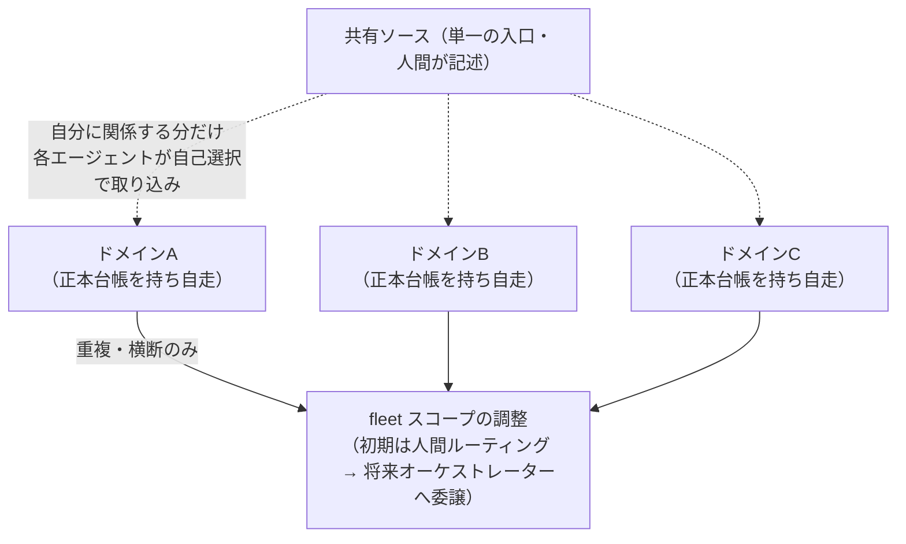

# 要件定義 — claude-flywheel

> AI を「自律的に働く社員」として動かすためのハーネス・ツール群に対する要件を定義する。
> アーキテクチャ・実装方式は別ドキュメント（`docs/architecture.md`）で扱う。本書は **何を満たすべきか（What）** に集中する。

- ステータス: ドラフト（立ち上げ期）
- 最終更新: 2026-06-02

---

## 1. 目的

### 最上位の目標（North Star）

**自律的に課題を整理し、自身のポジション（役割）に関係するものを自ら選び取り、自律的に動くエージェントを作ること。**

これが本プロジェクトの一番の目標であり、すべての要件の大前提となる。
人間が一つひとつ目標を与えるのではなく、エージェント自身が「今ある課題のうち、自分が取り組むべきもの」を判断して動き出すことを目指す。

### 補足

上記を実現する過程として、指定された目標に対して AI 自身が「やるべきこと」を探索し、タスクに分解し、実行・検証・改善まで自走させる。
人間は方向づけと要所の承認に集中し、AI が業務遂行の主体となる状態を目指す。
開発業務・運営業務の **両方** を横断的に扱える汎用ハーネスとして設計する。

### 主目的：自走エージェントを作るための土台（コンサル／ツールキット）

本プロジェクトの主目的は、**自走するエージェントを作るための土台（コンサル／ツールキット）** を提供することである。利用者はこの土台（Claude Code プラグイン）の上に、**プロジェクトごとに独立した自律エージェントの群（fleet）** を作る。

例: 医療機器開発エージェント / BIツール開発エージェント / インフラ・セキュリティ横断管理エージェント（いずれも別リポジトリで独自のドメイン知識・ハーネスを持ち自律稼働）。

具体的な提供物は:

- **(a) ポジションに沿ったスキル群** — 役割ごとに必要な能力をスキルとして用意する。
- **(b) エージェントを自律的に動かす実行基盤（ランタイム）** — 起動・スケジュール・トリガ。

前提:
- **守備範囲は原則重複しない**ようにエージェントを設計し、避けきれない重複だけを fleet スコープ（初期は人間、将来は自動化）が調整する。
- 課題は**共有ソース**（単一の入口）に集約し、各エージェントが自分に関係する分だけ自リポジトリへ取り込む。
- 実作業に使うツールは **差し替え可能**とする。開発の自律化では [claude-harness](https://github.com/masanami/claude-harness) を**利用できる**が、本プロジェクトは特定ツールに**依存しない**。

## 2. 背景・課題

- 現状の AI 活用は「人間が逐一指示する」前提で、指示出しコストが成果のボトルネックになる。
- 単発タスクは委譲できても、「目標 → タスク探索 → 実行 → 検証 → 学習」を **継続的に回す** 仕組みがない。
- 得られた知見が蓄積・再利用されず、毎回ゼロから立ち上げている。

→ これらをループ（Flywheel）として回し、回すほど自律性と成果が加速する基盤を作る。

## 3. スコープ

### 3.1 対象（In Scope）

| 領域 | 具体例 |
| --- | --- |
| 開発業務 | 要件定義、設計、実装、コードレビュー、テスト、PR 運用、技術負債の解消 |
| 運営業務 | 目標からのタスク探索・起票、進行管理、状況報告、定常業務の遂行 |
| 共通基盤 | 目標管理、タスク探索・分解、実行制御、検証、学習（記憶・改善）の各機構 |

### 3.2 対象外（Out of Scope）

- 具体的なアーキテクチャ・技術選定（→ `docs/architecture.md`）
- 特定の外部サービスとの個別連携仕様（要件が固まってから別途定義）
- AI モデル自体の学習・ファインチューニング

## 4. 用語定義

| 用語 | 定義 |
| --- | --- |
| 目標（Goal） | AI 社員が向かう、人間が設定する達成対象。例: 「○○機能をリリースする」 |
| タスク（Task） | 目標を達成するために実行する具体的な作業単位 |
| ハーネス（Harness） | AI を自律実行させるための実行基盤・制御ロジック |
| ツール（Tool） | AI が業務遂行に使うユーティリティ・外部連携機構 |
| Flywheel | 目標設定→タスク探索→実行→検証→学習のループ。本プロジェクトの中核概念 |
| 承認ポイント（Checkpoint） | 人間のレビュー・承認を必須とする要所 |
| ポジション | エージェントの「職務記述書」。担当ドメイン・ミッション・関心範囲・権限・関係から成る判断基準 |
| 課題台帳 | 各エージェントのリポジトリ内に持つ課題の正本。人間は共有ソース（単一の入口）に課題を集約し、各エージェントが自分に関係する分だけ台帳へ取り込む（[architecture.md §3.1](architecture.md)） |
| オーケストレーター | fleet スコープ（エージェント間の避けきれない重複・横断）の調整役。初期は人間がルーティングし、将来オーケストレーターへ委譲する（[architecture.md §3.2](architecture.md)） |
| ドメイン地図 | サービスとドメインの構造・関係性を可視化したもの。ポジション定義の土台 |

## 5. アクターとエージェント構成

| アクター | 役割 |
| --- | --- |
| 管理者（人間） | 目標設定、**共有ソース**への課題の記述、要所での承認・方向修正、fleet 横断課題のルーティング（初期） |
| オーケストレーター | **fleet スコープ（エージェント間の避けきれない重複・横断）の調整役**。初期は人間が担い、将来オーケストレーターへ委譲する（[architecture.md §3.2](architecture.md)） |
| ドメイン担当エージェント | **ビジネスドメイン（複数サービス横断）** を担当。関連課題を自己選択し、横断知識を蓄積して自走する |
| 外部システム | GitHub、各種業務ツールなど AI が連携する対象 |

### 構成の方針

- **ポジションの単位 = ビジネスドメイン**（単一サービスではなく、複数マイクロサービスを横断する業務領域）。
- **課題の供給 = 共有ソース（単一の入口）＋各エージェント内の正本台帳**。人間は共有ソースに課題を集約し、各エージェントが自分に関係する分だけ自リポジトリの台帳（正本）へ取り込む（[architecture.md §3.1](architecture.md)）。
  - 将来的には Slack ログや対話・依頼から課題を自動収集することを理想とするが、ハードルがあるため後続フェーズとする。
- **課題の引き受け方**:
  - **単一ドメインに収まる課題** → 該当ドメインエージェントが**自己選択**で引き受ける（North Star の自律選択）。
  - **複数ドメイン／エージェントを横断する課題** → **fleet スコープが調整**する。初期は人間がルーティングし、将来はオーケストレーターへ委譲する（[architecture.md §3.2](architecture.md)）。
  - 中央司令塔は置かない。fleet スコープが扱うのは避けきれない重複・横断のみで、平常時は各エージェントの自己選択を主とする。

*図: 課題の分配 — 共有ソースの課題を各エージェントが自己選択で取り込み、ポジションに沿って自走する。避けきれない重複・横断だけを fleet スコープ（初期は人間、将来はオーケストレーター）が調整する。*

## 6. 自律性レベルの方針

**要所で人間承認（Human-in-the-loop）** を基本方針とする。

- AI は目標に対しタスク探索〜検証まで自走するが、**影響が大きい・後戻りしにくい操作は人間の承認を必須** とする。
- 課題の引き受けは、単一ドメイン課題はエージェントの自己選択、横断課題は fleet スコープ（初期は人間、将来はオーケストレーター）の調整とする（§5）。
- 承認ポイントの具体は機能要件（FR）内で定義する。
- 将来的に信頼度に応じて自律度を引き上げられる設計余地を残す（段階的拡張は将来課題）。

## 7. 機能要件（FR）

Flywheel の各フェーズに沿って定義する。

### 7.1 課題探索・目標設定

> 最上位の目標（North Star、§1）を直接担うフェーズ。

- **FR-01** 人間が AI 社員に対して目標を設定・更新・終了できること。
- **FR-02** 目標は達成条件（完了の定義）を伴って記述できること。
- **FR-03** 複数の目標を同時に保持し、優先度を扱えること。
- **FR-04** エージェントは自身の **ポジション（役割）** を持ち、それを判断基準にできること。
- **FR-05** エージェントが課題を **自律的に探索・整理（構造化）** できること。
- **FR-06** 整理した課題のうち、**自身のポジションに関係するものを自律的に選定（ピックアップ）** し、目標・タスクに落とし込めること（単一ドメイン課題の自己選択）。
- **FR-07** 課題は人間が **共有ソース（単一の入口）** に記述し、各エージェントが自分に関係する分だけ自リポジトリの正本台帳へ取り込めること（[architecture.md §3.1](architecture.md)）。
- **FR-08** **複数ドメイン／エージェントを横断する課題** を、fleet スコープが分配・調整できること。初期は人間がルーティングし、将来はオーケストレーターへ委譲する（[architecture.md §3.2](architecture.md)）。
- **FR-09** サービスとドメインの構造・関係性をエージェントが探索・可視化（**ドメイン地図**化）し、ポジション定義の土台にできること（ブートストラップ）。

### 7.2 タスク探索・分解

- **FR-10** AI が目標から「やるべきこと」を自律的に探索し、タスク候補を列挙できること。
- **FR-11** タスクを実行可能な粒度に分解できること。
- **FR-12** タスク間の依存関係・順序を扱えること。
- **FR-13** 探索したタスクを起票する前に、**人間が取捨選択・承認できる（承認ポイント）**。

### 7.3 実行

- **FR-20** 承認されたタスクを AI が自律的に実行できること（開発・運営の双方）。
- **FR-21** 実行は中断・再開が可能で、途中状態を失わないこと。
- **FR-22** **本番に影響し後戻りしにくい操作**（例: 既定ブランチ〔`main`〕への昇格マージ、本番デプロイ・外部公開、削除、外部送信、履歴破壊）は **実行前に人間承認を必須** とすること（承認ポイント）。判定軸は「本番への影響」と「可逆性」で、**本番影響が無く可逆な操作（作業ブランチへの push・PR〔draft 含む〕作成・統合ブランチ／親Issueブランチ（本番非反映）へのマージ）は本ゲートの対象外**（サイクル内で自律実行可。人間の判断は既定ブランチへの昇格＝本番反映に集約）。
- **FR-23** 並行して複数タスクを実行できること（独立タスクの並列化）。

### 7.4 検証

- **FR-30** 実行結果が達成条件を満たすか AI が検証できること（テスト・レビュー・確認）。
- **FR-31** 検証に失敗した場合、原因を特定し再実行・修正のループに戻せること。
- **FR-32** 検証結果を人間が確認できる形で提示できること。

### 7.5 学習（記憶・改善）

- **FR-40** 実行・検証で得た知見を記憶として蓄積し、次回以降に再利用できること。
- **FR-41** 成功・失敗のパターンを記録し、タスク探索・実行の精度向上に活かせること。
- **FR-42** 記憶は人間が閲覧・修正・削除できること。

#### 自己改善（内省）

> ハーネス自体（スキル・サブエージェント・ポジション・recall）を継続的に改善する。実行ループとは分離し、低頻度で回す（[self-improvement.md](self-improvement.md)）。

- **FR-43** サイクルの good / bad（効いた点・うまくいかなかった点）を**軽量に記録**できること（実行ループ内では評価・改修をせず記録を残すだけ）。
- **FR-44** 蓄積した記録から傾向（再発する失敗・再利用価値のある成功）を集計し、**ハーネスの改修を提案**できること。改修の適用は人間承認を必須とする（承認ポイント）。
- **FR-45** 改修対象がプラグイン本体の共通機能の場合は、直接書き換えず**上流（claude-flywheel）への改善提案**として扱えること。

### 7.6 横断機能

- **FR-50** 一連の活動（探索・実行・検証）が人間に可観測であること（何を・なぜ実行したか追跡可能）。
- **FR-51** 状況・成果を人間に報告できること。

## 8. 非機能要件（NFR）

- **NFR-01 安全性**: 破壊的・不可逆な操作には承認ゲートを設ける（判定軸は「本番への影響」と「可逆性」。close/ブランチ削除/revert で戻せる可逆な中間操作はゲート対象外＝詳細は FR-22）。秘密情報をリポジトリ・ログに残さない。
- **NFR-02 可観測性**: AI の意思決定と実行を追跡・監査できる（ログ・履歴）。
- **NFR-03 再現性**: 同じ目標・入力に対して、実行プロセスを再現・検証できる。
- **NFR-04 拡張性**: 新しい業務領域・ツール・スキルを後から追加しやすい構造である。
- **NFR-05 中断耐性**: 長時間実行が中断されても、状態を失わず再開できる。
- **NFR-06 人間制御性**: 人間がいつでも介入・停止・方向修正できる。

## 9. 制約・前提

- Claude Code のハーネス／スキル機構を実行基盤として活用する。
- **Claude Code プラグインとして配布**し、機械（スキル/テンプレ）と状態（課題台帳/positions/memory）を分離する。状態は各エージェントの独立リポジトリに置く。
- **特定の実行ツールに依存しない汎用設計**とし、実作業ツール（claude-harness 等）は差し替え可能なプラグインとして扱う。
- バージョン管理・コード関連の連携は GitHub を前提とする。
- 本書は要件のみを定義し、実現方式は規定しない。

## 10. 未決事項（Open Questions）

> 後日、課題感とあわせて議論・決定する。

- **OQ-01 管理基盤の選定**:
  - **課題台帳**は「各エージェントのリポジトリ内のファイル＝正本」を当面の方針とする（§5）。人間は共有ソースに集約し、各エージェントが自分に関係する分だけ取り込む。課題ソースは差し替え可能とし、外部ドキュメント（Notion/Doc/Slack 等）化は後続。分類タグ・ステータスは正本（内部）で管理する。
  - **実行タスク・進捗**をどこで管理するか（GitHub Issue/PR 中心 / ファイル / 併用）は未決。論点: 自律実行との親和性、人間の可視性、履歴、既存 harness スキル（create-ticket 等）との接続。
- **OQ-05 ポジションの記述項目**: 担当ドメイン / ミッション・目標 / 関心範囲 / 権限 / 関係 をどう定義・記述するか。 → **確定**: [templates/position.md](../templates/position.md)（closed）。
- **OQ-06 課題台帳のフォーマット**: オーケストレーターがルーティング判断できる項目（関連ドメイン・サービス、完了条件、緊急度 等）。 → **確定**: [docs/challenge-ledger-format.md](challenge-ledger-format.md)（closed）。
- **OQ-07 ブートストラップ**: ドメイン地図づくり（FR-09）を誰が・どの順序で行い、ポジション定義へつなげるか。 → **確定**: [bootstrap-domain-map](../skills/bootstrap-domain-map/SKILL.md) スキル（closed）。
- **OQ-02 承認ポイントの粒度**: どの操作を「要承認」とするかの具体的な線引き。 → **確定**: FR-22 の精緻化（[#24](https://github.com/masanami/claude-flywheel/issues/24)）と [templates/position.md](../templates/position.md) の権限欄（closed）。
- **OQ-03 自律度の引き上げ基準**: 信頼に応じて承認を減らす際の判断基準。
- **OQ-04 成果・進捗の報告形式とタイミング**。

## 11. 受け入れ基準（立ち上げ期のゴール）

- [ ] エージェントが課題を整理し、自身のポジションに関係するものを選定して動き出せる（North Star の最小実証）。
- [ ] 1 つの目標を設定し、AI がタスク探索→承認→実行→検証→記憶までを一巡できる。
- [ ] 影響の大きい操作で人間承認が機能する。
- [ ] 実行内容が後から追跡できる。
- [ ] 開発業務・運営業務それぞれで最低 1 ユースケースを通せる。

---

### 関連ドキュメント

- `docs/architecture.md` — アーキテクチャ・実現方式
- `README.md` — プロジェクト概要・コンセプト
