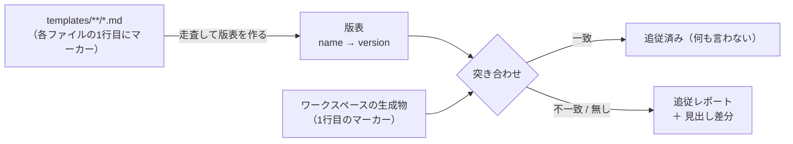

# テンプレート版マーカー（flywheel-template）

> scaffold 生成物に「どの版のテンプレートから生まれたか」を刻み、`migrate-workspace.rb` の
> テンプレート追従検出を**項目ごとの手書き検出器から、テンプレート由来の汎用検出へ**移す設計。
> 対象は Issue [#118](https://github.com/masanami/claude-flywheel/issues/118)。
>
> **本ファイルは決定の記録（正本）**。実装は `scripts/migrate-workspace.rb` §scaffold 追従レポート、
> 生成側は [`skills/flywheel-init/SKILL.md`](../skills/flywheel-init/SKILL.md) と
> [`skills/bootstrap-domain-map/SKILL.md`](../skills/bootstrap-domain-map/SKILL.md)。

## 1. 解こうとしている穴

`flywheel-init` は「既存を上書きしない」冪等 scaffold のため、**scaffold 後にテンプレートが
更新されても既存ワークスペースは追従しない**。`migrate-workspace.rb` はこの追従漏れを検出するが、
検出手段が 2 系統しかない:

| 既存の検出手段 | 対象 | 限界 |
| --- | --- | --- |
| バイト比較（`DOC_COPIES`） | 逐語コピーの 5 ファイル | 利用先がカスタマイズするファイル（`CLAUDE.md`・`positions/*.md`）には使えない |
| 内容ベースの個別検出器 | `.gitignore` の行・`settings.json` の allow・§意思決定の主体・§接続ツール | **テンプレートを更新するたびに検出器を書き足す必要があり、書き忘れると静かに落ちる** |

実際に落ちた: 0.19.0 で `templates/CLAUDE.md` に `## 1 サイクル = 1 セッション（対話実行の場合）`
と `## 委譲の費用ガード` の 2 節が入ったが、どちらにも検出器が無いため、既存ワークスペースは
**追従していないことを報告されない**。

## 2. 決定

| 論点 | 決定 | 根拠 |
| --- | --- | --- |
| **粒度** | **生成物ごと**（ワークスペース単位のマニフェストを作らない） | テンプレートは別々の速度で動く。ワークスペース単位だと「どれが古いか」を失う。加えてマニフェストは**生成物の一覧と別に維持する 2 本目のリスト**になり、必ずずれる（PR [#96](https://github.com/masanami/claude-flywheel/pull/96) の教訓） |
| **形式** | `<!-- flywheel-template: <name>@<version> -->` | Issue #118 の提案どおり。`<name>` は `templates/` からの相対パス（`CLAUDE.md` / `journal/README.md` / `position.md`）、`<version>` は semver |
| **置き場所** | 生成物の**1 行目**（本文の前）に書く。**読むときは先頭 5 行を走査**する（利用先が前後に 1〜2 行足していても拾う。全文走査にすると本文がマーカーを引用したときに誤認する） | マーカーが記述対象と同じファイルに乗るので、コピー・リネーム・移動で自動的に随伴する。`.flywheel/` 配下に置くと `.gitignore` の `!` 明示追跡（`!.flywheel/cadence.json` と同型）が要るうえ、生成物とマーカーが別々に動いてずれる |
| **版の値** | **そのテンプレートを最後に変更したときのプラグイン semver**（`.claude-plugin/plugin.json` の `version`）。**`<major>.<minor>.<patch>` の 3 要素ちょうどだけを受理**し、それ以外（`0.20` / `0.20.0.1` / `v0.20.0` / prerelease）は形式不正として報告する | 人間が読める・順序が付く・リリースと対応する。内容ハッシュは順序が付かず、空白の変更でも動く。要素数を可変にして欠けた分を 0 で補うと **`@0.20` が `@0.20.0` と一致し、形式不正であるべきマーカーが「追従済み」として黙殺される**（PR #119 レビュー指摘） |
| **対象ファイル** | **Markdown のテンプレートのみ** | JSON にコメント構文が無く、全種類で統一した行内マーカーは原理的に置けない。JSON を含めるにはマニフェスト方式が必要で、それは粒度の決定で退けた。§7 に対象外の扱いを書く |
| **既存世代（マーカー無し）** | 報告するだけ。**マーカーを自動で書き足さない** | 内容を確認せずにマーカーを入れると「現行版に追従済み」と**偽って宣言**することになる。マーカー無しより悪い |
| **自動適用** | 広げない。マーカーは**検出のためだけ**に使う | Issue #118 の明示制約。自動適用の範囲は `challenge-ledger.md` / `challenge-archive.md` の構造変換のまま |
| **既存の内容ベース検出器** | **残す（併用）** | §6 |

### キーの名前空間

キーは `flywheel-template` で固定する。claude-harness の `init-project` が同種の仕組みを
持つ場合（[claude-harness#178](https://github.com/masanami/claude-harness/issues/178)）でも
**キーが衝突しなければよい**のであって、flywheel は harness のキーを読みに行かない。

**この課題は flywheel 内で閉じる。** `scripts/migrate-workspace.rb` の `harness` 参照は
0 件であり、この性質はテストで固定する（§8）。harness の生成物の意味を flywheel が解釈しない。

## 3. マーカーの書き方

テンプレート・生成物の 1 行目に、次の 1 行だけを置く（直後に空行）:

```markdown
<!-- flywheel-template: CLAUDE.md@0.20.0 -->
```

- **経緯・Issue 番号・言い換えを書かない**。マーカーは `CLAUDE.md` のように**実行時に LLM が
  読む面**へ乗るため、モデルの振る舞いを変えない最小限に留める（判定軸は「この文を削ると
  モデルの振る舞いが変わるか」。経緯はこの docs 側に置く）。
- **テンプレートを変更したら、同じコミットで版を現在のプラグイン版へ上げる**。上げ忘れると
  「追従済み」と偽って報告されるため、§8 の bump ガードテストで検出する。
- 生成側（`flywheel-init` / `bootstrap-domain-map`）は**テンプレートを逐語コピーする**だけで
  よい。マーカーはテンプレートに書かれているので、コピーすれば生成物に乗る。**マーカー行を
  書き換えない・削除しない**ことだけを守る。

## 4. 検出のしくみ（正本を 1 本にする）

*図: テンプレート側のマーカーだけを正本にし、ワークスペース側と突き合わせる*



**正本はテンプレート側のマーカー 1 本だけ**。「現行版はいくつか」を書いた表を別に持たない。
`migrate-workspace.rb` は `templates/` 配下の Markdown を走査して版表をその場で作る。

配置先（テンプレート → ワークスペース）だけは対応表が要る。ここが 2 本目のリストになるのを
防ぐため、**対応表に無い Markdown テンプレートを見つけたら実行時に通知する**——「対象外だが
存在する」を静かな取りこぼしではなく通知として出す（PR #96 で有効だった型）。テストでも
同じことを固定する（§8）。

| テンプレート | ワークスペースの配置先 | 必須 |
| --- | --- | --- |
| `CLAUDE.md` | `CLAUDE.md` | ✓ |
| `challenge-ledger.md` | `challenge-ledger.md` | ✓ |
| `priority-policy.md` | `priority-policy.md` | ✓ |
| `challenge-sources.md` | `challenge-sources.md` | 任意（外部ソースを使う場合のみ） |
| `position.md` | `positions/*.md`（0..N 件） | 任意（bootstrap 前は 0 件） |
| `journal/README.md` | `journal/README.md` | ✓ |
| `journal/cycle-template.md` | `journal/cycle-template.md` | ✓ |
| `runtime/README.md` | `runtime/README.md` | ✓ |

### 版が古いときに「何が足りないか」まで出す

版番号だけでは「追従が必要」としか言えず、人間が差分を自分で探すことになる。そこで
**マーカーが不一致・欠落のときに限り、テンプレートと生成物の `##` 見出しを突き合わせ、
テンプレートにあって生成物に無い見出しを列挙する**。項目ごとの検出器を書かずに、
新設された節が名指しで出る。

見出しの正規化（利用先の文言ゆれで誤報しないため）:

1. 先頭の連番（`5. `）を落とす — `positions/*.md` は `## 5. 接続ツール（…）` の形を採る
2. 末尾の丸括弧（`（…）`）を落とす — 利用先が補足を足す実績がある
3. 前後の空白を落とす
4. プレースホルダ（`<…>`）を含む見出しは比較から外す

これは**参考情報**であり、見出しを改名した利用先では偽陽性が出る。出力にその旨を添える。

## 5. 状態空間と報告

生成側（マーカーを書く）と検証側（マーカーを読む）は、形がずれると
「自分の正規出力を自分が受理しない」欠陥になる。想定する状態を先に尽くす:

| # | 生成物の状態 | 報告 | exit への影響 |
| --- | --- | --- | --- |
| 1 | マーカーあり・版がテンプレートと一致 | 何も言わない | なし |
| 2 | マーカーあり・版がテンプレートより**古い** | 「テンプレート `<name>@<新>` に追従していない（生成物は `@<旧>`）」＋ 見出し差分 | なし（検出のみ） |
| 3 | マーカーあり・版がテンプレートより**新しい** | 「生成物の版がテンプレートより新しい（プラグインが古い可能性）」 | なし |
| 4 | マーカー無し（**既存世代**） | 「版マーカーが無い＝マーカー導入前に scaffold された世代。テンプレート `@<版>` と内容を突き合わせ、追従したうえで 1 行目にマーカーを追記する」＋ 見出し差分 | なし |
| 5 | マーカーの形が壊れている（`@` 無し・3 要素の semver でない） | 「版マーカーの形式が不正」＋ 内容は状態 4 と同じ扱い | なし |
| 6 | 人間が手で追従済みだがマーカーが古い | 状態 2 と同じ報告。ただし §6 の内容チェックが追従済みを示していれば、その旨を添える | なし |
| 7 | 生成物が存在しない | 既存の「不足: `<path>`」で報告済み（マーカー検査はしない） | なし |
| 8 | テンプレートにマーカーが無い | 「テンプレート `<rel>` に版マーカーが無い＝追従を検出できない」 | なし（テストが別途 fail させる） |
| 9 | Markdown テンプレートが配置先の対応表に無い | 「テンプレート `<rel>` の配置先が未定義＝追従検査の対象外」 | なし（テストが別途 fail させる） |

**受理方向**（生成側の正規出力を検証側が必ず受理する）は状態 1 が担う。テンプレートを
そのままコピーしたワークスペースは 1 件も報告されない——これをテストで固定する。

**マーカーは exit code を変えない**。scaffold 追従レポートは従来どおり「検出のみ」であり、
`challenge-ledger.md` / `challenge-archive.md` の構造変換の有無だけが exit を決める。

## 6. 既存の内容ベース検出器の去就 — 残す

Issue [#107](https://github.com/masanami/claude-flywheel/issues/107) 由来の 2 つ
（`CLAUDE.md` §意思決定の主体の 2 軸判定、`positions/*.md` §接続ツールの宣言項目 3 点）は
**置き換えず残す**。

| | 版マーカー | 内容ベース検出器 |
| --- | --- | --- |
| 網羅性 | 高い（全 Markdown 生成物を一律に見る。検出器の書き忘れが無い） | 低い（書いた項目だけ） |
| 精度 | 低い（**人間が手で追従してもマーカーは古いまま＝偽陽性**。逆にマーカーだけ上げれば偽陰性） | 高い（その節の中身を直接見る） |
| 対象 | すべての Markdown 生成物 | run-cycle の意思決定経路を実際に変える 2 項目 |

**併用が正しい理由**: マーカーは「誰も検出器を書いていない項目」を拾う網であり、内容チェックは
「間違えると自走の挙動が変わる重要項目」の精度を担保する。どちらも他方を代替できない。

さらに両者を協調させる: マーカーが古い生成物について内容チェックが**追従済み**を示す場合、
報告に「重要項目の内容チェックでは追従済み」と添える。既知の偽陽性を、人間が
「マーカー行だけ直せばよい」と判断できる形に変える。**対象は `CLAUDE.md` と
`positions/*.md` の両方**——照合はワークスペース相対パスで行うため、`content_ok` に積む値の
形が照合側とずれると**黙って発火しなくなる**（PR #119 レビュー指摘。両経路をテストで固定した）。

## 7. 版マーカーの対象外（既知の穴・静かにしない）

| 生成物 | 対象外の理由 | 現在の検出 |
| --- | --- | --- |
| `.claude/settings.json` | JSON にコメント構文が無い | `Bash(claude -p:*)` の allow 有無 |
| `.flywheel/cadence.json` | 同上 | **無し（既知の穴）** |
| `repos.tsv` | テンプレートではなく利用先のデータ | 対象外でよい |
| `.gitignore` | 既存ファイルへの追記でありコピーではない | 必要な行の有無（5 検査） |
| `container/Dockerfile` | 逐語コピーでバイト比較が完全に効く | バイト比較 ＋ ruby 導入検査 |
| `container/compose.yml` | 同上 | バイト比較 |

`cadence.json` の検出器が無いことは本課題では埋めない（Issue #118 のスコープ外）。ここに
書き残すことで「対象外」と「見落とし」を区別できる状態にしておく。

## 8. テスト（`scripts/tests/migrate-workspace.test.sh` に追加）

無テストのまま検出ロジックを足さない。追加する検査:

1. **受理方向**: テンプレートを逐語コピーしたワークスペースは、版マーカーの指摘が 1 件も出ない（状態 1）
2. **状態 2〜5 の各報告**が、それぞれの状態を作ったフィクスチャで出る
3. **既存世代の実証（Issue #118 の完了条件）**: 0.18 世代相当の `CLAUDE.md`（`## 1 サイクル = 1 セッション` を持たない）を置くと、**その見出しが名指しで報告される**
4. **書き換えない**: `--apply` を通しても、マーカー検査の対象ファイルは 1 バイトも変わらない（既存の「検出のみ」テストと同型）
5. **正本の一本化を固定**: `templates/**/*.md` のすべてが（a）マーカーを持ち（b）配置先の対応表に載っていること。新しいテンプレートを足して対応表に載せ忘れると fail する
6. **bump ガード**: 作業ブランチで内容が変わった Markdown テンプレートは、マーカー行も変わっていること（`origin/main` 基準。基準が取れない環境ではスキップし、スキップした事実を出力する）
7. **`harness` 参照 0 件**: `scripts/migrate-workspace.rb` に `harness` の文字列が現れない（Issue #118 の制約を機械で固定する）
8. **変異注入**: 検出ロジックがタウトロジーでないことを示す。マーカーの比較を無効化する変異を入れると、上記 2・3 が落ちること
   - **変異注入の前に必ず `cp` でバックアップを取り、復元はそのコピーからの上書きで行う**（`git checkout --` は使わない）

## 9. 実装計画

| ファイル | 変更 |
| --- | --- |
| `templates/*.md`・`templates/journal/*.md`・`templates/runtime/README.md` | 1 行目に `<!-- flywheel-template: <name>@<version> -->` を追加（8 ファイル） |
| `.claude-plugin/plugin.json` | マイナー版を上げる（機能変更とは別コミット） |
| `scripts/migrate-workspace.rb` | `scaffold_report` に版マーカー検査を追加。テンプレート走査・版表構築・配置先対応表・見出し差分・§6 の協調 |
| `scripts/tests/migrate-workspace.test.sh` | §8 の検査を追加（**先に足して failing を確認してから実装する**） |
| `skills/flywheel-init/SKILL.md` | 生成物にマーカーが乗ること・マーカー行を書き換えないこと・再実行時にマーカー報告を人間へ転記することを規定 |
| `skills/bootstrap-domain-map/SKILL.md` | `positions/<domain>.md` 生成時にマーカー行を残すことを規定 |
| `docs/README.md` | 本ファイルへのリンク |

### 版マーカー行が既存の機械処理と干渉しないこと（実装時に確認する）

- `challenge-ledger.md` の 1 行目にマーカーを置いても、`migrate-workspace.rb` の記入例ブロック
  再構築（`head + canonical + tail`）はマーカーを `head` 側に残す
- `validate-artifact.rb ledger` が 1 行目の単一行 HTML コメントを違反にしない
- テンプレートが移行の不動点であること（既存テスト §8「テンプレートは移行の不動点」）が保たれる

## 10. 実装時に実測したこと

設計段階で「実測が要る」と印を付けた 4 点は、実装前に実データで確認した。**いずれも設計変更は不要**だった。

| # | 確認したこと | 結果 |
| --- | --- | --- |
| 1 | `challenge-ledger.md` の 1 行目マーカーを `validate-artifact.rb ledger` が違反にしないか | **違反にしない**（exit 0）。単一行の HTML コメントは `annotate_exclusions` で検査対象に含まれるが、台帳の契約に触れる行ではない |
| 2 | 記入例ブロック再構築（`head + canonical + tail`）でマーカーが `head` に残るか | **残る**。マーカーは最初の `---` より前にあるため `head` 側に落ち、既存テスト「テンプレートは移行の不動点」も保たれる |
| 3 | 見出し正規化の偽陽性が実用範囲か | **偽陽性 0 件**。実運用の `positions/harness.md`（`## 5. 接続ツール（実作業の委譲先）` 形）とテンプレートの H2 差分は空。連番と末尾丸括弧を落とす正規化で足りる |
| 4 | bump ガードが手動実行運用で機能するか | **機能する**。`origin/main` は解決でき、`git merge-base` から作業ツリーまでの差分で判定できる。ただし**マーカーを導入するこの PR では全テンプレートのマーカー行が変わるため、この PR 上では常に pass する**（意味を持つのは次にテンプレートを編集する PR から） |

### 穴が塞がったことの実証（Issue #118 の完了条件）

0.18 世代の `templates/CLAUDE.md`（`git show a11ab46^:templates/CLAUDE.md`＝実データ）を
ワークスペースに置いて `migrate-workspace.rb` を掛けると、**専用の検出器を 1 つも書かずに**
新設節が名指しで報告される:

```text
- 版マーカー: CLAUDE.md に版マーカーが無い（マーカー導入前に scaffold された世代）。…
- 版マーカー: CLAUDE.md — テンプレートにあって見当たらない見出し（参考・…）: 1 サイクル = 1 セッション / 委譲の費用ガード
```

実運用中のワークスペース（`## 1 サイクル = 1 セッション` は手で追従済み・`## 委譲の費用ガード` は未追従）
では、§6 の協調が効いて次のようになる——**マーカーが古いだけの既知の偽陽性が、
「マーカー行だけ直せばよい」と読める形に落ちている**:

```text
- 版マーカー: CLAUDE.md に版マーカーが無い（マーカー導入前に scaffold された世代）。…
- 版マーカー: CLAUDE.md — 重要項目の内容チェックでは追従済み（マーカー行の版を上げれば足りる可能性がある）
- 版マーカー: CLAUDE.md — テンプレートにあって見当たらない見出し（参考・…）: 委譲の費用ガード
```
