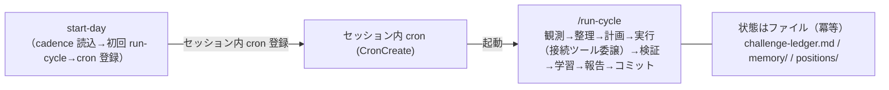

# runtime — 自律実行ランタイム【成果物 (b)】

自走エージェントを定期的に起こすための構成。**制御プレーン（自走の実行基盤）には専用アプリを作らず**、Claude Code のセッション内 cron（`start-day` スキルが登録）＋ `run-cycle` スキルで実現する。状態ファイルを読んで可視化するだけの**読み取り専用の観測プレーン**（別アプリ。例: [claude-flywheel-board](https://github.com/masanami/claude-flywheel-board)）は、①状態ファイルに書き込まない ②制御プレーンの依存にならない（止まっても自走に影響しない）——の 2 条件を満たす限り許容する。

## 4 レイヤー

| レイヤー | 役割 | 実体 |
| --- | --- | --- |
| ① 拍動（cadence） | いつ起こすか | セッション内 cron（Claude Code の CronCreate）。`start-day` スキルが起動時に登録 |
| ② サイクル本体 | 1 周の制御フロー | `run-cycle` スキル |
| ③ 能力 | 各エージェントの能力 | ポジション別スキル群 ＋ 記憶。横断はワークフローでファンアウト |
| ④ 自己改善 | ②③ を磨く別ループ | `reflect` スキル（低頻度・内省） |

*図: ランタイム — セッション内 cron（start-day が登録）が run-cycle を定期起動し、状態はファイルに保持して冪等に回す。*



## セットアップ（段階）

1. **手動検証**: まず `/run-cycle`（または `/run-cycle --dry-run`）を手動実行し、1 周の挙動を確認する。
2. **定期自走**: board（または人間）が各エージェントワークスペースで `claude "/claude-flywheel:start-day"` を起動する。`start-day` スキルが cadence 設定（`.flywheel/cadence.json`。無ければ既定値＝平日 10:00–18:00・90 分間隔で続行し、その旨を報告）を読み、**初回 `run-cycle` を即実行**したうえで、セッション内 cron（Claude Code の CronCreate）に次を登録する:
   - **run-cycle 定期便**（recurring）: 業務時間内の発火時刻を間隔から算出して登録した cron 式（例: 開始 10:00・間隔 90 分・オフセット 5 分なら `5 10,13,16 * * 1-5` と `35 11,14,17 * * 1-5` の 2 ジョブ。分はエージェントごとにずらし `:00`/`:30` を避ける＝fleet で複数エージェントが同時発火して API バーストしないため）。**各発火後、台帳に未完了課題が無ければ（`計画承認待ち`/`完了確認待ち` 等の承認待ちを除く）定期便を自動削除**し「課題が枯渇した。次は要件定義から」と報告して終了する。
   - **就業前の締めジョブ**（one-shot）: 業務時間終了直前に本日サマリを報告 → run-cycle 定期便を削除 → reflect しきい値（`.flywheel/cadence.json` の `reflect.every_n_cycles` 等）到達時のみ `/claude-flywheel:reflect` を起動する。
   - セッション（board の埋め込みターミナル等）を閉じると登録した cron ごと消滅する（「board を閉じたら自走も止まる」安全なキルスイッチ）。recurring は 7 日で自動失効するが、日次起動の運用では到達しない。対話割り込み中は発火が遅延する（承認対話を邪魔しない望ましい挙動）。
   - 拍動（cadence）の詳細仕様（手順・設計メモ）の**正本は [`skills/start-day/SKILL.md`](../../skills/start-day/SKILL.md)**。本 README と architecture.md §7 は要約であり、食い違う場合はスキル側が正（runs.jsonl の正本が本 README にあるのと同じレイヤリング規律）。
3. **自己改善（内省）を低頻度で**: `reflect` を run-cycle より**まばらに**起動する（通常は上記 `start-day` の締めジョブがしきい値判定で条件付き起動する。手動起動も可）。run-cycle が残した good/bad の記録を集計し、skill/ブリーフ/ポジション/recall の改修を提案する（手順は `reflect` スキルに自己完結）。毎周は回さない。
4. **承認ゲートは常に維持**（本番に影響する不可逆な操作＝既定ブランチ〔`main`〕への昇格マージ／本番影響／削除／履歴破壊は人間承認。作業ブランチへの push・PR 作成・統合ブランチ／親Issueブランチ（本番非反映）へのマージは本番影響が無く可逆で自律可）。スケジュール実行では人間をインラインで待たず、「提案を残して保留 → 次サイクルで前進」とする。ハーネス改修の適用も人間承認。

## 状態管理

- 状態はすべてファイル（`challenge-ledger.md` / `memory/` / `positions/`）。
- `run-cycle` は毎回それらを読み、ステータスに基づき**冪等**に処理する（**逐次の再実行**に対して安全。**並走**は run-cycle のロック `.flywheel/cycle.lock` が排他する）。

## 実行イベントログ（runs.jsonl）

各エージェント repo の `.flywheel/runs.jsonl` に残す**リアルタイムのイベント境界ログ（append-only JSONL）**。gitignore 対象＝コミットしないローカル実行状態であり、「いま何が走っているか」を表す。journal を代替しない。本セクションがこのファイルの**スキーマの正本**。

台帳・journal・runs.jsonl は役割が違う（役割が重なると正本が曖昧になるため、分担を固定する）:

| ファイル | 表すもの | 記録の性質 |
| --- | --- | --- |
| `challenge-ledger.md`（台帳） | 課題の**現在状態** | Git 追跡・恒久記録 |
| `journal/` | 1 周の**事後サマリ**（FR-50 / NFR-02 の正） | Git 追跡・恒久記録 |
| `.flywheel/runs.jsonl` | **いま何が走っているか**（イベント境界） | ローカルのみ（gitignore）・観測用 |

消費者は**読み取り専用の観測プレーン**（例: [claude-flywheel-board](https://github.com/masanami/claude-flywheel-board)）。「実行中」は**対応する `*_end` のない `*_start`** として導出する。

### イベント（6 種）

| イベント | 意味 |
| --- | --- |
| `cycle_start` | run-cycle 1 周の開始 |
| `cycle_end` | run-cycle 1 周の終了 |
| `delegate_start` | 子セッションへの委譲の開始 |
| `delegate_end` | 委譲の終了（【委譲結果の照合】の後） |
| `adhoc_start` | 差し込み作業（サイクル外の対話作業）の開始 |
| `adhoc_end` | 差し込み作業の終了 |

### フィールド

1 行 1 イベント・1 JSON オブジェクト。

| フィールド | 型 | 必須となるイベント | 内容 |
| --- | --- | --- | --- |
| `ts` | string | 全イベント | ISO 8601・タイムゾーンオフセット付き |
| `event` | string | 全イベント | 上表 6 種のいずれか |
| `cycle` | string | `cycle_*` | 当周の journal ファイル名 basename（`YYYY-MM-DD-cycle`、同日 2 周目以降は `-2` / `-3` ...）。**`cycle_start` 時に journal の命名規則（既存ファイルの存在で連番判定）で確定し、run-cycle step 6 の journal 書き出しは同じ名前を使う**（ログと journal を機械的に突合できるようにするため）。`cycle_start` / `cycle_end` の対応付けキー |
| `challenge` | string | `delegate_*`（`adhoc_*` は任意） | 課題 ID（`C-xxx`） |
| `repo` | string | `delegate_*`（`adhoc_*` は任意） | `repos.tsv` の `<name>` |
| `session_id` | string (UUID) | `delegate_*` | **委譲コマンド発行の直前に `uuidgen` で事前採番し、子セッションに `--session-id <uuid>` で指定する**（停止したセッションにも start 時点で resume 用 ID が残るようにするため）。macOS の `uuidgen` は大文字を返すため `uuidgen \| tr '[:upper:]' '[:lower:]'` のように**小文字へ正規化**する（対応付けを大文字小文字差で壊さないため）。`delegate_start` / `delegate_end` の対応付けキー |
| `result` | string | `*_end` | 結果 1 行。`delegate_end` は【委譲結果の照合】を経た**実状態**に基づく。`cycle_end` は `completed`（正常終了）または `abandoned`（後続サイクルが stale ロック回収時に代筆） |
| `id` | string | `adhoc_*` | `adhoc_start` / `adhoc_end` の対応付けキー（例: `adhoc-YYYYMMDD-HHMM-<slug>`。start 時に発番） |
| `title` | string | `adhoc_start` | 差し込み作業の 1 行タイトル |

サンプル（1 行ずつ）:

```json
{"ts":"2026-07-16T10:00:00+09:00","event":"cycle_start","cycle":"2026-07-16-cycle"}
{"ts":"2026-07-16T10:05:12+09:00","event":"delegate_start","challenge":"C-044","repo":"net-config","session_id":"550e8400-e29b-41d4-a716-446655440000"}
{"ts":"2026-07-16T10:42:30+09:00","event":"delegate_end","challenge":"C-044","repo":"net-config","session_id":"550e8400-e29b-41d4-a716-446655440000","result":"実装完了・PR起票（照合済み）"}
{"ts":"2026-07-16T10:45:00+09:00","event":"cycle_end","cycle":"2026-07-16-cycle","result":"completed"}
{"ts":"2026-07-16T13:02:00+09:00","event":"adhoc_start","id":"adhoc-20260716-1302-ci-failure","title":"CI 落ちの調査","repo":"net-config"}
{"ts":"2026-07-16T13:40:00+09:00","event":"adhoc_end","id":"adhoc-20260716-1302-ci-failure","result":"修正PRを作成"}
```

### 規則

- **append-only**。既存行を書き換えず、**末尾に 1 行 append** のみ（journal の `index.jsonl` と同じ規律。過去のイベントを後から改変しないため）。
- **1 イベント＝1 行を単一の書き込みで append する**（例: `printf '%s\n' '<JSON 1 行>' >> .flywheel/runs.jsonl`。複数の親セッション〔run-cycle と差し込み〕が同時に書いても、O_APPEND への短い単一 write なら実用上行が交錯しないため。複数行をまとめて書かない）。それでも破損した行は消費者がパースエラーとして可視化する前提とし、厳密な直列化（`flock` 等）は交錯が実際に観測されてから導入する（YAGNI）。
- **書き手は親セッション**（run-cycle を回すメインセッション／差し込みの対話セッション）。委譲先の子セッションは書かない（書き手を一本化し、並走委譲での競合を避けるため）。
- 初回 append の前に `mkdir -p .flywheel` する（ディレクトリ未作成で append が失敗しないため）。
- **best-effort**: 書き込みに失敗してもサイクル・作業を止めない（観測が制御を阻害しないため）。
- **秘密情報（トークン・資格情報等）は書かない**（run-cycle 本体の原則を踏襲。`session_id` は識別子であり可）。
- `run-cycle --dry-run` 実行時は一切書かない（journal と同じパリティ。dry-run は状態を変えないため）。
- gitignore 対象＝コミットしない（ローカル実行状態のため）。恒久記録は journal 側が担う。
- 肥大化対策（ローテーション等）は必要になるまで入れない（YAGNI。当面問題にならないため）。
- **再開（`--resume`）の扱い**: 同一サイクル内の `--resume` 往復は 1 委譲とみなしイベントを追加しない。**別サイクルに持ち越した resume は新しい `delegate_start`（同じ `session_id` の再登場可）で挟む**（各サイクルの委譲区間を独立に観測できるようにするため）。対応付けは「同一 `session_id` の**最新の未終了 start**」とする。
- **`session_id` 不一致時**: 子の返り値の `session_id` が事前採番値と一致しない場合（環境が `--session-id` を尊重しないケース）、書き手は事前採番値の `delegate_start` を `delegate_end`（`result` に不一致の事実と実際の ID を明記）で閉じ、以後は返り値を正として扱う（未終了 start を残さないため。委譲の再実行はしない）。
- **未終了 `adhoc_start` の扱い**: 中断・クラッシュで `adhoc_end` が残らなかった場合も代筆回収はしない（cycle の `abandoned` と違い、回収の自然な契機〔次サイクルの stale ロック回収〕が無いため）。消費者はしきい値超過の未終了 start を要確認として扱う。作業を再開したら同じ `id` のまま継続し、終了時に `adhoc_end` で閉じる。
- プラグインは書き込みの**参照実装**として `scripts/log-run-event.sh`（イベント append）・`scripts/cycle-lock.sh`（サイクルロックの取得・解放と stale 回収時の `abandoned` 代筆）を同梱する。仕様の正本は引き続き本セクションであり、スクリプトと本仕様が食い違う場合は本仕様が正。

## メモ

- **読み取り専用の観測プレーン**（ダッシュボード。例: claude-flywheel-board）は冒頭の 2 条件（状態ファイルに書き込まない・制御プレーンの依存にならない）を満たす限り**許容済み**であり、`runs.jsonl` 等の状態ファイルを読んで可視化する。
- 一方、**制御プレーン側**の薄いアプリ追加（リアルタイムのイベント駆動〔Slack 連動等〕）は、必要になった段階で初めて検討する。当面は不要。
