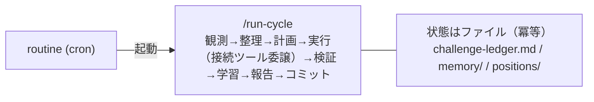

# runtime — 自律実行ランタイム【成果物 (b)】

自走エージェントを定期的に起こすための構成。**専用アプリは作らず**、Claude Code のスケジュール実行（routine/cron）＋ `run-cycle` スキルで実現する。

> 設計: claude-flywheel の `docs/architecture.md` §7

## 3 レイヤー

| レイヤー | 役割 | 実体 |
| --- | --- | --- |
| ① 拍動（cadence） | いつ起こすか | スケジュール実行（routine / cron） |
| ② サイクル本体 | 1 周の制御フロー | `run-cycle` スキル |
| ③ 能力 | 各エージェントの能力 | ポジション別スキル群 ＋ 記憶。横断はワークフローでファンアウト |
| ④ 自己改善 | ②③ を磨く別ループ | `reflect` スキル（低頻度・内省） |

*図: ランタイム — cron が run-cycle を定期起動し、状態はファイルに保持して冪等に回す。*

## セットアップ（段階）

1. **手動検証**: まず `/run-cycle`（または `/run-cycle --dry-run`）を手動実行し、1 周の挙動を確認する。
2. **定期自走**: Claude Code のスケジュール実行（routines）で `run-cycle` を定期起動する。
   - 例: 毎営業日 09:00 に「`/run-cycle` を実行して結果を報告」。
   - cron 定義は運用開始時にここへ追記する。
3. **自己改善（内省）を低頻度で**: `reflect` を run-cycle より**まばらに**起動する（例: 週次、または再発 bad が溜まったとき）。run-cycle が残した good/bad の記録を集計し、skill/ブリーフ/ポジション/recall の改修を提案する（設計は `docs/self-improvement.md`）。毎周は回さない。
4. **承認ゲートは常に維持**（claude-flywheel の `docs/architecture.md` §6）。スケジュール実行では人間をインラインで待たず、「提案を残して保留 → 次サイクルで前進」とする。ハーネス改修の適用も人間承認（#8）。

## 状態管理

- 状態はすべてファイル（`challenge-ledger.md` / `memory/` / `positions/`）。
- routine は毎回それらを読み、ステータスに基づき**冪等**に処理する（多重起動でも安全）。

## メモ

- リアルタイムのイベント駆動（Slack 連動等）やダッシュボードが必要になった段階で、初めて薄いアプリの追加を検討する。当面は不要。
